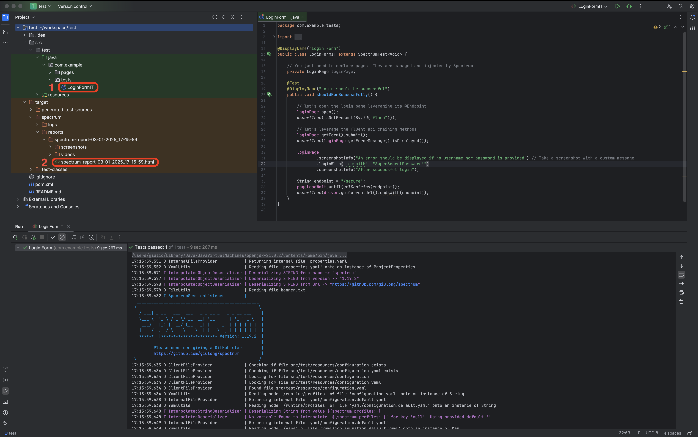
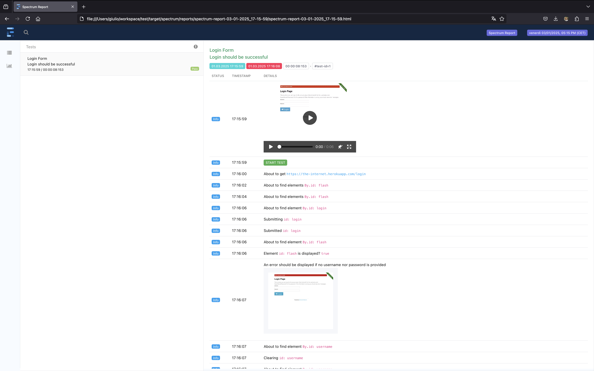

<div align="center">

[](https://github.com/giulong/spectrum/actions?query=branch%3Adevelop)
[](https://github.com/giulong/spectrum/actions/workflows/codeql.yml)
[](https://giulong.github.io/spectrum/jacoco/)
[](https://javadoc.io/doc/io.github.giulong/spectrum)
[](https://jdk.java.net/21/)
[](https://opensource.org/licenses/Apache-2.0)
[](https://search.maven.org/search?q=g:io.github.giulong%20a:spectrum)

<br />


<br/>
<br/>
<div>
<a href="https://giulong.github.io/spectrum/">Full Docs</a>
·
<a href="https://javadoc.io/doc/io.github.giulong/spectrum/latest/index.html">Javadoc</a>
·
<a href="https://github.com/giulong/spectrum/issues/new?assignees=giulong&labels=&projects=&template=bug_report.md&title=%5BBUG%5D+%3CProvide+a+short+title%3E">Report Bug</a>
·
<a href="https://github.com/giulong/spectrum/issues/new?assignees=giulong&labels=&projects=&template=feature_request.md&title=%5BRFE%5D+%3CProvide+a+short+title%3E">Request Feature</a>

</div>
</div>
<br/>

<details>
  <summary>Table of Contents</summary>
  <ol>
    <li><a href="#about">About</a></li>
    <li><a href="#getting-started">Getting Started</a></li>
    <li><a href="#usage">Usage</a></li>
    <li><a href="#contributing">Contributing</a></li>
    <li><a href="#contacts">Contacts</a></li>
    <li><a href="#acknowledgments">Acknowledgments</a></li>
  </ol>
</details>

# About

Spectrum is an **e2e test automation framework** that leverages **JUnit 5** and **Selenium 4** to provide these features automatically:

* **Driver** management
* **Auto-waiting** before interacting with elements, to **highly reduce flakiness**
* **Html report** generation with the **execution video**
* **Coverage report** generation by reading a **testbook**
* **Mail/Slack notifications** with reports as attachments
* It is fully configurable via a **declarative yaml file**
* It provides **out-of-the-box defaults** to let you run tests with no additional configuration
* It supports **browsers automation** via Selenium
* It supports **mobile and desktop applications automation** via Appium
* It generates **several additional reports** that are **fully customisable**

Spectrum manages all the boilerplate code, allowing you to focus on test logic:
you just need to write a JUnit test using the native Selenium API as you would do in a vanilla Selenium test,
and Spectrum will enrich your suite transparently.
Be sure to check the [full documentation](https://giulong.github.io/spectrum/) to see all the available features.

# Getting Started

> ⚠️ Spectrum requires [Java 21](https://jdk.java.net/archive/) or newer.

The easiest way is to take the three steps listed below, as shown in this video:

https://github.com/giulong/spectrum/assets/27963644/fecee8f5-f6dc-4b47-81a3-514e66b3907d

1. Generate a new project leveraging the [Spectrum Archetype](https://mvnrepository.com/artifact/io.github.giulong/spectrum-archetype):

   ```text
   mvn archetype:generate -DarchetypeGroupId=io.github.giulong -DarchetypeArtifactId=spectrum-archetype
   ```

2. Run the `LoginFormIT` demo test.
3. Check the report generated in `target/spectrum/reports/spectrum-report-<TIMESTAMP>/spectrum-report-<TIMESTAMP>.html`.

> ⚠️ Tests run on Chrome by default. As shown in the video above, you can change this with:<br/>
> `-Dspectrum.driver=firefox`, `-Dspectrum.driver=edge` or `-Dspectrum.driver=safari`

If you like Spectrum, please consider giving it a GitHub Star ⭐

# Usage

If you'd rather add Spectrum manually to your project, you just need to add its dependency:

## Maven

```xml
<dependency>
    <groupId>io.github.giulong</groupId>
    <artifactId>spectrum</artifactId>
    <version>1.22.1</version>
    <scope>test</scope>
</dependency>
```

## Gradle

```gradle
dependencies {
  implementation group: 'io.github.giulong', name: 'spectrum', version: '1.22.1'
}
```

Here's an overview of the project created by the archetype, along with the generated report and video:<br/><br/>

&nbsp;

https://github.com/giulong/spectrum/assets/27963644/df6b801e-91ca-415b-b510-a45b7392de20

You can also configure Spectrum to produce additional reports, such as summary and coverage:<br/><br/>

&nbsp;

# Contributing

Contributions to Spectrum are welcome! If you're interested, please check out the [CONTRIBUTING.md](CONTRIBUTING.md)
and the [open issues](https://github.com/giulong/spectrum/issues).

# Contacts

| Creator         | GitHub                                | Linkedin                                                       | Email                                                       |
|-----------------|---------------------------------------|----------------------------------------------------------------|-------------------------------------------------------------|
| Giulio Longfils | [giulong](https://github.com/giulong) | [Giulio Longfils](https://www.linkedin.com/in/giuliolongfils/) | [giuliolongfils@gmail.com](mailto:giuliolongfils@gmail.com) |

# Acknowledgments

Spectrum leverages these projects you should definitely check out!

* [JUnit 5](https://junit.org/junit5/docs/current/user-guide/)
* [Selenium](https://www.selenium.dev/)
* [Appium](http://appium.io/docs/en/latest/)
* [Lombok](https://projectlombok.org/)
* [Extent Reports](https://www.extentreports.com/)
* [FreeMarker](https://freemarker.apache.org/)
* [Simple Java Mail](https://www.simplejavamail.org/)
* [JCodec](http://www.jcodec.org/)
* [VicTools JsonSchema Generator](https://victools.github.io/jsonschema-generator/#introduction)
* [Jekyll](https://jekyllrb.com/)
* [Modernist Theme](https://github.com/pages-themes/modernist)
* [Datafaker](https://github.com/datafaker-net/datafaker)
