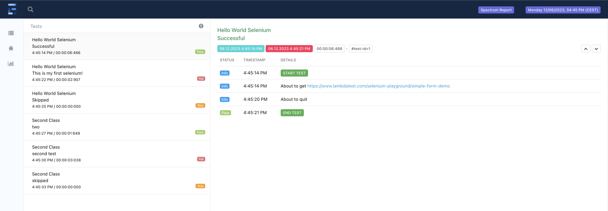

####


[](https://github.com/giulong/spectrum/actions?branch=develop)


[](https://www.oracle.com/java/technologies/javase-downloads.html)
[](https://opensource.org/licenses/Apache-2.0)
[](https://search.maven.org/search?q=g:io.github.giulong%20a:spectrum-archetype)
TODO MAVEN BADGE FIX URL

Spectrum is a Java 17 and [Selenium 4](https://www.selenium.dev/) framework that aims to simplify the writing of E2E tests by automatically:

* generating html reports
* generating coverage by reading a testbook
* providing out-of-the-box defaults to let you immediately run tests with no additional configuration needed
* providing a human-readable and declarative configuration via yaml files

Spectrum leverages [JUnit 5](https://junit.org/junit5/docs/current/user-guide/) extension model to initialise and inject all the needed objects
directly in your test classes, so that you can focus just on writing the logic to test your application.

## Setup

### Spectrum Archetype

You should leverage the latest published version of the [Spectrum Archetype](https://mvnrepository.com/artifact/io.github.giulong/spectrum-archetype) to create a new project.
You can either use it via your IDE, or run this from command line:

`mvn archetype:generate -DarchetypeGroupId=io.github.giulong -DarchetypeArtifactId=spectrum-archetype -DarchetypeVersion=LATEST -DgroupId=<YOUR GROUP ID> -DartifactId=<YOUR ARTIFACT ID>`

Needless to say that `<YOUR GROUP ID>` and `<YOUR ARTIFACT ID>` are placeholders that you need to replace with actual values.

The project created will contain a demo test you can immediately run.
If you don't want to leverage the archetype, you can manually add the Spectrum dependency to your project TODO maven link

### Test creation

In general, all you need to do is create a **JUnit 5** test class and make it extend the `SpectrumTest` class:

```Java
import io.github.giulong.spectrum.SpectrumTest;
import org.junit.jupiter.api.Test;

public class HelloWorldIT extends SpectrumTest<Void> {

    @Test
    public void dummyTest() {
        webDriver.get(configuration.getApplication().getBaseUrl());
    }
}
```

> ⚠️ Running with Maven<br/>
> If you run tests with Maven, the name of your test classes should end with `IT` as in the example above: `HelloWorldIT`,
> to leverage the [default inclusions](https://maven.apache.org/surefire/maven-failsafe-plugin/examples/inclusion-exclusion.html) of the failsafe plugin.

> 💡 Tip<br/>
> The default browser is `chrome`. If you want to use another one, you can switch via the `spectrum.browser` system property, setting its value to
> `firefox`, `edge` ...

If you now run the test, you will find a html report generated in the `target/spectrum/reports` folder.

TODO: examples

# Configuration

Spectrum is fully configurable and comes with default values which you can find in the [configuration.default.yaml](spectrum/src/main/resources/yaml/configuration.default.yaml).
Be sure to check it: each key is properly commented to clarify its purpose.

> ⚠️ Running on *nix<br/>
> When running on *nix, the [configuration.default.unix.yaml](spectrum/src/main/resources/yaml/configuration.default.unix.yaml) will be merged onto the base one
> to set filesystem-specific values such as path separators.

To customise these values, you can create the `src/test/resources/configuration.yaml` file in your project.

> ⚠️ Files Extension<br/>
> The extension must be `.yaml`. The shortened `.yml` won't work.

Furthermore, you can provide how many profile-specific configurations in the same folder, by naming them
`configuration-<PROFILE>.yaml`, where `<PROFILE>` is a placeholder that you need to replace with the actual profile name.

To let Spectrum pick the right profiles-related configuration, you must run with the `-Dspectrum.profiles` flag, 
which is a comma separated list of profile names you want to activate. 

> **_Example:_**
> When running tests with `-Dspectrum.profiles=test,grid`, Spectrum will merge these files in this order of precedence:
> 1. configuration.default.yaml [Spectrum internal defaults]
> 2. configuration.default.unix.yaml [Spectrum internal defaults for *nix, not read on Windows]
> 3. configuration.yaml
> 4. configuration-test.yaml [A warning will be raised if not found, no errors]
> 5. configuration-grid.yaml [A warning will be raised if not found, no errors]

Values in the most specific configuration file will take precedence over the others.

> 💡 Tip<br/>
> There's no need to repeat everything: configuration files are merged, so it's better to keep values that are common to all the profiles in the base configuration.yaml,
> while providing `<PROFILE>`-specific ones in the `configuration-<PROFILE>.yaml`

> ⚠️ Merging Lists<br/>
> Watch out that list-type nodes will not be overridden. Their values will be merged by appending elements! For example, if you have these:
>
> ```yaml
> # configuration.yaml
> someList:
>   - value1
> ```
>
> ```yaml
> # configuration-test.yaml
> someList:
>   - value2
> ```
>
> If you run with `-Dspectrum.profiles=test` both files will be loaded and lists will be merged, resulting in:
>
> ```yaml
> someList:
>   - value1
>   - value2
> ```

> 💡 Tip<br/>
> If you need different configurations for the same environment, instead of manually changing values in the configuration*.yaml, you should
> provide different files and choose the right one with the `-Dspectrum.profiles` flag. <br/>
> For example, if you need to be able to run from your local machine alternatively targeting a remote grid or executing browsers in local,
> it's preferable to have something like these two files, where you change just the target runtime:
> * configuration-local-local.yaml
> * configuration-local-grid.yaml
>
> In this way, you don't need to change any configuration file. This is important, since configurations are versioned alongside your tests,
> so you will avoid errors and will keep your scm history clean.
> You need just to activate the right one by creating different run configurations in your IDE.

> 💡 Tip<br/>
> Working in a team where devs need different local configurations? You can *gitignore* a file like `configuration-personal.yaml`,
> so that everyone can provide its own configuration without interfering with others.

## Vars node

The `vars` node is a special one in the `configuration.yaml`. You can use it to define common vars once and refer to them in several nodes.
`vars` is a `Map<String, String>`, so you can define all the keys you need, naming them how you want.

```yaml
vars:
  commonKey: some-value # commonKey is a name of your choice

node:
  property: ${commonKey} # Will be replaced with `some-value`

anotherNode:
  subNode:
    key: ${commonKey} # Will be replaced with `some-value`
```

## Values interpolation

Each non-object value in the configuration can be interpolated by placing a dollar-string like this:

```yaml
object:
  key: ${key:-defaultValue}
```

Where the `:-` is the separator between the name of the key to search for and the default value in case the key is not found. The default value is optional: you can just
have `${key}`

Spectrum will replace the dollar-string with the first value found in this list:

1. `key` in [vars node](#vars-node):
    ```yaml
    vars:
      key: value 
   ```
2. system property named `key`
3. `defaultValue` (if provided)

If the provided key can't be found, a warning will be raised. Both key name and default value can contain dots like in `${some.key:-default.value}`

# Data

As a general best practice, test code should only contain the flow logic and assertions, while data should be kept outside.
Spectrum embraces this by leveraging dedicated yaml files. This is completely optional, you can run all your tests without any data file.

By default, you can create `data*.yaml` files under the `src/test/resources/data` folder.
Data files will be loaded and merged following the same conventions of `configurations*.yaml` files.

> **_Example:_**
> When running tests with `-Dspectrum.profiles=test`, Spectrum will merge these files in this order of precedence:
> 1. data.yaml
> 2. data-test.yaml

For data files to be properly unmarshalled, you must create the corresponding *pojos* and set the fqdn of your parent data class in the configuration.yaml.

Let's see an example. Let's say we want to test the application with two users with two different roles (admin and guest).
Both will have the same set of params, such as a name and a password to login.

We need to take four steps:

1. Create the yaml describing this scenario:

    ```yaml
    # data.yaml
    users:
      admin:
        name: ada
        password: secret
      guest:
        name: bob
        password: pwd
    ```

2. Create the *pojo* mapping the yaml above:

    ```java
    package your.package_name;  // this must be set in the configuration.yaml. Keep reading below :)
    
    import lombok.Getter;
    import java.util.Map;
    
    @Getter
    public class Data {
    
        private Map<String, User> users;
    
        @Getter
        public static class User {
            private String name;
            private String password;
        }
    }
    ```

   > ⚠️ Lombok Library<br/>
   The example above uses [Lombok](https://projectlombok.org/) to generate getters. Lombok is internally used in Spectrum, and provided
   as a transitive dependencies, so you can already use it. Be sure to check its docs to understand how to configure it in your IDE.
   If you don't want to leverage it, you can safely write getters the old way.

   > 💡 Tip<br/>
   The `User` class in the snippet above is declared as a static inner class. This is not mandatory, you could have plain public classes each in its own java file.

3. Make Spectrum aware of our Data class by providing its fqdn in the configuration.yaml:

    ```yaml
    # configuration.yaml    
    data:
      fqdn: your.package_name.Data  # Form: <package_name>.<class name>
    ```

4. Declare the Data class as generic in the SpectrumTest(s) that will use it:

    ```java
    import your.package_name.Data;
   
    public class SomeIT extends SpectrumTest<Data> { // &larr; Mind the generic here
        
        public void someTestMethod() {
            data.getUsers().get("admin").getName(); // we can now use the data object leveraging its getters. No need to declare/instantiate the 'data' field: Spectrum is taking care of injecting it.
        }
    }
    ```

This is just a simple example. Be sure to check the example repo for more complex use cases, such as data driven and parameterised tests.

> 💡 Tip<br/>
> For the sake of completeness, you can name the `Data` *pojo* as you prefer. 
> You can name it `MySuperShinyWhatever.java` and have this as generic in you SpectrumTest(s):
> `public class SomeIT extends SpectrumTest<MySuperShinyWhatever> {`
> 
> That said, I don't really see any valid use case for this. Let me know if you see one.

# Automatically Generated Reports

After each execution, Spectrum automatically produces two files:

* [log](#log-file)
* [html report](#html-report)

## Log file

The log file will contain the same information you see in the console. It will be produced by default under the `target/spectrum/logs` folder.

It's generated using [Logback](https://logback.qos.ch/), and [here](spectrum/src/main/resources/logback.xml) you can find its configuration.
Logs are rotated daily, meaning the results of each execution occurred in the same day will be appended to the same file.

> 💡 Tip<br/>
> By default, logs are generated using a colored pattern. In case the console you use doesn't support it (if you see weird characters at the beginning of each line),
> you should deactivate colors by setting the `spectrum.log.colors` system properties to `false`.

## Html report

Spectrum generates a html report using [Extent Reports](https://www.extentreports.com/). By default, it will be produced under the `target/spectrum/reports` folder.
You can see an example here:



> 💡 Tip<br/>
> You can also provide your own Look&Feel by putting additional css rules in the `src/test/resources/css/report.css` file.
> Spectrum will automatically load and apply it to the Extent Report.

# Data

# Project Structure

Let's see how your project will look like. Few assumptions for this example:

* you defined base values plus three profiles, each with its own set of Data:
    * [base] &rarr; `configuration.yaml` + `data.yaml`
    * local &rarr; `configuration-local.yaml` + `data-local.yaml`
    * test &rarr; `configuration-test.yaml` + `data-test.yaml`
    * uat &rarr; `configuration-uat.yaml` + `data-uat.yaml`
* you configured the yaml testbook parser, which will read the `testbook.yaml`
* you configured both a html and a txt testbook reporters, which will produce `testbook.html` and `testbook.txt` reports

```
root
└─ src
|  └─ test
|     ├─ java
|     |  └─ com.your.tests
|     |     └─ ...
|     └─ resources
|        ├─ data
|        |  ├─ data.yaml
|        |  ├─ data-local.yaml
|        |  ├─ data-test.yaml
|        |  └─ data-uat.yaml
|        ├─ configuration.yaml
|        ├─ configuration-local.yaml
|        ├─ configuration-test.yaml
|        ├─ configuration-uat.yaml
|        └─ testbook.yaml
├─ target
|  └─ spectrum
|     |─ logs
|     |  └─ spectrum.log   # rotated daily
|     |─ reports
|     |  |─ screenshots    # folder where Extent Reports screenshots are saved
|     |  └─ report.html    # by default the name will ends with the timestamp
|     └─ testbook
|        |─ testbook.html  # by default the name will ends with the timestamp
|        └─ testbook.txt   # by default the name will ends with the timestamp
└─ pom.xml
```

# Advanced Topics

## Parallel Execution

Spectrum tests can be run in parallel by leveraging [Junit Parallel Execution](https://junit.org/junit5/docs/snapshot/user-guide/#writing-tests-parallel-execution)

# How to Build Spectrum

## How to run Spectrum's Unit Tests

Spectrum leverages `SpectrumSessionListener`, a [LauncherSessionListener](https://junit.org/junit5/docs/current/user-guide/#launcher-api-launcher-session-listeners-custom)
registered via the
Service Loader mechanism. A file is copied into the `META-INF` folder during the `prepare-package` phase.
You need to get rid of it while running Spectrum's own unit tests. You have a couple options, it's up to you to decide which to apply:

* manually run a `mvn clean`
* configure your IDE's JUnit configuration template to add it as a before-launch task to run `mvn clean`
* manually delete the
  file [target/classes/META-INF/services/org.junit.platform.launcher.LauncherSessionListener](spectrum/target/classes/META-INF/services/org.junit.platform.launcher.LauncherSessionListener)

# TODO injected objects

# TODO freemarker templates

# TODO event handlers

# TODO mail configuration

# TODO env vars

# TODO runtime environment

# TODO SpectrumPage

# Honourable Mentions

* [Extent Reports](https://www.extentreports.com/)
* [FreeMarker](https://freemarker.apache.org/)
* [VicTools JsonSchema Generator](https://victools.github.io/jsonschema-generator/#introduction)
* [Simple Java Mail](https://www.simplejavamail.org/)

# About

Spectrum is created and maintained by Giulio Longfils: [ LinkedIn](https://www.linkedin.com/in/giuliolongfils/)
and licensed under the terms of the [Apache 2.0 License](https://www.apache.org/licenses/LICENSE-2.0).


<a href="https://slack.com/oauth/v2/authorize?client_id=2946027914464.5355770664291&scope=chat:write,channels:read,incoming-webhook&user_scope="></a>
