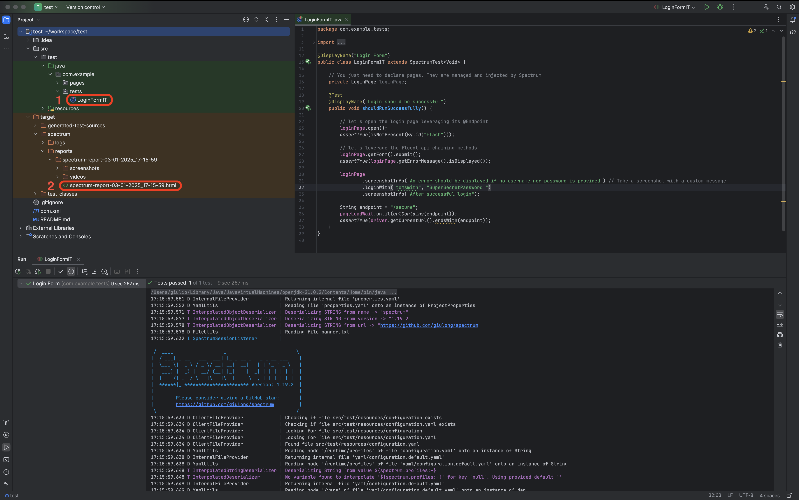

<div align="center">

[](https://github.com/giulong/spectrum/actions?query=branch%3Adevelop)
[](https://github.com/giulong/spectrum/actions/workflows/codeql.yml)
[](https://giulong.github.io/spectrum/jacoco/)
[](https://javadoc.io/doc/io.github.giulong/spectrum)
[](https://jdk.java.net/archive/)
[](https://opensource.org/licenses/Apache-2.0)
[](https://central.sonatype.com/artifact/io.github.giulong/spectrum)
[](https://github.com/giulong/spectrum/commits/develop/)
[](https://github.com/giulong/spectrum/discussions)

<br />


<br/>
<br/>
<div>
<a href="https://giulong.github.io/spectrum/">Full Docs</a>
·
<a href="https://github.com/giulong/spectrum/issues/new?template=bug_report.md">Report Bug</a>
·
<a href="https://github.com/giulong/spectrum/issues/new?template=feature-request.md">Request Feature</a>

</div>
</div>
<br/>

<details>
   <summary>Table of Contents</summary>
   <ol>
      <li><a href="#about">About</a></li>
      <li><a href="#getting-started">Getting Started</a></li>
      <li><a href="#usage">Usage</a></li>
      <li><a href="#contributing">Contributing</a></li>
      <li><a href="#acknowledgments">Acknowledgments</a></li>
   </ol>
</details>

# About

Spectrum is an **e2e test automation framework** that leverages **JUnit 6** and **Selenium 4** to provide these features automatically:

* **Driver** management with **auto-waiting**, to **highly reduce flakiness**
* Generation of a **html report** with the **execution video**, **coverage** and **several additional reports**. All **fully customisable**
* **Mail/Slack notifications** with reports as attachments
* It is fully configurable via a **declarative yaml file**, providing **out-of-the-box defaults** to let you run tests with no additional configuration
* It supports **browsers automation** via Selenium and **mobile and desktop automation** via Appium
* It supports **WebDriver BiDi** protocol

Spectrum manages all the boilerplate code, allowing you to focus on test logic:
you just need to write a JUnit test using the native Selenium API as you would do in a vanilla Selenium test,
and Spectrum will enrich your suite transparently.
Be sure to check the [full documentation](https://giulong.github.io/spectrum/) to see all the available features.

# Getting Started

> ⚠️ Spectrum requires [Java 21](https://jdk.java.net/archive/) or newer.

The easiest way is to take the three steps listed below, as shown in this video:

https://github.com/giulong/spectrum/assets/27963644/fecee8f5-f6dc-4b47-81a3-514e66b3907d

1. Generate a new project leveraging the [Spectrum Archetype](https://mvnrepository.com/artifact/io.github.giulong/spectrum-archetype):

   ```text
   mvn archetype:generate -DarchetypeGroupId=io.github.giulong -DarchetypeArtifactId=spectrum-archetype
   ```

2. Run the `LoginFormIT` demo test.
3. Check the generated report, which opens automatically in your browser.

> ⚠️ Tests run on Chrome by default. As shown in the video above, you can change this with:<br/>
> `-Dspectrum.driver=firefox`, `-Dspectrum.driver=edge` or `-Dspectrum.driver=safari`

Here's an overview of the project created by the archetype, along with the generated report and video:<br/><br/>

&nbsp;

https://github.com/giulong/spectrum/assets/27963644/df6b801e-91ca-415b-b510-a45b7392de20

You can also configure Spectrum to produce additional reports, such as summary and coverage:<br/><br/>

&nbsp;

If you like Spectrum, please consider giving it a GitHub Star ⭐

# Usage

To start without the archetype, it's as simple as following these steps:

1. Add the Spectrum dependency to your project, you can find the snippet for every build tool [here](https://central.sonatype.com/artifact/io.github.giulong/spectrum).

   ```xml
   <dependency>
       <groupId>io.github.giulong</groupId>
       <artifactId>spectrum</artifactId>
       <version>1.27.1</version>
       <scope>test</scope>
   </dependency>
   ```

2. Create the `HelloWorldIT` test class extending `SpectrumTest`:

   ```java
   import io.github.giulong.spectrum.SpectrumTest;
   import org.junit.jupiter.api.Test;
   
   public class HelloWorldIT extends SpectrumTest<Void> {
   
       @Test
       public void dummyTest() {
           driver.get(configuration.getApplication().getBaseUrl());
       }
   }
   ```

3. create a basic `src/test/resources/configuration.yaml`:

   ```yaml
   application:
     baseUrl: https://the-internet.herokuapp.com/ # Change this with your app's landing page
   
   video: # video of the execution attached to the html report (will be empty since the test is doing nothing)
     frames:
       - autoBefore
   
   extent:
     openAtEnd: true # the html report will open automatically in your browser after the execution
   ```
   
4. Run the test!

# Contributing

Contributions to Spectrum are welcome! Please check out the [CONTRIBUTING.md](CONTRIBUTING.md)
and the [open issues](https://github.com/giulong/spectrum/issues).

# Acknowledgments

<details>
   <summary>Spectrum leverages these projects you should definitely check out!</summary>
   <ul>
      <li><a href="https://docs.junit.org/current/user-guide/">JUnit 6</a></li>
      <li><a href="https://www.selenium.dev/">Selenium</a></li>
      <li><a href="http://appium.io/docs/en/latest/">Appium</a></li>
      <li><a href="https://projectlombok.org/">Lombok</a></li>
      <li><a href="https://www.extentreports.com/">Extent Reports</a></li>
      <li><a href="https://freemarker.apache.org/">FreeMarker</a></li>
      <li><a href="https://www.simplejavamail.org/">Simple Java Mail</a></li>
      <li><a href="http://www.jcodec.org/">JCodec</a></li>
      <li><a href="https://victools.github.io/jsonschema-generator/#introduction">VicTools JsonSchema Generator</a></li>
      <li><a href="https://jekyllrb.com/">Jekyll</a></li>
      <li><a href="https://github.com/pages-themes/modernist">Modernist Theme</a></li>
      <li><a href="https://github.com/datafaker-net/datafaker">Datafaker</a></li>
   </ul>
</details>
