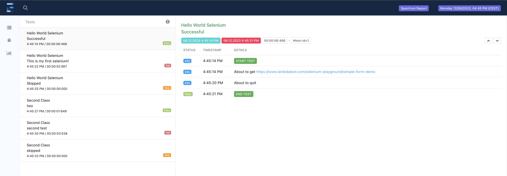

####


[](https://github.com/giulong/spectrum/actions?branch=main)


[](https://www.oracle.com/java/technologies/javase-downloads.html)
[](https://opensource.org/licenses/Apache-2.0)

Spectrum is a Java/[Selenium 4](https://www.selenium.dev/) framework that aims to simplify the writing of E2E tests suites by automatically:
* managing the WebDriver
* generating html reports
* generating coverage by leveraging a testbook which could be written in different formats
* providing out-of-the-box defaults to let you immediately run tests with no additional configuration needed
* providing a human-readable and declarative configuration via yaml files

Spectrum leverages [JUnit 5](https://junit.org/junit5/docs/current/user-guide/) extension model to initialise and inject all the needed objects 
directly in your test classes, so that you can focus just on writing tests to navigate through your web application and run the needed assertions.

TODO: TABLE OF CONTENT

## Quick example

Let's see a quick example to immediately run a first test. All you need to do is:
1. add the Spectrum dependency to your project TODO maven link
2. create a **JUnit 5** test and make it extend the `SpectrumTest` class:
    ```Java
    public class HelloWorldIT extends SpectrumTest<Data> {
   
        @Test
        public void dummyTest() {
            webDriver.get(configuration.getApplication().getBaseUrl());
        }
   }
    ```

> ⚠️<br/>
> If you run tests with Maven, and you don't want to customise the failsafe plugin configuration, 
> it's important that the name of your test classes ends with `IT` as in the example above: `HelloWorldIT`. 
> These are indeed the [default inclusions](https://maven.apache.org/surefire/maven-failsafe-plugin/examples/inclusion-exclusion.html) of the failsafe plugin.

> 💡<br/>
> The default browser is `chrome`. If you want to use another one, you can switch via the `spectrum.browser` system property, setting its value to
> `firefox`, `edge` ...

> 💡<br/>
> The web driver is managed by WebDriverManager. By sure to check its [docs](https://bonigarcia.dev/webdrivermanager/) in case of issues and/or to customise its behaviour.

You can immediately run this test. After the execution, you will find a html report generated in the `target/spectrum/reports` folder.

TODO: archetype
TODO: examples

# Configuration

TODO: downloadPath defaults for windows (path separator)

Spectrum is fully configurable and comes with default values which you can find in the [configuration.default.yaml](src/main/resources/yaml/configuration.default.yaml).

To provide different values, you can create the `src/test/resources/configuration.yaml` file in your project.
Furthermore, you can provide how many env-specific configurations in the same folder, by naming them 
`configuration-<ENV>.yaml`, where `<ENV>` is a placeholder that you need to replace with the actual environment name.

To let Spectrum pick the right environment-related configuration, you must run with the `-Denv` flag.

> **_Example:_**
> When running tests with `-Denv=test`, Spectrum will merge these three files in this order of precedence:
> 1. configuration-test.yaml
> 2. configuration.yaml 
> 3. configuration.default.yaml [Spectrum internal defaults]

Values in the most specific configuration file will take precedence over the others.

> 💡<br/>
> There's no need to repeat everything: configuration files are merged, so it's better to keep values that are common to all the environments in the base configuration.yaml,
> while providing `<ENV>`-specific ones in the `configuration-<ENV>.yaml`

> 💡<br/>
> If you need different configurations for the same environment, instead of manually changing values in the configuration*.yaml, you should
> provide different files and choose the right one with the `-Denv` flag. <br/>
> For example, if you need to run from your local machine targeting sometimes a remote grid, and sometimes running in local, you should have these two, where you change just the target runtime:
> * configuration-local-local.yaml
> * configuration-local-grid.yaml

## Vars node

The `vars` node is a special one in the `configuration.yaml`: you can use it to define common vars once and refer to them in several nodes. `vars` is a map, so you can define how many keys you need.

```yaml
vars:
  commonKey: some-value

node:
  property: ${commonKey} # Will be replaced with `some-value`

anotherNode:
  subNode:
    key: ${commonKey} # Will be replaced with `some-value`
```

## Values interpolation

Each non-object value in the configuration can be interpolated by placing a dollar-string like this:

```yaml
object:
  key: ${key:-defaultValue}
```

Where the `:-` is the separator between the name of the key to search for and the default value in case the key is not found. The default value is optional: you can just have `${key}`

Spectrum will replace the dollar-string with the first value found in this list:
1. `key` in [vars node](#vars-node)
    ```yaml
    vars:
      key: value 
   ```
2. system property named `key`
3. `defaultValue` (if provided)

If the provided key can't be found, a warning will be raised. Both key name and default value can contain dots like in `${some.key:-default.value}`

TODO: Configuration nodes

# Automatically Generated Reports

On each execution, Spectrum automatically produces two files:
* [log](#log-file)
* [html report](#html-report)

## Log file

The log file will contain the same information you see in the console. It will be produced by default under the `target/spectrum/logs` folder.

It's generated using [Logback](https://logback.qos.ch/), and [here](src/main/resources/logback.xml) you can find its configuration.
Logs are rotated daily, meaning the results of each execution occurred in the same day will be appended to the same file.

> 💡<br/>
> By default, logs are generated using a colored pattern. In case the console you use doesn't support it (if you see weird characters at the beginning of each line),
> you should deactivate colors by setting the `spectrum.log.colors` system properties to `false`.

## Html report

Spectrum generates a html report using [Extent Reports](https://www.extentreports.com/). By default, it will be produced under the `target/spectrum/reports` folder.
You can see an example here:



> 💡<br/>
> You can also provide your own Look and Feel by putting additional css rules in the `src/test/resources/css/report.css` file. Spectrum will automatically load it and apply to the
> Extent Reports.

# Data

# Project Structure

Let's see how your project will look like. Few assumptions for this example:
* you defined base values plus three environments, each with its own set of Data:
  * [base] &rarr; `configuration.yaml` + `data.yaml`
  * local &rarr; `configuration-local.yaml` + `data-local.yaml`
  * test &rarr; `configuration-test.yaml` + `data-test.yaml`
  * uat &rarr; `configuration-uat.yaml` + `data-uat.yaml`
* you configured the yaml testbook parser, which will read the `testbook.yaml`
* you configured both a html and a txt testbook reporters, which will produce `testbook.html` and `testbook.txt` reports

```
root
└─ src
|  └─ test
|     ├─ java
|     |  └─ com.your.tests
|     |     └─ ...
|     └─ resources
|        ├─ data
|        |  ├─ data.yaml
|        |  ├─ data-local.yaml
|        |  ├─ data-test.yaml
|        |  └─ data-uat.yaml
|        ├─ configuration.yaml
|        ├─ configuration-local.yaml
|        ├─ configuration-test.yaml
|        ├─ configuration-uat.yaml
|        └─ testbook.yaml
├─ target
|  └─ spectrum
|     |─ logs
|     |  └─ spectrum.log   # rotated daily
|     |─ reports
|     |  |─ screenshots    # folder where Extent Reports screenshots are saved
|     |  └─ report.html    # by default the name will ends with the timestamp
|     |─ testbook
|        |─ testbook.html  # by default the name will ends with the timestamp
|        └─ testbook.txt   # by default the name will ends with the timestamp
└─ pom.xml
```

# Advanced Topics

## Parallel Execution

Spectrum tests can be run in parallel by leveraging [Junit Parallel Execution](https://junit.org/junit5/docs/snapshot/user-guide/#writing-tests-parallel-execution)

# How to Build Spectrum

## How to run Spectrum's Unit Tests

Spectrum leverages `SpectrumSessionListener`, a [LauncherSessionListener](https://junit.org/junit5/docs/current/user-guide/#launcher-api-launcher-session-listeners-custom) registered via the
Service Loader mechanism. A file is copied into the `META-INF` folder during the `prepare-package` phase.
You need to get rid of it while running Spectrum's own unit tests. You have a couple options, it's up to  you to decide which to apply:
* manually run a `mvn clean`
* configure your IDE's JUnit configuration template to add it as a before-launch task to run `mvn clean`
* manually delete the file [target/classes/META-INF/services/org.junit.platform.launcher.LauncherSessionListener](target/classes/META-INF/services/org.junit.platform.launcher.LauncherSessionListener)

# TODO SpectrumPage

TODO GRID:
hub: java -jar selenium-server-4.10.0.jar hub --host localhost
node: java -Dwebdriver.chrome.driver=/Users/c325006/.cache/selenium/chromedriver/mac-arm64/114.0.5735.90/chromedriver -jar selenium-server-4.10.0.jar node --hub http://localhost:4444 --host localhost

# Licenses

# About

Spectrum is created and maintained by Giulio Longfils: [ LinkedIn](https://www.linkedin.com/in/giuliolongfils/) 
and licensed under the terms of the [Apache 2.0 License](https://www.apache.org/licenses/LICENSE-2.0).
