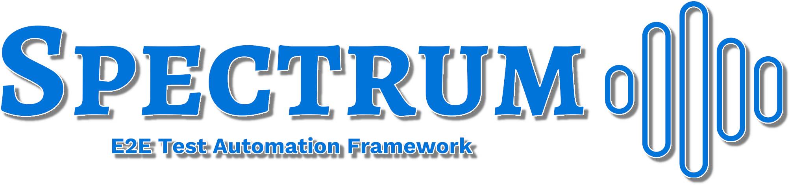

 

 
 

<a href="https://giulong.github.io/spectrum/">Full Docs</a>
·
<a href="https://javadoc.io/doc/io.github.giulong/spectrum/latest/index.html">Javadoc</a>
·
<a href="https://github.com/giulong/spectrum/issues/new?assignees=giulong&labels=&projects=&template=bug_report.md&title=%5BBUG%5D+%3CProvide+a+short+title%3E">Report Bug</a>
·
<a href="https://github.com/giulong/spectrum/issues/new?assignees=giulong&labels=&projects=&template=feature_request.md&title=%5BRFE%5D+%3CProvide+a+short+title%3E">Request Feature</a>

 

  
Table of Contents

  <ol>
    <li><a href="#about">About</a></li>
    <li><a href="#getting-started">Getting Started</a></li>
    <li><a href="#contributing">Contributing</a></li>
    <li><a href="#contacts">Contacts</a></li>
    <li><a href="#acknowledgments">Acknowledgments</a></li>
  </ol>

## About

Spectrum is a **test automation framework** that leverages **JUnit 5** and **Selenium 4** to simplify e2e tests development providing these features automatically:

* **Driver** instantiation
* **Html report** generation
* **Execution video** generation
* **Coverage report** generation by reading a **testbook**
* **Mail/Slack notifications** with reports as attachments

Spectrum manages all the boilerplate code to get these features and many more, allowing you to focus on test logic.

* It is fully configurable via a **declarative yaml file**
* It provides **out-of-the-box defaults** to let you run tests with no additional configuration
* supports **browsers automation** via Selenium
* supports **mobile and desktop applications** via Appium

## Getting Started

All you need to do is take the three steps listed below, as shown in this video:

https://github.com/giulong/spectrum/assets/27963644/f9339a81-ae55-453a-a013-7ad893738c08

> ⚠️ JDK 
> Since Spectrum is compiled with a jdk 21, you need a [jdk 21+](https://jdk.java.net/21/) to be able to run your tests.

1. Generate a new project leveraging the [Spectrum Archetype](https://mvnrepository.com/artifact/io.github.giulong/spectrum-archetype) via your IDE or by running this in a terminal
   and providing values when prompted:

   `mvn archetype:generate -DarchetypeGroupId=io.github.giulong -DarchetypeArtifactId=spectrum-archetype -DarchetypeVersion=LATEST`
2. Run the `LoginFormIT` demo test injected by the archetype. It runs on Chrome by default.
3. Once the execution is done, you will find the `target/spectrum/reports/spectrum-report-<TIMESTAMP>.html` report with the execution video attached.

Here's a quick overview of the project created by the archetype, along with the report generated after the first execution:

&nbsp;&nbsp;&nbsp;

And here's the generated video:

https://github.com/giulong/spectrum/assets/27963644/df6b801e-91ca-415b-b510-a45b7392de20

Additionally, you can configure Spectrum to automatically produce a html summary and coverage report like these:

&nbsp;&nbsp;&nbsp;

For more details, please refer to the [full documentation](https://giulong.github.io/spectrum/).

## Contributing

Contributions to Spectrum are welcome! If you're interested, please check out the [CONTRIBUTING.md](CONTRIBUTING.md).

If you're using Spectrum, please consider giving it a GitHub Star ⭐. It would be really appreciated 🙏

## Contacts

| Creator         | GitHub  | Linkedin       | Email  |
|-----------------|------------------------------------------------------------------|----------------------------------------------------------------|---------------------------------------------------------------|
| Giulio Longfils | [giulong](https://github.com/giulong)                            | [Giulio Longfils](https://www.linkedin.com/in/giuliolongfils/) | [giuliolongfils@gmail.com](mailto:giuliolongfils@gmail.com)   |

## Acknowledgments

Spectrum leverages these projects you should definitely check out!

* [JUnit 5](https://junit.org/junit5/docs/current/user-guide/)
* [Selenium](https://www.selenium.dev/)
* [Appium](http://appium.io/docs/en/latest/)
* [Lombok](https://projectlombok.org/)
* [Extent Reports](https://www.extentreports.com/)
* [FreeMarker](https://freemarker.apache.org/)
* [Simple Java Mail](https://www.simplejavamail.org/)
* [JCodec](http://www.jcodec.org/)
* [VicTools JsonSchema Generator](https://victools.github.io/jsonschema-generator/#introduction)
* [Jekyll](https://jekyllrb.com/)
* [Modernist Theme](https://github.com/pages-themes/modernist)
