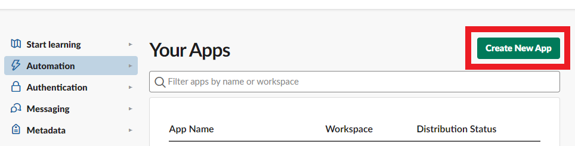

####


[](https://github.com/giulong/spectrum/actions?query=branch%3Adevelop)


[](https://www.oracle.com/java/technologies/javase-downloads.html)
[](https://opensource.org/licenses/Apache-2.0)
[](https://search.maven.org/search?q=g:io.github.giulong%20a:spectrum-archetype)
TODO MAVEN BADGE FIX URL

[ Giulio Longfils](https://www.linkedin.com/in/giuliolongfils/)

Spectrum is a [JUnit 5](https://junit.org/junit5/docs/current/user-guide/) and [Selenium 4](https://www.selenium.dev/) framework that aims to simplify the writing of e2e tests.
Main features:

* automatic [html report](#html-report) generation
* automatic coverage report generation by reading a [testbook](#testbook-coverage)
* automatic [mail/slack notifications](#events-consumers)
* fully configurable providing human-readable and [declarative yaml files](#configuration)
* out-of-the-box defaults to let you run tests with no additional configuration

Spectrum leverages JUnit's extension model to initialise and inject all the needed objects
directly in your test classes, so that you can focus just on writing the logic to test your application.

## Glossary

| Acronym | Meaning                                                                                                   |
|---------|-----------------------------------------------------------------------------------------------------------|
| AUT     | Application Under Test                                                                                    |
| POM     | [Page Object Model](https://www.selenium.dev/documentation/test_practices/encouraged/page_object_models/) |
| QG      | Quality Gate                                                                                              |
| POJO    | Plain Old Java Object                                                                                     |

## Setup

> ⚠️ JDK<br/>
> Since Spectrum is compiled with a jdk 17, you need a jdk 17+ to be able to run your tests.
> If you get an `Unsupported major.minor version` exception, the reason is that you're using an incompatible java version.

### Spectrum Archetype

You should leverage the latest published version of the [Spectrum Archetype](https://mvnrepository.com/artifact/io.github.giulong/spectrum-archetype) to create a new project.
You can either use it via your IDE, or run this from command line:

`mvn archetype:generate -DarchetypeGroupId=io.github.giulong -DarchetypeArtifactId=spectrum-archetype -DarchetypeVersion=LATEST -DgroupId=<YOUR GROUP ID> -DartifactId=<YOUR ARTIFACT ID>`

Needless to say that `<YOUR GROUP ID>` and `<YOUR ARTIFACT ID>` are placeholders that you need to replace with actual values.

The project created will contain a demo test you can immediately run.
If you don't want to leverage the archetype, you can manually add the Spectrum dependency to your project TODO maven link

### Test creation

In general, all you need to do is create a **JUnit 5** test class and make it extend the `SpectrumTest` class:

```Java
import io.github.giulong.spectrum.SpectrumTest;
import org.junit.jupiter.api.Test;

public class HelloWorldIT extends SpectrumTest<Void> {

    @Test
    public void dummyTest() {
        webDriver.get(configuration.getApplication().getBaseUrl());
    }
}
```

> ⚠️ Running with Maven<br/>
> If you run tests with Maven, the name of your test classes should end with `IT` as in the example above: `HelloWorldIT`,
> to leverage the [default inclusions](https://maven.apache.org/surefire/maven-failsafe-plugin/examples/inclusion-exclusion.html) of the failsafe plugin.

> 💡 Tip<br/>
> The default browser is `chrome`. If you want to use another one, you can switch via the `spectrum.browser` system property, setting its value to
> `firefox` or `edge`

If you now run the test, you will find a html report generated in the `target/spectrum/reports` folder.

> 💡 Tip<br/>
> Spectrum is tested with itself, so in this repo you can find real examples of Spectrum e2e tests.
> They're in the [it](it) and [it-testbook](it-testbook) modules. Throughout this doc, you will be pointed to specific examples.

# SpectrumTest and SpectrumPage

These are the two main entities you will need to know to fully leverage Spectrum:

* your test classes must extend [SpectrumTest](#spectrumtest)
* your test pages must extend [SpectrumPage](#spectrumpage)

## SpectrumTest

Your test classes must extend [SpectrumTest](spectrum/src/main/java/io/github/giulong/spectrum/SpectrumTest.java).
As you might have noticed in the examples above, you need to provide a generic parameter when extending it.
That is the `Data` type of your own. Be sure to check the [Data section](#data) below. In case you don't need any,
you just need to set `Void` as generic.

`SpectrumTest` extends [SpectrumEntity](#spectrumentity) and inherits its fields and methods.

Beyond having direct access to `webDriver`, `configuration`, `data`, and all the other inherited fields
that you don't even need to declare or instantiate, by extending `SpectrumTest`, each `SpectrumPage` that you declare
in your test class will automatically be initialised.

```Java
import io.github.giulong.spectrum.SpectrumTest;
import org.junit.jupiter.api.Test;

public class HelloWorldIT extends SpectrumTest<Void> {

    // page class that extends SpectrumPage. 
    // Simply declare it. Spectrum will initialise an instance and inject it
    private MyPage myPage;

    @Test
    public void dummyTest() {

        // getting direct access to both webDriver and configuration without declaring nor instantiating them.
        // Spectrum does that for you.
        // Here we're opening the landing page of the AUT
        webDriver.get(configuration.getApplication().getBaseUrl());

        // assuming in MyPage we have a WebElement named "button", now we're clicking on it
        myPage.getButton().click();
    }
}
```

> 💡 Example<br/>
> Check the [tests](it/src/test/java/io/github/giulong/spectrum/it/pages) package to see real examples of SpectrumTests.

## SpectrumPage

As per Selenium's best practices, you should leverage the [page object model](https://www.selenium.dev/documentation/test_practices/encouraged/page_object_models/)
to represent the objects of the web pages you need to interact with.
To fully leverage Spectrum, your pages must extend the [SpectrumPage](spectrum/src/main/java/io/github/giulong/spectrum/SpectrumPage.java) class.

`SpectrumPage` extends [SpectrumEntity](#spectrumentity) and inherits its fields and methods.

Each `SpectrumPage` takes two generics:

1. the page itself
2. the `Data` type of your own, the same used as generic in your SpectrumTests.

For example, assuming you need no data, this would be the signature of a page class named `WebAppPage`:

```java
import io.github.giulong.spectrum.SpectrumPage;

public class WebAppPage extends SpectrumPage<WebAppPage, Void> {
    // ...
}
```

> 💡 Example<br/>
> Check the [pages](it/src/test/java/io/github/giulong/spectrum/it/pages) package to see real examples of SpectrumPages.

### SpectrumPage Service Methods

By extending `SpectrumPage`, you will inherit few service methods listed here:

* `open()`:

  You can specify an endpoint for your pages by annotating them like this:

    ```java
    import io.github.giulong.spectrum.SpectrumPage;
    import io.github.giulong.spectrum.interfaces.Endpoint;
    
    @Endpoint("login")
    public class WebAppPage extends SpectrumPage<WebAppPage, Void> {
        // ...
    }
    ```

  Then, in your tests, you can leverage the `open` method. Spectrum will combine the AUT's base url from the `configuration*.yaml` with the endpoint:

    ```yaml
    # configuration.yaml
    application:
      baseUrl: http://my-app.com
    ```

    ```java
    public class HelloWorldIT extends SpectrumTest<Void> {
    
        private WebAppPage webAppPage;
    
        @Test
        public void myTest() {
            webAppPage.open();  // will open http://my-app.com/login
        }
    }
    ```

  Moreover, `open` will internally call the `waitForPageLoading` method.


* `waitForPageLoading()`:

  This is a method that by default just logs a warning. If you need to check for custom conditions before considering a page fully loaded,
  you should override this method, so that calling `open` on pages will call your implementation automatically.

  For example, you could have a spinner shown by default when opening pages, and disappearing once the page is fully loaded.
  You should override the `waitForPageLoading` like this:

    ```java
    
    import org.openqa.selenium.WebElement;
    import org.openqa.selenium.support.FindBy;
    import org.openqa.selenium.support.ui.ExpectedConditions;
    
    import static org.openqa.selenium.support.ui.ExpectedConditions.invisibilityOf;
    
    public class WebAppPage extends SpectrumPage<WebAppPage, Void> {
    
        @FindBy(id = "spinner")
        private WebElement spinner;
    
        @Override
        public WebAppPage waitForPageLoading() {
            pageLoadWait.until(invisibilityOf(spinner));
    
            return this;
        }
    }
    ```

  > 💡 Tip<br/>
  > Both the `open` and `waitForPageLoading` methods return the instance calling them.
  > This is meant to provide a [fluent API](https://en.wikipedia.org/wiki/Fluent_interface), so that you can rely on method chaining.
  > You should write your service methods with this in mind.
  >
  > Check [FilesIT](it-testbook/src/test/java/io/github/giulong/spectrum/it_testbook/tests/FilesIT.java) for an example:
  > ```java
    > uploadPage
    >     .open()
    >     .upload(uploadPage.getFileUpload(), FILE_TO_UPLOAD)
    >     .getSubmit()
    >     .click();
    > ```

* `isLoaded()`:

  This is a method to check if the caller page is loaded.
  It returns a boolean, which is true if the current url is equal to the AUT's base url combined with the page's endpoint.

    ```java
    public class HelloWorldIT extends SpectrumTest<Void> {
    
        private WebAppPage webAppPage;
    
        @Test
        public void myTest() {
            // assuming:
            //  - base url in configuration.yaml is http://my-app.com
            //  - webAppPage is annotated with @Endpoint("login")
            //  
            //  will be true if the current url in the browser is http://my-app.com/login
            boolean loaded = webAppPage.isLoaded();
        }
    }
    ```

## SpectrumEntity

[SpectrumEntity](spectrum/src/main/java/io/github/giulong/spectrum/SpectrumEntity.java) is the parent class of both `SpectrumTest` and `SpectrumPage`.
Whenever extending any of those, you will inherit its fields and methods.

Spectrum takes care of resolving and injecting all the fields below,
so you can directly use them in your tests/pages without caring about declaring nor instantiating them.

| Field            | Description                                                                                                                                                                                                                   |
|------------------|-------------------------------------------------------------------------------------------------------------------------------------------------------------------------------------------------------------------------------|
| configuration    | maps the result of the merge of all the `configuration*.yaml` files. You can use it to access to all of its values                                                                                                            |
| extentReports    | instance of the Extent Report                                                                                                                                                                                                 |
| extentTest       | instance linked to the section of the Extent Report that will represent the current test. You can use it to directly add info/screenshots programmatically.                                                                   |
| actions          | instance of Selenium [Actions class](https://www.selenium.dev/selenium/docs/api/java/org/openqa/selenium/interactions/Actions.html), useful to simulate complex user gestures                                                 |
| webDriver        | instance of the WebDriver running for the current test, configured in a declarative way via `configuration*.yaml`                                                                                                             |
| implicitWait     | instance of [WebDriverWait](https://www.selenium.dev/selenium/docs/api/java/org/openqa/selenium/support/ui/WebDriverWait.html) with the duration taken from the `webDriver.waits.implicit` in the `configuration.yaml`        |
| pageLoadWait     | instance of [WebDriverWait](https://www.selenium.dev/selenium/docs/api/java/org/openqa/selenium/support/ui/WebDriverWait.html) with the duration taken from the `webDriver.waits.pageLoadTimeout` in the `configuration.yaml` |
| scriptWait       | instance of [WebDriverWait](https://www.selenium.dev/selenium/docs/api/java/org/openqa/selenium/support/ui/WebDriverWait.html) with the duration taken from the `webDriver.waits.scriptTimeout` in the `configuration.yaml`   |
| downloadWait     | instance of [WebDriverWait](https://www.selenium.dev/selenium/docs/api/java/org/openqa/selenium/support/ui/WebDriverWait.html) with the duration taken from the `webDriver.waits.downloadTimeout` in the `configuration.yaml` |
| eventsDispatcher | you can use it to fire custom events. Check the [Custom Events section](#custom-events)                                                                                                                                       |
| data             | maps the result of the merge of all the `data*.yaml` files. You can use it to access to all of its values                                                                                                                     |

### SpectrumEntity Service Methods

> ⚠️ Methods returning `T`<br/>
> in the list below, the `T` return type means that method returns the caller instance, so you can leverage method chaining.

* `T hover(WebElement)`: hovers on the provided WebElement, leveraging the `actions` field
* `T screenshot()`: adds a screenshot at INFO level to the current test in the Extent Report
* `T screenshotInfo(String)`: adds a screenshot with the provided message and INFO status to the current test in the Extent Report
* `T screenshotWarning(String)`: adds a screenshot status with the provided message and WARN to the current test in the Extent Report
* `T screenshotFail(String)`: adds a screenshot with the provided message and FAIL status to the current test in the Extent Report
* `Media addScreenshotToReport(String, Status)`: adds a screenshot with the provided message and the provided status to the current test in the Extent Report
* `void deleteDownloadsFolder()`: deletes the download folder (its path is provided in the `configuration*.yaml`)
* `T waitForDownloadOf(Path)`: leverages the configurable `downloadWait` to check fluently if the file at the provided path is fully downloaded
* `boolean checkDownloadedFile(String, String)`: leverages the `waitForDownloadOf` method and then compares checksum of the two files provided. Check
  the [File Download section](#file-download)
* `boolean checkDownloadedFile(String)`: leverages the `waitForDownloadOf` method and then compares checksum of the file provided. Check the [File Download section](#file-download)
* `WebElement clearAndSendKeys(WebElement, CharSequence)`: helper method to call Selenium's `clear` and `sendKeys` on the provided WebElement, which is then returned
* `T upload(WebElement, String)`: uploads to the provided WebElement (usually an input field with `type="file"`) the file with the provided name, taken from the
  configurable `runtime.filesFolder`
* `boolean isNotPresent(By)`: checks if no WebElement with the provided `by` is present in the current page
* `boolean hasClass(WebElement, String)`: checks if the provided WebElement has the provided css class
* `boolean hasClasses(WebElement, String...)`: checks if the provided WebElement has **all** the provided css classes

# Configuration

Spectrum is fully configurable and comes with default values which you can find in the [configuration.default.yaml](spectrum/src/main/resources/yaml/configuration.default.yaml).
Be sure to check it: each key is properly commented to clarify its purpose.

> ⚠️ Running on *nix<br/>
> When running on *nix, the [configuration.default.unix.yaml](spectrum/src/main/resources/yaml/configuration.default.unix.yaml) will be merged onto the base one
> to set filesystem-specific values such as path separators.

To customise these values, you can create the `src/test/resources/configuration.yaml` file in your project.

> ⚠️ Files Extension<br/>
> The extension must be `.yaml`. The shortened `.yml` won't work.

Furthermore, you can provide how many profile-specific configurations in the same folder, by naming them
`configuration-<PROFILE>.yaml`, where `<PROFILE>` is a placeholder that you need to replace with the actual profile name.

To let Spectrum pick the right profiles-related configuration, you must run with the `-Dspectrum.profiles` flag,
which is a comma separated list of profile names you want to activate.

> 💡 Example<br/>
> When running tests with `-Dspectrum.profiles=test,grid`, Spectrum will merge these files in this order of precedence:
> 1. configuration.default.yaml [Spectrum internal defaults]
> 2. configuration.default.unix.yaml [Spectrum internal defaults for *nix, not read on Windows]
> 3. configuration.yaml
> 4. configuration-test.yaml [A warning will be raised if not found, no errors]
> 5. configuration-grid.yaml [A warning will be raised if not found, no errors]

Values in the most specific configuration file will take precedence over the others.

> 💡 Tip<br/>
> There's no need to repeat everything: configuration files are merged, so it's better to keep values that are common to all the profiles in the base configuration.yaml,
> while providing `<PROFILE>`-specific ones in the `configuration-<PROFILE>.yaml`

> ⚠️ Merging Lists<br/>
> Watch out that list-type nodes will not be overridden. Their values will be merged by appending elements! For example, if you have these:
>
> ```yaml
> # configuration.yaml
> someList:
>   - value1
> ```

>
> ```yaml
> # configuration-test.yaml
> someList:
>   - value2
> ```
>
> If you run with `-Dspectrum.profiles=test` both files will be loaded and lists will be merged, resulting in:
>
> ```yaml
> someList:
>   - value1
>   - value2
> ```

> 💡 Tip<br/>
> If you need different configurations for the same environment, instead of manually changing values in the configuration*.yaml, you should
> provide different files and choose the right one with the `-Dspectrum.profiles` flag. <br/>
> For example, if you need to be able to run from your local machine alternatively targeting a remote grid or executing browsers in local,
> it's preferable to have something like these two files, where you change just the target runtime:
> * configuration-local-local.yaml
> * configuration-local-grid.yaml
>
> In this way, you don't need to change any configuration file. This is important, since configurations are versioned alongside your tests,
> so you will avoid errors and will keep your scm history clean.
> You need just to activate the right one by creating different run configurations in your IDE.

> 💡 Tip<br/>
> Working in a team where devs need different local configurations? You can *gitignore* a file like `configuration-personal.yaml`,
> so that everyone can provide its own configuration without interfering with others.

> 💡 Example<br/>
> Check these configurations to see an example of merging:
> * [configuration.yaml](it-testbook/src/test/resources/configuration.yaml)
> * [configuration-first.yaml](it-testbook/src/test/resources/configuration-first.yaml)
> * [configuration-second.yaml](it-testbook/src/test/resources/configuration-second.yaml)
>
> The very first node of the base `configuration.yaml` linked above is setting the active profiles, instructing Spectrum to load the other two configurations,
> and overriding the `application.baseUrl` accordingly:
> ```yaml
> runtime:
>   profiles: local,second
> ```

## Vars node

The `vars` node is a special one in the `configuration.yaml`. You can use it to define common vars once and refer to them in several nodes.
`vars` is a `Map<String, String>`, so you can define all the keys you need, naming them how you want.

```yaml
vars:
  commonKey: some-value # commonKey is a name of your choice

node:
  property: ${commonKey} # Will be replaced with `some-value`

anotherNode:
  subNode:
    key: ${commonKey} # Will be replaced with `some-value`
```

## Values interpolation

Each non-object value in the configuration can be interpolated by placing a dollar-string like this:

```yaml
object:
  key: ${key:-defaultValue}
```

Where the `:-` is the separator between the name of the key to search for and the default value in case the key is not found. The default value is optional: you can just
have `${key}`

Spectrum will replace the dollar-string with the first value found in this list:

1. `key` in [vars node](#vars-node):
    ```yaml
    vars:
      key: value 
   ```
2. system property named `key`
3. `defaultValue` (if provided)

If the provided key can't be found, a warning will be raised. Both key name and default value can contain dots like in `${some.key:-default.value}`

> 💡 Tip<br/>
> This trick is widely used in the internal `configuration.default.yaml` to allow for variables to be read from outside.
> For example, the profiles are set like this:
> ```yaml
> # internal configuration.default.yaml
> runtime:
>   profiles: ${spectrum.profiles:-local}
> ```
> This allows you to just run with `-Dspectrum.profiles=...` while having a default, but you can still explicitly set them in your `configuration.yaml`:
> ```yaml
> # your configuration.yaml
> runtime:
>   profiles: my-profile,another-one
> ```
> You can also decide to provide your own variable:
> ```yaml
> # your configuration.yaml
> runtime:
>   profiles: ${active-profiles:-local}
> ```
> This could be useful to create and leverage your own naming convention for env variables.
>
> Be sure to check the internal `configuration.default.yaml` to see which variables are already available.

## Running on a Grid

By default, browsers run in local. This is because the default value in the internal `configuration.default.yaml` is:

```yaml
runtime:
  environment:
    local: { }
```

To run on a remote [grid](https://www.selenium.dev/documentation/grid/), you just need to change that node, providing at least the grid url:

```yaml
runtime:
  environment:
    grid:
      url: https://my-grid-url:4444/wd/hub
      capabilities:
        someCapability: its value
        another: blah
      localFileDetector: true
```

Where the params are:

| Param             | Type                | Default   | Mandatory | Description                                                                                                                                                                           |
|-------------------|---------------------|-----------|-----------|---------------------------------------------------------------------------------------------------------------------------------------------------------------------------------------|
| url               | String              | null      | ✅         | url of the remote grid                                                                                                                                                                |
| capabilities      | Map<String, String> | empty map | ❌         | additional webDriver capabilities to be added only when running on a grid                                                                                                             |
| localFileDetector | boolean             | false     | ❌         | if true, allows to transfer files from the client machine to the remote server [docs](https://www.selenium.dev/documentation/webdriver/drivers/remote_webdriver/#local-file-detector) |

# JSON Schema

You can find the JSON Schema for the `configuration*.yaml` in the [spectrum-json-schemas repository](https://github.com/giulong/spectrum-json-schemas).

If your IDE supports json schemas, be sure to pick the right one according to the version of Spectrum you are using.

The path to the raw file is: `https://raw.githubusercontent.com/giulong/spectrum-json-schemas/main/<SPECTRUM VERSION>/Configuration.json`,
where `<SPECTRUM VERSION>` must be replaced with the one you're using.

TODO check json schema url is accessible

# Automatically Generated Reports

After each execution, Spectrum automatically produces two files:

* [log](#log-file)
* [html report](#html-report)

## Log file

The log file will contain the same information you see in the console. It will be produced by default under the `target/spectrum/logs` folder.

It's generated using [Logback](https://logback.qos.ch/), and [here](spectrum/src/main/resources/logback.xml) you can find its configuration.
Logs are rotated daily, meaning the results of each execution occurred in the same day will be appended to the same file.

> 💡 Tip<br/>
> By default, logs are generated using a colored pattern. In case the console you use doesn't support it (if you see weird characters at the beginning of each line),
> you should deactivate colors by setting the `spectrum.log.colors` system properties to `false`.

## Html report

Spectrum generates a html report using [Extent Reports](https://www.extentreports.com/).
By default, it will be produced under the `target/spectrum/reports` folder.
Check the `extent` node in the `configuration.default.yaml` to see how to customise it.

You can see an example report here:


> 💡 Tip<br/>
> You can also provide your own *Look&Feel* by putting additional css rules in the `src/test/resources/css/report.css` file.
> Spectrum will automatically load and apply it to the Extent Report.

When running, the WebDriver is firing events that are automatically logged and added to the html report.
Check the `webDriver.events` node in the `configuration.default.yaml` to see the defaults log levels and messages.

You can also add logs to the report programmatically. Check the [SpectrumEntity Service Methods](#spectrumentity-service-methods) section for details.
For example, to add a screenshot with a message at INFO level to the `dummyTest`:

```Java
public class HelloWorldIT extends SpectrumTest<Void> {

    @Test
    public void dummyTest() {
        extentTest.screenshotInfo("Custom message");
    }
}
```

# Common Use Cases

Here there you can find how Spectrum helps you in few common use cases.

## File Upload

You can add files to be uploaded in the folder specified in the `runtime.filesFolder` node of the `configuration*.yaml`.
This is the default you can see in the internal `configuration.default.yaml`:

```yaml
runtime:
  filesFolder: src/test/resources/files
```

If you have these files in the configured folder:

```
root
└─ src
  └─ test
     └─ resources
        └─ files
           ├─ myFile.txt
           └─ document.pdf
```

If in the web page there's an input field with `type="file"`, you can leverage the `upload` method directly in any of your tests/pages like this:

```java
public class HelloWorldIT extends SpectrumTest<Void> {

    private WebAppPage webAppPage;

    @Test
    public void myTest() {
        WebElement fileUploadInput = webAppPage.getFileUploadInput();

        // leveraging method chaining
        webAppPage.open().upload(fileUploadInput, "myFile.txt");

        // directly invoking the upload
        upload(fileUploadInput, "document.pdf");
    }
}
```

> 💡 Example<br/>
> Check the [FilesIT.upload() test](it/src/test/java/io/github/giulong/spectrum/it/tests/FilesIT.java) to see a real example

## File Download

Files are downloaded in the folder specified as `vars.downloadsFolder` in the `configuration*.yaml`.
If needed, you should change this value, since this is used in several places, for example in all the browsers' capabilities.
So, this is a useful way to avoid redundancy and to be able to change all the values with one key.

When downloading a file from the AUT, you can leverage Spectrum to check if it's what you expected.
Technically speaking, checking the file's content is beyond the goal of a Selenium test, which aims to check web applications, so its boundary is the browser.

Given a file downloaded from the AUT (so, in the `vars.downloadsFolder`),
Spectrum helps checking it by comparing its SHA 256 checksum with the checksum of a file in the folder specified in the `runtime.filesFolder` node of the `configuration*.yaml`.

Let's explain this with an example. Let's say that:

* you want to check a file downloaded with the name `downloadedFile.txt`
* you rely on the default `filesFolder`, which is `src/test/resources/files`:

You need to place an exact copy of that file in that folder:

```
root
└─ src
  └─ test
     └─ resources
        └─ files
           └─ downloadedFile.txt
```

Now you can leverage the `checkDownloadedFile(String)` method like this:

```java
public class HelloWorldIT extends SpectrumTest<Void> {

    private WebAppPage webAppPage;

    @Test
    public void myTest() {
        assertTrue(checkDownloadedFile("downloadedFile.txt"));
    }
}
```

If the files are the same, their checksum will match, and that assertion will pass.
In case you need to check a file with a different name, for example if the AUT is generating file names dynamically,
you can leverage the overloaded `checkDownloadedFile(String, String)` method, which takes the names of both the downloaded file and the one to check:

```java
public class HelloWorldIT extends SpectrumTest<Void> {

    private WebAppPage webAppPage;

    @Test
    public void myTest() {
        // the first file will be searched in the downloadsFolder
        // the second file will be searched in the filesFolder
        assertTrue(checkDownloadedFile("downloadedFile.txt", "fileToCheck.txt"));
    }
}
```

> 💡 Example<br/>
> Check the [FilesIT.download() test](it/src/test/java/io/github/giulong/spectrum/it/tests/FilesIT.java) to see a real example

# Data

As a general best practice, test code should only contain the flow logic and assertions, while data should be kept outside.
Spectrum embraces this by leveraging dedicated yaml files. This is completely optional, you can run all your tests without any data file.

By default, you can create `data*.yaml` files under the `src/test/resources/data` folder.
Data files will be loaded and merged following the same conventions of `configurations*.yaml` files.

> 💡 Example<br/>
> When running tests with `-Dspectrum.profiles=test`, Spectrum will merge these files in this order of precedence:
> 1. data.yaml
> 2. data-test.yaml

For data files to be properly unmarshalled, you must create the corresponding POJOs and set the fqdn of your parent data class in the configuration.yaml.

Let's see an example. Let's say we want to test the AUT with two users with two different roles (admin and guest).
Both will have the same set of params, such as a name and a password to login.

We need to take four steps:

1. Create the yaml describing this scenario:

    ```yaml
    # data.yaml
    users:
      admin:
        name: ada
        password: secret
      guest:
        name: bob
        password: pwd
    ```

2. Create the POJO mapping the yaml above:

    ```java
    package your.package_name;  // this must be set in the configuration.yaml. Keep reading below :)
    
    import lombok.Getter;
    import java.util.Map;
    
    @Getter
    public class Data {
    
        private Map<String, User> users;
    
        @Getter
        public static class User {
            private String name;
            private String password;
        }
    }
    ```

   > ⚠️ Lombok Library<br/>
   The example above uses [Lombok](https://projectlombok.org/) to generate getters. Lombok is internally used in Spectrum, and provided
   as a transitive dependencies, so you can already use it. Be sure to check its docs to understand how to configure it in your IDE.
   If you don't want to leverage it, you can safely write getters the old way.

   > 💡 Tip<br/>
   The `User` class in the snippet above is declared as a static inner class. This is not mandatory, you could have plain public classes each in its own java file.

3. Make Spectrum aware of our Data class by providing its fqdn in the configuration.yaml:

    ```yaml
    # configuration.yaml    
    data:
      fqdn: your.package_name.Data  # Form: <package_name>.<class name>
    ```

4. Declare the Data class as generic in the SpectrumTest(s) that will use it:

    ```java
    import your.package_name.Data;
   
    public class SomeIT extends SpectrumTest<Data> { // &larr; Mind the generic here
        
        public void someTestMethod() {
            data.getUsers().get("admin").getName(); // we can now use the data object leveraging its getters. No need to declare/instantiate the 'data' field: Spectrum is taking care of injecting it.
        }
    }
    ```

This is just a simple example. Be sure to check the example repo for more complex use cases, such as data driven and parameterised tests.

> 💡 Tip<br/>
> For the sake of completeness, you can name the `Data` POJO as you prefer.
> You can name it `MySuperShinyWhatever.java` and have this as generic in you SpectrumTest(s):
> `public class SomeIT extends SpectrumTest<MySuperShinyWhatever> {`
>
> That said, I don't really see any valid use case for this. Let me know if you see one.

> 💡 Example<br/>
> Check the [data.yaml](it/src/test/resources/data/data.yaml) and how it's used in the [LoginFormIT](it/src/test/java/io/github/giulong/spectrum/it/tests/LoginFormIT.java).
> Look for the usage of `data.getUsers()` in that class.

# Project Structure

Let's see how your project will look like. Few assumptions for this example:

* you defined base values plus three profiles, each with its own set of Data:
    * [base] &rarr; `configuration.yaml` + `data.yaml`
    * local &rarr; `configuration-local.yaml` + `data-local.yaml`
    * test &rarr; `configuration-test.yaml` + `data-test.yaml`
    * uat &rarr; `configuration-uat.yaml` + `data-uat.yaml`
* you configured the yaml testbook parser, which will read the `testbook.yaml`
* you configured both a html and a txt testbook reporters, which will produce `testbook.html` and `testbook.txt` reports

```
root
└─ src
|  └─ test
|     ├─ java
|     |  └─ com.your.tests
|     |     └─ ...
|     └─ resources
|        ├─ data
|        |  ├─ data.yaml
|        |  ├─ data-local.yaml
|        |  ├─ data-test.yaml
|        |  └─ data-uat.yaml
|        ├─ configuration.yaml
|        ├─ configuration-local.yaml
|        ├─ configuration-test.yaml
|        ├─ configuration-uat.yaml
|        └─ testbook.yaml
├─ target
|  └─ spectrum
|     |─ logs
|     |  └─ spectrum.log   # rotated daily
|     |─ reports
|     |  |─ screenshots    # folder where Extent Reports screenshots are saved
|     |  └─ report.html    # by default the name ends with the timestamp
|     └─ testbook
|        |─ testbook.html  # by default the name ends with the timestamp
|        └─ testbook.txt   # by default the name ends with the timestamp
└─ pom.xml
```

# Parallel Execution

Spectrum tests can be run in parallel by leveraging [JUnit Parallel Execution](https://junit.org/junit5/docs/snapshot/user-guide/#writing-tests-parallel-execution)

# Event Sourcing

Spectrum leverages event sourcing, meaning throughout the execution it fires events at specific moments.
These events are sent in broadcast to a list of consumers.
Each consumer defines the events it's interested into. Whenever an event is fired, any consumer interested into that is notified,
performing the action it's supposed to (more in the [Events Consumers section](#events-consumers) below).

Each [event](spectrum/src/main/java/io/github/giulong/spectrum/pojos/events/Event.java) defines a set of keys that consumers can use to define the events they want to be
notified about:

| Field Name  | Type                                                                          | Match |
|-------------|-------------------------------------------------------------------------------|-------|
| primaryId   | String                                                                        | regex |
| secondaryId | String                                                                        | regex |
| tags        | Set<String>                                                                   | exact |
| reason      | String                                                                        | regex |
| result      | [Result](spectrum/src/main/java/io/github/giulong/spectrum/enums/Result.java) | exact |

Let's see them in detail:

### PrimaryId and SecondaryId

`primaryId` and `secondaryId` are strings through which you can identify each event. For example, for each test method, their value is:

* `primaryId` &rarr; \<CLASS NAME> meaning the actual name of the test class
* `secondaryId` &rarr; \<TEST NAME> meaning the actual name of the test method

Let's see what they mean with an example. Given the following test:

```Java
public class HelloWorldIT extends SpectrumTest<Void> {

    @Test
    public void dummyTest() {
        ...
    }
}
```

Spectrum will fire an event with:

* `primaryId` &rarr; "HelloWorldIT"
* `secondaryId` &rarr; "dummyTest()"

If the `@DisplayName` is provided for either the class and/or the method, those will be used. Given:

```Java

@DisplayName("Class display name")
public class HelloWorldIT extends SpectrumTest<Void> {

    @Test
    @DisplayName("Method display name")
    public void dummyTest() {
        ...
    }
}
```

Spectrum will fire an event with:

* `primaryId` &rarr; "Class display name"
* `secondaryId` &rarr; "Method display name"

### Tags

Tags are a set of strings used to group events together. For example, all test methods will have the "test" tag.
This way, instead of attaching a consumer to a specific event (with primary and secondary id, for example) you can listen
to all events tagged in a particular way, such as all the tests.

### Reason

Reason specifies why an event has been fired.

### Result

This is the result of the executed test. Of course, this will be available only in events fired after tests execution, as per the table below.

---

## Events fired

Spectrum fires these events. The first column in the table below highlights the moment when that specific event is fired.
The other columns are the event's keys, with blank values being nulls.

| Event description                 | primaryId     | secondaryId  | tags       | reason | result                                                 |
|-----------------------------------|---------------|--------------|------------|--------|--------------------------------------------------------|
| Suite started                     |               |              | \[ suite ] | before |                                                        |
| Suite ended                       |               |              | \[ suite ] | after  |                                                        |
| Class started (JUnit's BeforeAll) | \<CLASS NAME> |              | \[ class ] | before |                                                        |
| Class ended (JUnit's AfterAll)    | \<CLASS NAME> |              | \[ class ] | after  |                                                        |
| Test started (JUnit's BeforeEach) | \<CLASS NAME> | \<TEST NAME> | \[ test ]  | before |                                                        |
| Test ended (JUnit's AfterEach)    | \<CLASS NAME> | \<TEST NAME> | \[ test ]  | after  | NOT_RUN \| SUCCESSFUL \| FAILED \| ABORTED \| DISABLED |

> 💡 Tip<br/>
> If you're not sure about a particular event, when it's fired and what are the actual values of its keys,
> you can always run with `-Dspectrum.log.level=TRACE` and look into logs. You'll find something like:
> ```text
> 18:00:05.076 D EventsDispatcher          | Dispatching event Event(primaryId=null, secondaryId=null, tags=[suite], reason=before, result=null, context=null)
> 18:00:05.081 T EventsConsumer            | ExtentTestConsumer matchers for Event(primaryId=null, secondaryId=null, tags=[suite], reason=before, result=null, context=null)
> 18:00:05.081 T EventsConsumer            | reasonMatches: false
> 18:00:05.081 T EventsConsumer            | resultMatches: false
> 18:00:05.081 T EventsConsumer            | TestBookConsumer matchers for Event(primaryId=null, secondaryId=null, tags=[suite], reason=before, result=null, context=null)
> 18:00:05.081 T EventsConsumer            | reasonMatches: false
> 18:00:05.081 T EventsConsumer            | resultMatches: false
> ```

## Custom Events

Since `eventsDispatcher` is injected in every `SpectrumTest` and `SpectrumPage`, you can programmatically send custom events and listen to them:

```Java

@DisplayName("Class display name")
public class HelloWorldIT extends SpectrumTest<Void> {

    @Test
    @DisplayName("Method display name")
    public void dummyTest() {
        eventsDispatcher.fire("myCustom primary Id", "my custom reason");
    }
}
```

> 💡 Example<br/>
> Check the [DemoIT.events()](it/src/test/java/io/github/giulong/spectrum/it/tests/DemoIT.java) test to see how to fire custom events,
> and the related [configuration.yaml](it/src/test/resources/configuration.yaml) to check how `eventsConsumers` are set, leveraging regex matches
> (more on this below).

## Events Consumers

Time to understand what to do with events: we need consumers!

Given the events' keys defined above, the consumers list will be looped to check if any of those is interested into being notified.
This is done by comparing the fired event's keys with each consumer's events' keys.

Here below are the checks applied. Order matters:
as soon as a check is satisfied, the consumer is notified, and the subsequent checks will not be considered.
Spectrum will proceed with inspecting the next consumer.

1. reason and primaryId and secondaryId
2. reason and just primaryId
3. reason and tags
4. result and primaryId and secondaryId
5. result and just primaryId
6. result and tags

> ⚠️ Matches applied<br/>
> You can specify regexes to match Reason, primaryId, and secondaryId.<br/>
> To match tags and result you need to provide the exact value.

> ⚠️ Tags matchers condition<br/>
> In the conditions above, "tags" means that the set of tags of the fired event and the set of tags of the consumer events must intersect.
> This means that they don't need to be all matching, it's enough to have at least one match among all the tags. Few examples:

| Fired event's tags | Consumer event's tags | Match |
|--------------------|-----------------------|-------|
| \[ tag1, tag2 ]    | \[ tag1, tag2 ]       | ✅     |
| \[ tag1, tag2 ]    | \[ tag2 ]             | ✅     |
| \[ tag1 ]          | \[ tag1, tag2 ]       | ✅     |
| \[ tag1, tag2 ]    | \[ tag666 ]           | ❌     |

> ⚠️ Consumers exceptions<br/>
> Each consumer handles events silently, meaning if any exception is thrown during the handling of an event,
> that will be logged and the execution of the tests will continue without breaking. This is meant to avoid that something like a network issue
> during the sending of an email can cause the whole suite to fail.

> 💡 Tip<br/>
> You can configure how many consumers you need. Each consumer can listen to many events

Let's now see how to configure few consumers:

> 💡 Example: reason and primaryId and secondaryId<br/>
> We want to send a Slack notification before and after every test, and an email just after:
> ```yaml
> eventsConsumers:
>   - slack:
>       events:
>         - primaryId: Class Name 
>           secondaryId: test name 
>           reason: before
>         - primaryId: Class Name 
>           secondaryId: test name 
>           reason: after
>   - mail:
>       events:
>         - primaryId: Class Name 
>           secondaryId: test name 
>           reason: after
> ```

> 💡 Example: reason and primaryId and secondaryId<br/>
> We want to send a mail notification if the whole suite fails:
> ```yaml
> eventsConsumers:
>   - mail:
>       events:
>         - result: FAILED
>           tags: [ suite ]
> ```

> 💡 Example: custom event by primaryId and reason<br/>
> ```yaml
> eventsConsumers:
>   - slack:
>       events:
>         - primaryId: primary.*  # every event which primaryId is starting with "primary" 
>           reason: custom-event
> ```

### Mail Consumer

You can leverage this consumer to send email notification. Spectrum uses [Simple Java Mail](https://www.simplejavamail.org/),
and you can configure it with the file `src/test/resources/simplejavamail.properties`, as specified in
the [docs](https://www.simplejavamail.org/configuration.html#section-config-properties).

For example, to send an email via GMail, you can use these properties by replacing placeholders with actual values:

```properties
simplejavamail.transportstrategy=SMTP_TLS
simplejavamail.smtp.host=smtp.gmail.com
simplejavamail.smtp.port=587
simplejavamail.smtp.username=<YOUR GMAIL ADDRESS>
simplejavamail.smtp.password=<YOUR GMAIL PASSWORD>
simplejavamail.defaults.trustedhosts=smtp.gmail.com
simplejavamail.defaults.subject=Spectrum Notification
simplejavamail.defaults.to.name=<RECIPIENT NAME>
simplejavamail.defaults.to.address=<RECIPIENT EMAIL ADDRESS>
```

Actual configurations of any email provider to be used are out of scope. For the provided snippet,
check [Google's docs](https://support.google.com/accounts/answer/185833?p=InvalidSecondFactor) on how to generate an app password.

Check Simple Java Mail's docs to see all the [available properties](https://www.simplejavamail.org/configuration.html#section-available-properties).

> ⚠️ Mail Template<br/>
> The default [mail.html template](spectrum/src/main/resources/templates/mail.html) is meant to be used to notify about each test result,
> as per the snippet below. It might not be correctly interpolated if used on other events.
> ```yaml
> mail:
>   events:
>     - reason: after
>       tags: [ test ]
> ```
>
> If you want to provide a custom template there are two ways:
> 1. provide a template with a custom name under `src/test/resources/templates``:
     >   ```yaml
     > mail:
     > template: my-template.txt # The extension doesn't really matter.
     > events:
     >

- reason: after
  > tags: [ test ]
  >   ```  

> 2. simply create the file `src/test/resources/templates/mail.html`. This will override the internal default, so there's no need to explicitly provide the path.

> 💡 Tip<br/>
> You may add how many consumers you want, so if you want to use different templates just add different consumers and provide a template for each.
> Otherwise, if you set many events on the same consumer, they will share the template.

You can also specify a list of attachments, by providing:

* the name they will have in the email
* the path to the file

For example, it's useful to send the html report and/or testbook when the suite is complete:

```yaml
mail:
  events:
    - reason: after
      tags: [ suite ]
  attachments:
    - name: report
      file: target/spectrum/reports/report.html
    - name: testbook
      file: target/spectrum/testbook/testbook.html
```

### Slack Consumer

A few steps are needed to configure your Slack Workspace to receive notifications from Spectrum:

1. You need to create an app [from here](https://api.slack.com/apps) by following these steps:<br/><br/>
    1. click on the **Create New App** button:<br/><br/>
       <br/><br/>
    2. choose to create it **from an app manifest**<br/><br/>
       <br/><br/>
    3. Select your workspace, delete the default yaml manifest and copy this one:<br/><br/>
       ```yaml
       display_information:
         name: Spectrum
         description: Notification from Spectrum Selenium Framework
         background_color: "#2c2d30"
       features:
         bot_user:
           display_name: Spectrum
           always_online: false
       oauth_config:
         scopes:
           bot:
             - channels:read
             - chat:write
             - incoming-webhook
       settings:
         org_deploy_enabled: false
         socket_mode_enabled: false
         token_rotation_enabled: false
       ```
    4. Click on **Next** and then **Create**<br/><br/>
2. You should have been redirected to the **Basic Information** page of the newly created app. From there:<br/><br/>
    1. Install the app to Workspace:<br/><br/>
       <br/><br/>
    2. Choose the channel where you want to receive the notifications and click **Allow**:<br/><br/>
       <br/><br/>
3. Go in the **OAuth & Permissions** page and copy the **Bot User OAuth Token**. You will need this in the `configuration*.yaml` (see last bullet)<br/><br/>
   <br/><br/>
4. In Slack:<br/><br/>
    1. open the channel you chose in the previous steps and invite the Spectrum app by sending this message: `/invite @Spectrum`. You should see this after sending it:<br/><br/>
       <br/><br/>
    2. right-click on the channel you chose in the previous steps and select **View channel details**:<br/><br/>
       <br/><br/>
    3. copy the **Channel ID** from the details overlay:<br/><br/>
       <br/><br/>
5. Configure the Slack consumer(s) in your `configuration*.yaml` by providing the **token** and the **Channel ID** from the previous steps:<br/><br/>
   ```yaml
   - slack:
       token: xoxb-***
       channel: C05***
       template: slack-suite.json
       events:
         - reason: after
           tags: [ test ]
   ```
6. If everything is configured correctly, with the consumer above you should receive a notification at the very beginning of your test suite.

> ⚠️ Slack Template<br/>
> The default [slack.json template](spectrum/src/main/resources/templates/slack.json) is meant to be used to notify about each test result,
> as per the snippet below. It might not be correctly interpolated if used on other events.
> ```yaml
> slack:
>   events:
>     - reason: after
>       tags: [ test ]
> ```
>
> If you want to provide a custom template there are two ways:
> * provide a template with a custom name under `src/test/resources/templates`:
> ```yaml
> slack:
>   template: my-template.txt # The extension doesn't really matter.
>   events:
>     - reason: after
>       tags: [ test ]
> ```
>* simply create the file `src/test/resources/templates/slack.json`. This will override the internal default, so there's no need to explicitly provide the path.

> 💡 Tip<br/>
> You may add how many consumers you want, so if you want to use different templates just add different consumers and provide a template for each.
> Otherwise, if you set many events on the same consumer, they will share the template.

# TestBook (Coverage)

Talking about coverage for e2e tests is not so straightforward. Coverage makes sense for unit tests, since they directly run against methods,
so it's easy to check which lines were covered during the execution.
On the other hand, e2e tests run against a long living instance of the AUT, with no visibility on the source code.

As e2e tests are tied to the business functionalities of the AUT, so should be their coverage.
Spectrum helps you to keep track of which functionalities are covered by parsing a testbook, in which you can declare all the tests
of your full suite. When running them, Spectrum will check which were executed and which not, generating a dedicated report in several formats.

These are the information needed in a testbook:

| Field      | Type   | Default | Mandatory | Description                                                                                     |
|------------|--------|---------|-----------|-------------------------------------------------------------------------------------------------|
| Class Name | String | null    | ✅         | enclosing class name                                                                            |
| Test Name  | String | null    | ✅         | name of the test method                                                                         |
| Weight     | int    | 1       | ❌         | optional number representing the importance of the related test, with regards to all the others |

In short, we need to uniquely identify each test by their class name and method name.
Method name alone is not enough, since there might be test methods with the same name in different classes.

You can also give a weight to each test: you can give a higher weight to those functionalities that are more important or critical.
In the report produced, tests will be also aggregated considering their weights. In this way, the final coverage percentage varies based on the weights,
meaning critical functionalities will have a higher impact on the outcome.

Additionally, you can set a Quality Gate, which is a boolean condition that will be evaluated to mark the suite as successful or not.

These are the testbook parameters you need to configure:

| Parameter                        | Description                                                                                 |
|----------------------------------|---------------------------------------------------------------------------------------------|
| [qualityGate](#quality-gate)     | object holding the condition to be evaluated to consider the execution successful or failed |
| [parser](#testbook-parsers)      | object specifying the format of the testbook                                                |
| [reporters](#testbook-reporters) | list of objects to specify which kind of report(s) to produce                               |

## Quality Gate

The QG node has only one property, which is the boolean condition to be evaluated:

```yaml
qualityGate:
  condition: ${weightedSuccessful.percentage} > 60
```

This means that the execution is considered successful if at least 60% of the weighted tests are successful.

The condition is evaluated leveraging [FreeMarker](https://freemarker.apache.org/), meaning you can write complex conditions using the variables
briefly explained below. They're all put in the `vars` map in the [TestBook.java](spectrum/src/main/java/io/github/giulong/spectrum/utils/testbook/TestBook.java)
(check the `mapVars()` method).

> ⚠️ FreeMarker<br/>
> Explaining how FreeMarker works, and how to take the most out of it, goes beyond the goal of this doc.
> Please check its own [docs](https://freemarker.apache.org/).

Generic variables:

| Variable                                                                                               | Description                                                                         |
|--------------------------------------------------------------------------------------------------------|-------------------------------------------------------------------------------------|
| mappedTests                                                                                            | map of tests found in the provided testbook                                         |
| unmappedTests                                                                                          | map of tests not found in the provided testbook                                     |
| groupedMappedTests                                                                                     | like mappedTests, but grouped by class names                                        |
| groupedUnmappedTests                                                                                   | like unmappedTests, but grouped by class names                                      |
| [statistics](spectrum/src/main/java/io/github/giulong/spectrum/pojos/testbook/TestBookStatistics.java) | object containing all the object reported in the tables below, plus additional ones |
| [qg](spectrum/src/main/java/io/github/giulong/spectrum/pojos/testbook/QualityGate.java)                | qualityGate node from `configuration*.yaml`                                         |
| timestamp                                                                                              | when the testbook was generated                                                     |

Each key in the lists below is an instance of the inner static class [Statistics](spectrum/src/main/java/io/github/giulong/spectrum/pojos/testbook/TestBookStatistics.java),
and it holds both a `total` int field and a `percentage` double field.
For example, given the `successful` key here below, you can access:

* ${successful.total}
* ${successful.percentage}

Statistics of tests mapped in the testbook:

* successful
* failed
* aborted
* disabled
* notRun

Statistics of tests, mapped or not in the provided testbook, based on their weights:

* grandSuccessful
* grandFailed
* grandAborted
* grandDisabled
* grandNotRun

Statistics of tests mapped in the testbook, based on their weights

* weightedSuccessful
* weightedFailed
* weightedAborted
* weightedDisabled
* weightedNotRun

Statistics of all tests, mapped or not in the testbook, based on their weights

* grandWeightedSuccessful
* grandWeightedFailed
* grandWeightedAborted
* grandWeightedDisabled
* grandWeightedNotRun

> 💡 Tip<br/>
> It's hard to explain and grasp each of these vars. The best way is to:
> 1. check the [default html template](spectrum/src/main/resources/testbook/template.html) and the [default txt template](spectrum/src/main/resources/testbook/template.txt)
> 2. run your suite with the html reporter as explained below
> 3. check the outcome

## TestBook Parsers

### Txt TestBook Parser

You can provide a txt file where each line is in this format:

`<CLASS NAME>::<TEST NAME>##<WEIGHT>`

For example:

```text
test class::my test
another class::another test
another class::weighted test##123
```

### Csv TestBook Parser

You can provide a csv file where each line is in this format:

`<CLASS NAME>,<TEST NAME>,<WEIGHT>`

For example:

```text
test class,my test
another class,another test
another class,weighted test,123
```

### Yaml TestBook Parser

You can provide a yaml file where you have class names as keys in the root of the file. Each of those is mapped to a list of objects made of two fields:

* name
* weight (optional)

For example:

```yaml
test class:
  - name: my test

another class:
  - name: another test
  - name: weighted test
    weight: 123
```

## TestBook Reporters

All the reporters below have default values for their parameter, which means you can just configure them as empty objects like:

```yaml
reporters:
  - log: { }
  - txt: { }
  - html: { }
```

Of course, they're all optional: you can add just those you want.

For each reporter:

* values reported in the snippets below are the defaults (no need to provide them)
* `template` is a path relative to `src/test/resources`
* `output` parameter can contain the `{timestamp}` placeholder, which will be evaluated

### Log TestBook Reporter

```yaml
log:
  template: testbook/template.txt
```

### Txt TestBook Reporter

```yaml
txt:
  template: testbook/template.txt
  output: target/spectrum/testbook/testbook-{timestamp}.txt
```

### Html TestBook Reporter

```yaml
html:
  template: testbook/template.html
  output: target/spectrum/testbook/testbook-{timestamp}.html
```

## Full TestBook Examples

```yaml
testBook:
  qualityGate:
    condition: ${weightedSuccessful.percentage} > 60  # The execution is considered successful if at least 60% of the weighted tests are successful
  parser:
    yaml:
      path: testbook.yaml # we provided the yaml testbook in src/test/resources/testbook.yaml
  reporters:
    - log: { }  # the report will be logged
    - txt:
        output: target/spectrum/testbook/testbook.txt # a text report will be produced at this path
    - html:
        output: target/spectrum/testbook/testbook.html # a html report will be produced at this path
```

```yaml
testBook:
  qualityGate:
    condition: ${weightedSuccessful.percentage} > 60  # The execution is considered successful if at least 60% of the weighted tests are successful
  parser:
    yaml:
      path: testbook.yaml # we provided the yaml testbook in src/test/resources/testbook.yaml
  reporters:
    - txt:
        template: template.txt  # we want to produce a text report based on a custom template in src/test/resources
    - html:
        template: my-custom-template.html # src/test/resources/my-custom-template.html
        output: some/path/testbook.html # a html report will be produced at this path
```

```yaml
testBook:
  qualityGate:
    condition: ${weightedSuccessful.percentage} > 40 || ${failed} < 10  # We want the testbook to be marked as successful if we have at least 40% of successful weighted tests or less than 10 tests failed
  parser:
    txt:
      path: testbook.txt # we provided the yaml testbook in src/test/resources/testbook.txt
  reporters:
    - log: { }  # we just want the report to be logged
```
