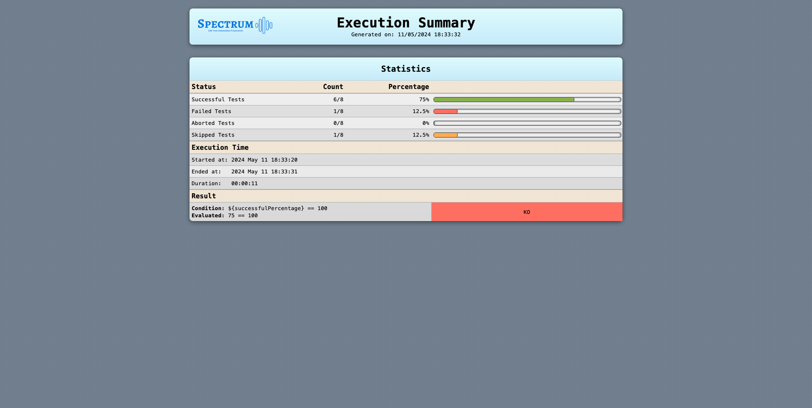

# Introduction

Spectrum is a [JUnit 5](https://junit.org/junit5/docs/current/user-guide/){:target="_blank"} and [Selenium 4](https://www.selenium.dev/){:target="_blank"} framework that aims to
simplify the writing of e2e tests, providing these features:

* automatic [execution video](#automatic-execution-video-generation) generation
* automatic [log and html report](#automatically-generated-reports) generation
* automatic [coverage report](#testbook---coverage) generation by reading a testbook
* automatic [mail/slack notifications](#events-consumers) with reports as attachments
* reduces flakiness with [auto-waiting](#auto-waiting)
* fully configurable providing human-readable and [declarative yaml files](#configuration)
* out-of-the-box defaults to let you run tests with no additional configuration

Spectrum leverages JUnit's extension model to initialise and inject all the needed objects
in your test classes, so that you can focus just on writing the logic to test your application.

Spectrum supports both **browsers automation** via [Selenium](https://www.selenium.dev/){:target="_blank"}
and **mobile and desktop applications** via [Appium](http://appium.io/docs/en/latest/){:target="_blank"}.

## Glossary

| Acronym | Meaning                                                                                                                     |
|---------|-----------------------------------------------------------------------------------------------------------------------------|
| AUT     | Application Under Test                                                                                                      |
| POM     | [Page Object Model](https://www.selenium.dev/documentation/test_practices/encouraged/page_object_models/){:target="_blank"} |
| QG      | Quality Gate                                                                                                                |
| POJO    | Plain Old java Object                                                                                                       |

# Setup

> ⚠️ **JDK**<br/>
> Since Spectrum is compiled with a jdk 21, you need a [jdk 21+](https://jdk.java.net/archive/){:target="_blank"} to be able to run your tests.
> If you get an `Unsupported major.minor version` exception, the reason is that you're using an incompatible java version.

## Spectrum Archetype

You should leverage the latest published version of the [Spectrum Archetype](https://mvnrepository.com/artifact/io.github.giulong/spectrum-archetype){:target="_blank"} to create a
new project either via your IDE or by running this from command line:



```shell
mvn archetype:generate -DarchetypeGroupId=io.github.giulong -DarchetypeArtifactId=spectrum-archetype -DarchetypeVersion=LATEST
```

> ⚠️ **Maven archetype:generate**<br/>
> If you want to tweak the behaviour of the command above, check the
> official [archetype:generate docs](https://maven.apache.org/archetype/maven-archetype-plugin/generate-mojo.html){:target="_blank"}.

The project created contains a demo test you can immediately run.
If you don't want to leverage the archetype, you can manually add the [Spectrum dependency](https://mvnrepository.com/artifact/io.github.giulong/spectrum){:target="_blank"} to your
project:

## Maven



```xml

<dependency>
    <groupId>io.github.giulong</groupId>
    <artifactId>spectrum</artifactId>
    <version>1.22.2</version>
    <scope>test</scope>
</dependency>
```

## Gradle



```gradle
dependencies {
  implementation group: 'io.github.giulong', name: 'spectrum', version: '1.22.2'
}
```

## Test creation

In general, all you need to do is create a **JUnit 5** test class extending the `SpectrumTest` class:



```java
import io.github.giulong.spectrum.SpectrumTest;
import org.junit.jupiter.api.Test;

public class HelloWorldIT extends SpectrumTest<Void> {

    @Test
    public void dummyTest() {
        driver.get(configuration.getApplication().getBaseUrl());
    }
}
```

After running it, you will find a html report in the `target/spectrum/reports` folder.

> ⚠️ **Running with Maven**<br/>
> If you run tests with Maven, the name of your test classes should end with `IT` as in the example above (`HelloWorldIT`),
> to leverage the [default inclusions](https://maven.apache.org/surefire/maven-failsafe-plugin/examples/inclusion-exclusion.html){:target="_blank"} of the failsafe plugin.

> 💡 **Tip**<br/>
> The default driver is `chrome`. If you want to use another one, you can switch via the `-Dspectrum.driver` system property, setting its value to one of the possible values:
> * `-Dspectrum.driver=chrome`
> * `-Dspectrum.driver=firefox`
> * `-Dspectrum.driver=edge`
> * `-Dspectrum.driver=safari`
> * `-Dspectrum.driver=uiAutomator2`
> * `-Dspectrum.driver=espresso`
> * `-Dspectrum.driver=xcuiTest`
> * `-Dspectrum.driver=windows`
> * `-Dspectrum.driver=mac2`
> * `-Dspectrum.driver=appiumGeneric`

> 💡 **Tip**<br/>
> The default log level is `INFO`. If you want to change it, run with `-Dspectrum.log.level=<LEVEL>`,
> for example:
> * `-Dspectrum.log.level=DEBUG`
> * `-Dspectrum.log.level=TRACE`

---

# SpectrumTest and SpectrumPage

These are the two main entities you will need to know to fully leverage Spectrum:

* your test classes must extend [SpectrumTest](#spectrumtest)
* your test pages must extend [SpectrumPage](#spectrumpage)

> 💡 **Tip**<br/>
> Check the [Javadoc](https://javadoc.io/doc/io.github.giulong/spectrum/latest/index.html){:target="_blank"}
> for a detailed api description of
> [SpectrumTest](https://javadoc.io/doc/io.github.giulong/spectrum/latest/io/github/giulong/spectrum/SpectrumTest.html){:target="_blank"},
> [SpectrumPage](https://javadoc.io/doc/io.github.giulong/spectrum/latest/io/github/giulong/spectrum/SpectrumPage.html){:target="_blank"},
> and their superclass [SpectrumEntity](https://javadoc.io/doc/io.github.giulong/spectrum/latest/io/github/giulong/spectrum/SpectrumEntity.html){:target="_blank"}

## SpectrumTest

Your test classes must extend [SpectrumTest]({{ site.repository_url }}/spectrum/src/main/java/io/github/giulong/spectrum/SpectrumTest.java){:target="_blank"}.
As you might have noticed in the examples above, you need to provide a generic parameter when extending it.
That is the [Data](#data) type of your own. In case you don't need any,
you just need to set `Void` as generic.

`SpectrumTest` extends [SpectrumEntity](#spectrumentity) and inherits its fields and methods.

Beyond having direct access to `driver`, `configuration`, `data`, and all the other inherited objects,
by extending `SpectrumTest` each `SpectrumPage` that you declare
in your test class will automatically be initialised.



```java
import io.github.giulong.spectrum.SpectrumTest;
import org.junit.jupiter.api.Test;

public class HelloWorldIT extends SpectrumTest<Void> {

    // page class that extends SpectrumPage. 
    // Simply declare it. Spectrum will inject it
    private MyPage myPage;

    @Test
    public void dummyTest() {

        // getting direct access to both driver and configuration without declaring
        // nor instantiating them. Spectrum does that for you.
        // Here we're opening the landing page of the AUT
        driver.get(configuration.getApplication().getBaseUrl());

        // assuming in MyPage we have a WebElement named "button", now we're clicking on it
        myPage.getButton().click();
    }
}
```

> 💡 **Example**<br/>
> Check the [tests]({{ site.repository_url }}/it/src/test/java/io/github/giulong/spectrum/it/tests){:target="_blank"} package to see real examples of SpectrumTests.

## SpectrumPage

As per Selenium's best practices, you should leverage the [page object model](https://www.selenium.dev/documentation/test_practices/encouraged/page_object_models/){:target="_
blank"}
to represent the objects of the web pages you need to interact with.
To fully leverage Spectrum, your pages must extend the [SpectrumPage]({{ site.repository_url }}/spectrum/src/main/java/io/github/giulong/spectrum/SpectrumPage.java){:
target="_blank"} class.

`SpectrumPage` extends [SpectrumEntity](#spectrumentity) and inherits its fields and methods.

Each `SpectrumPage` takes two generics:

1. the page itself
2. the `Data` type of your own, the same used as generic in your SpectrumTests.

For example, assuming you need no data, this would be the signature of a page class named `WebAppPage`:



```java
import io.github.giulong.spectrum.SpectrumPage;

public class WebAppPage extends SpectrumPage<WebAppPage, Void> {
    // ...
}
```

> 💡 **Example**<br/>
> Check the [pages]({{ site.repository_url }}/it/src/test/java/io/github/giulong/spectrum/it/pages){:target="_blank"} package to see real examples of SpectrumPages.

### SpectrumPage Service Methods

By extending `SpectrumPage`, you inherit few service methods listed here:

* `open()`:

  You can specify an endpoint for your pages by annotating them with the `@Endpoint` annotation:



```java
import io.github.giulong.spectrum.SpectrumPage;
import io.github.giulong.spectrum.interfaces.Endpoint;

@Endpoint("login")
public class WebAppPage extends SpectrumPage<WebAppPage, Void> {
    // ...
}
```

Then, in your tests, you can leverage the `open` method. Spectrum will combine the AUT's base url from the `configuration*.yaml` with the endpoint:



```yaml
# configuration.yaml
application:
  baseUrl: http://my-app.com
```



```java
public class HelloWorldIT extends SpectrumTest<Void> {

    private WebAppPage webAppPage;

    @Test
    public void myTest() {
        webAppPage.open();  // will open http://my-app.com/login
    }
}
```

Moreover, `open` will internally call the `waitForPageLoading` method.

* `waitForPageLoading()`:

  This is a method that by default just logs a warning. If you need to check for custom conditions before considering a page fully loaded,
  you should override this method, so that calling `open` on pages will call your implementation automatically.

  For example, you could have a spinner shown by default when opening pages, and disappearing once the page is fully loaded.
  You should override the `waitForPageLoading` like this:



```java
import org.openqa.selenium.WebElement;
import org.openqa.selenium.support.FindBy;
import org.openqa.selenium.support.ui.ExpectedConditions;

import static org.openqa.selenium.support.ui.ExpectedConditions.invisibilityOf;

public class WebAppPage extends SpectrumPage<WebAppPage, Void> {

    @FindBy(id = "spinner")
    private WebElement spinner;

    @Override
    public WebAppPage waitForPageLoading() {
        pageLoadWait.until(invisibilityOf(spinner));

        return this;
    }
}
```

💡 **Tip**<br/>
Both the `open` and `waitForPageLoading` methods return the instance calling them.
This is meant to provide a [fluent API](https://en.wikipedia.org/wiki/Fluent_interface){:target="_blank"}, so that you can rely on method chaining.
You should write your service methods with this in mind.
Check [FilesIT]({{ site.repository_url }}/it-testbook/src/test/java/io/github/giulong/spectrum/it_testbook/tests/FilesIT.java){:target="_blank"} for an example:



```java
uploadPage
        .open()
        .upload(uploadPage.getFileUpload(),FILE_TO_UPLOAD)
        .getSubmit()
        .click();
```

* `isLoaded()`:

  This is a method to check if the caller page is loaded.
  It returns a boolean which is true if the current url is equal to the AUT's base url combined with the page's endpoint.



```java
public class HelloWorldIT extends SpectrumTest<Void> {

    private WebAppPage webAppPage;

    @Test
    public void myTest() {
        // assuming:
        //  - base url in configuration.yaml is http://my-app.com
        //  - webAppPage is annotated with @Endpoint("login")
        //  
        //  will be true if the current url in the driver is http://my-app.com/login
        boolean loaded = webAppPage.isLoaded();
    }
}
```

## SpectrumEntity

[SpectrumEntity]({{ site.repository_url }}/spectrum/src/main/java/io/github/giulong/spectrum/SpectrumEntity.java){:target="_blank"} is the parent class of
both `SpectrumTest` and `SpectrumPage`.
Whenever extending any of those, you will inherit its fields and methods.

Spectrum takes care of resolving and injecting all the fields below,
so you can directly use them in your tests/pages.

> 💡 **Tip**<br/>
> Check the [Javadoc](https://javadoc.io/doc/io.github.giulong/spectrum/latest/index.html){:target="_blank"}
> for a detailed api description of
> [SpectrumTest](https://javadoc.io/doc/io.github.giulong/spectrum/latest/io/github/giulong/spectrum/SpectrumTest.html){:target="_blank"},
> [SpectrumPage](https://javadoc.io/doc/io.github.giulong/spectrum/latest/io/github/giulong/spectrum/SpectrumPage.html){:target="_blank"},
> and their superclass [SpectrumEntity](https://javadoc.io/doc/io.github.giulong/spectrum/latest/io/github/giulong/spectrum/SpectrumEntity.html){:target="_blank"}

| Field            | Description                                                                                                                                                                                                                                           |
|------------------|-------------------------------------------------------------------------------------------------------------------------------------------------------------------------------------------------------------------------------------------------------|
| configuration    | maps the result of the merge of all the `configuration*.yaml` files. You can use it to access to all of its values                                                                                                                                    |
| extentReports    | instance of the Extent Report                                                                                                                                                                                                                         |
| extentTest       | instance linked to the section of the Extent Report that will represent the current test. You can use it to add info/screenshots programmatically.                                                                                                    |
| actions          | instance of Selenium [Actions class](https://www.selenium.dev/selenium/docs/api/java/org/openqa/selenium/interactions/Actions.html){:target="_blank"}, useful to simulate complex user gestures                                                       |
| testData         | instance of [TestData]({{ site.repository_url }}/spectrum/src/main/java/io/github/giulong/spectrum/types/TestData.java){:target="_blank"} that contains info related to the current test                                                              |
| driver           | instance of the [WebDriver](https://www.selenium.dev/documentation/webdriver/){:target="_blank"} running for the current test, configured via the `configuration*.yaml`                                                                               |
| implicitWait     | instance of [WebDriverWait](https://www.selenium.dev/selenium/docs/api/java/org/openqa/selenium/support/ui/WebDriverWait.html){:target="_blank"} with the duration taken from the `drivers.waits.implicit` in the `configuration.yaml`                |
| pageLoadWait     | instance of [WebDriverWait](https://www.selenium.dev/selenium/docs/api/java/org/openqa/selenium/support/ui/WebDriverWait.html){:target="_blank"} with the duration taken from the `drivers.waits.pageLoadTimeout` in the `configuration.yaml`         |
| scriptWait       | instance of [WebDriverWait](https://www.selenium.dev/selenium/docs/api/java/org/openqa/selenium/support/ui/WebDriverWait.html){:target="_blank"} with the duration taken from the `drivers.waits.scriptTimeout` in the `configuration.yaml`           |
| downloadWait     | instance of [WebDriverWait](https://www.selenium.dev/selenium/docs/api/java/org/openqa/selenium/support/ui/WebDriverWait.html){:target="_blank"} with the duration taken from the `drivers.waits.downloadTimeout` in the `configuration.yaml`         |
| eventsDispatcher | you can use it to fire [custom events](#custom-events)                                                                                                                                                                                                |
| js               | instance of [Js](https://javadoc.io/doc/io.github.giulong/spectrum/latest/io/github/giulong/spectrum/utils/Js.html){:target="_blank"}. Check the [Javascript Executor](#javascript-executor) paragraph to see the available Javascript helper methods |
| data             | maps the result of the merge of all the `data*.yaml` files. You can use it to access to all of its values                                                                                                                                             |

### SpectrumEntity Service Methods

> ⚠️ **Methods returning `T`**<br/>
> in the list below, the `T` return type means that method returns the caller instance, so you can leverage method chaining.

* `T hover(WebElement)`: hovers on the provided WebElement, leveraging the `actions` field
* `T screenshot()`: adds a screenshot at INFO level to the current test in the Extent Report
* `T screenshotInfo(String)`: adds a screenshot with the provided message and INFO status to the current test in the Extent Report
* `T screenshotWarning(String)`: adds a screenshot status with the provided message and WARN to the current test in the Extent Report
* `T screenshotFail(String)`: adds a screenshot with the provided message and FAIL status to the current test in the Extent Report
* `Media addScreenshotToReport(String, Status)`: adds a screenshot with the provided message and the provided status to the current test in the Extent Report
* `void deleteDownloadsFolder()`: deletes the download folder (its path is provided in the `configuration*.yaml`)
* `T waitForDownloadOf(Path)`: leverages the configurable `downloadWait` to check fluently if the file at the provided path is fully downloaded
* `boolean checkDownloadedFile(String, String)`: leverages the `waitForDownloadOf` method and then compares checksum of the two files provided. Check
  the [File Download section](#file-download)
* `boolean checkDownloadedFile(String)`: leverages the `waitForDownloadOf` method and then compares checksum of the file provided. Check the [File Download section](#file-download)
* `WebElement clearAndSendKeys(WebElement, CharSequence)`: helper method to call Selenium's `clear` and `sendKeys` on the provided WebElement, which is then returned
* `T upload(WebElement, String)`: uploads to the provided WebElement (usually an input field with `type="file"`) the file with the provided name, taken from the
  configurable `runtime.filesFolder`. Check the [File Upload section](#file-upload)
* `boolean isPresent(By)`: checks if the WebElement with the provided `by` is present in the current page
* `boolean isNotPresent(By)`: checks if no WebElement with the provided `by` is present in the current page
* `boolean hasClass(WebElement, String)`: checks if the provided WebElement has the provided css class
* `boolean hasClasses(WebElement, String...)`: checks if the provided WebElement has **all** the provided css classes

---

# Drivers and Environments

The two main things you need when running an e2e test are the **driver** and the **environment**.
Spectrum lets you configure all the supported values in the same configuration file, and then select the ones
to be activated either via the same configuration or via runtime properties.
Let's see a configuration snippet to have a clear picture:



```yaml
# All needed drivers' configurations
drivers:
  waits:
    downloadTimeout: 5
  chrome:
    args:
      - --headless=new
  firefox:
    args:
      - -headless
  edge:
    args:
      - --headless=new
    experimentalOptions:
      binary: /usr/bin/microsoft-edge

# All needed environments' configuration. This is the default environments node, 
# so no need to explicitly override this with these values
environments:
  local: { }
  grid:
    url: http://localhost:4444/wd/hub
  appium:
    url: http://localhost:4723/

# Node to select, among other properties, a specific driver and environment. This is the default, no need to explicitly set these.
runtime:
  driver: ${spectrum.driver:-chrome}
  environment: ${spectrum.environment:-local}
```

> 💡 **Tip**<br/>
> The snippet above leverages [interpolation](#values-interpolation).

As you can see in the snippet above, in the `configuration.yaml` you can statically configure many drivers such as `chrome`, `firefox`, `edge` and
many environments such as `local`, `grid` and `appium`.
Then, you can choose to run with a specific combination of those, such as `firefox` on a remote `grid`,
either via `configuration.yaml` or via the corresponding runtime property.

| Configuration Node | Selection Node        | Selection Property       |
|--------------------|-----------------------|--------------------------|
| `drivers`          | `runtime.driver`      | `-Dspectrum.driver`      |
| `environments`     | `runtime.environment` | `-Dspectrum.environment` |

Where the columns are:

* **Configuration Node**: name of the node in the `configuration.yaml` to map the configurations of all the possible drivers/environments
* **Selection Node**: name of the node in the `configuration.yaml` to select the specific driver/environment to be used
* **Selection Property**: name of the runtime property to select the specific driver/environment to be used

---

## Selecting the driver

You can select the driver via the `runtime.driver` node. As you can see in the internal
[configuration.default.yaml]({{ site.repository_url }}/spectrum/src/main/resources/yaml/configuration.default.yaml){:target="_blank"},
its value leverages [interpolation](#values-interpolation) with the default set to `chrome`:



```yaml
runtime:
  driver: ${spectrum.driver:-chrome}
```

This means you can either change it directly in your `configuration*.yaml` by hardcoding it:



```yaml
runtime:
  driver: firefox
```

or overriding it at runtime by providing the `spectrum.driver` property: `-Dspectrum.driver=firefox`

Before actually providing the list of available drivers, it's important to spend a few words on the runtime environment.

---

## Selecting the environment

You can select the environment via the `runtime.environment` node. As you can see in the internal
[configuration.default.yaml]({{ site.repository_url }}/spectrum/src/main/resources/yaml/configuration.default.yaml){:target="_blank"},
its value leverages [interpolation](#values-interpolation) with the default set to `local`:



```yaml
runtime:
  environment: ${spectrum.environment:-local}
```

This means you can either change it directly in your `configuration*.yaml` by hardcoding it:



```yaml
runtime:
  environment: grid
```

or overriding it at runtime by providing the `spectrum.environment` property: `-Dspectrum.environment=grid`

---

## Available Drivers and Environments

These are the drivers currently supported, each must be used with a compatible environment:

| Driver                                  | Local | Grid | Appium |
|-----------------------------------------|:-----:|:----:|:------:|
| [chrome](#chrome)                       |   ✅   |  ✅   |        |
| [chromium based](#chromium-based)       |   ✅   |  ✅   |        |
| [firefox](#firefox)                     |   ✅   |  ✅   |        |
| [geckodriver based](#geckodriver-based) |   ✅   |  ✅   |        |
| [edge](#edge)                           |   ✅   |  ✅   |        |
| [safari](#safari)                       |   ✅   |  ✅   |        |
| [uiAutomator2](#uiautomator2)           |       |      |   ✅    |
| [espresso](#espresso)                   |       |      |   ✅    |
| [xcuiTest](#xcuitest)                   |       |      |   ✅    |
| [windows](#windows)                     |       |      |   ✅    |
| [mac2](#mac2)                           |       |      |   ✅    |
| [appiumGeneric](#appiumgeneric)         |       |      |   ✅    |

---

# Configuration

Spectrum is fully configurable and comes with default values which you can find in
the [configuration.default.yaml]({{ site.repository_url }}/spectrum/src/main/resources/yaml/configuration.default.yaml){:target="_blank"}.
Be sure to check it: each key is properly commented to clarify its purpose.
You should also leverage the [Json Schema](#json-schema) to have autocompletion and fields' descriptions directly in your IDE.

> ⚠️ **Running on *nix**<br/>
> When running on *nix, the [configuration.default.unix.yaml]({{ site.repository_url }}/spectrum/src/main/resources/yaml/configuration.default.unix.yaml){:target="_blank"}
> will be merged onto the base
> one
> to set filesystem-specific values such as path separators.

To provide your own configuration and customise these values, you can create the `src/test/resources/configuration.yaml` file in your project.

> ⚠️ **Files Extension**<br/>
> The extension can be either `.yaml` or `.yml`. This is valid not only for the `configuration`,
> but also for all the yaml files you'll see in this docs, such as `data` and `tesbook` for instance.

Furthermore, you can provide how many profile-specific configurations in the same folder, by naming them
`configuration-<PROFILE>.yaml`, where `<PROFILE>` is a placeholder that you need to replace with the actual profile name of your choice.

To let Spectrum pick the right profiles-related configurations, you must run with the `-Dspectrum.profiles` flag,
which is a comma separated list of profile names you want to activate.

> 💡 **Example**<br/>
> When running tests with `-Dspectrum.profiles=test,grid`, Spectrum will merge the files below in this exact order.
> The first file loaded is the internal one, which has the lowest priority. This means if the same key is provided in any of the
> other files, it will be overridden. Values in the most specific configuration file will take precedence over the others.

| Configuration file              | Priority | Description                                                  |
|---------------------------------|:--------:|--------------------------------------------------------------|
| configuration.default.yaml      |    1     | Spectrum internal defaults                                   |
| configuration.default.unix.yaml |    2     | Spectrum internal defaults for *nix, not read on Windows     |
| configuration.yaml              |    3     | Provided by you                                              |
| configuration-test.yaml         |    4     | Provided by you. A warning is raised if not found, no errors |
| configuration-grid.yaml         |    5     | Provided by you. A warning is raised if not found, no errors |

> 💡 **Tip**<br/>
> There's no need to repeat everything: configuration files are merged, so it's better to keep values that are common to all the profiles in the base `configuration.yaml`,
> while providing `<PROFILE>`-specific ones in the `configuration-<PROFILE>.yaml`.
>
> In this way, when you need to run with a different configuration, you don't need to change any configuration file.
> This is important, since configurations are versioned alongside your tests,
> so you avoid errors and keep your scm history clean.
> You then just need to activate the right one by creating different run configurations in your IDE.

> ⚠️ **Merging Lists**<br/>
> Watch out that list-type nodes will not be overridden. Their values will be merged by appending elements! Let's clarify with an example:



```yaml
# configuration.yaml
anyList:
  - baseValue

# configuration-test.yaml
anyList:
  - valueForTest

# merged configurations
anyList:
  - baseValue
  - valueForTest
```

> 💡 **Tip**<br/>
> Working in a team where devs need different local configurations? You can *gitignore* a file like `configuration-personal.yaml`,
> so that everyone can provide their own configuration without interfering with others.
> Remember to run with `-Dspectrum.profiles=personal` to activate it!

> 💡 **Example**<br/>
> Check the `application.baseUrl` node in these configurations used in Spectrum's own tests to see an example of merging:
> * [configuration.yaml]({{ site.repository_url }}/it-testbook/src/test/resources/configuration.yaml){:target="_blank"}
> * [configuration-first.yaml]({{ site.repository_url }}/it-testbook/src/test/resources/configuration-first.yaml){:target="_
    blank"} [Actually ignored, active profiles are `local` and `second`]
> * [configuration-second.yaml]({{ site.repository_url }}/it-testbook/src/test/resources/configuration-second.yaml){:target="_blank"}
>
> The very first node of the base `configuration.yaml` linked above sets the active profiles, instructing Spectrum to load the other two configurations,
> and overriding the `application.baseUrl` accordingly:



```yaml
runtime:
  profiles: local,second
```

---

## Values interpolation

Plain values (not objects nor arrays) in `configuration*.yaml` and `data*.yaml`  can be interpolated with a dollar-string
in one of these two ways, depending on the type needed as result. Let's suppose we have the variable `key = 123`:

| Needed type | Interpolation key | Result | Behaviour if not found                                       |
|-------------|-------------------|--------|--------------------------------------------------------------|
| String      | `${key}`          | '123'  | The placeholder `${key}` is returned and a warning is raised |
| Numeric     | `$<key>`          | 123    | 0 is returned                                                |

Let's clarify this with an example where you run behind a proxy. You could store the proxy port as a common variable,
and then interpolate it in each driver's preferences with the proper type:



```yaml
vars:
  proxyHost: my-proxy.com
  proxyPort: 8080

drivers:
  chrome:
    args:
      - --proxy-server=${proxyHost}:${proxyPort} # proxyPort interpolated as string, numeric interpolation doesn't make sense here
  firefox:
    preferences:
      network.proxy.type: 1
      network.proxy.http: ${proxyHost}
      network.proxy.http_port: $<proxyPort> # proxyPort interpolated as number, since Firefox requires this preference to be numeric
      network.proxy.ssl: ${proxyHost}
      network.proxy.ssl_port: $<proxyPort>
```

This is the full syntax for values interpolation, where '`:-`' is the separator
between the name of the key to search for and the default value to use in case that key is not found:



```yaml
# String example
object:
  myVar: ${key:-defaultValue}

# Number example
object:
  myVar: $<key:-defaultValue>
```

> ⚠️ **Default value**<br/>
> The default value is optional: you can have just `${key}` or `$<key>`. Mind that the default value for numeric interpolation
> **must resolve to a number**! If a string is provided, like in the line below, 0 is returned.
>
> `$<key:-someStringDefault>` &rarr; will return 0 in case `key` is not found.

Spectrum will interpolate the dollar-string with the first value found in this list:

1. [vars node](#vars-node):

   
    ```yaml
    vars:
      key: value 
    ```
2. system property: `-Dkey=value`
3. environment variable named `key`
4. `defaultValue` (if provided)

Both key name and default value might contain dots like in `${some.key:-default.value}`

> ⚠️ **Combined keys**<br/>
> It's possible to interpolate multiple **string** values in the same key, for example:
>
> `${key:-default}-something_else-${anotherVar}`
>
> Nested interpolation works as well, for example if you need a default which is stored in another variable:
>
> `${key:-${nestedKey:-default}}-something_else-${anotherVar}`
>
> It doesn't make any sense to do the same with numeric interpolation, since the result would be a string. These are **not** valid:
>
> * `${key:-default}-something_else-$<anotherVar>`
> * `$<key:-default>$<anotherVar>`
>
> If you need to combine strings and numbers, rely on string interpolation only. It doesn't matter if the original value of these
> variables is a number. The composed result will always be a string, so use string interpolation only:
>
> * `${key:-default}-something_else-${anotherVar}`
> * `${key:-default}${anotherVar}`
>
> This is the same thing you saw in the proxy example above, where `proxyPort` is a number which gets interpolated as a string:
>
> `--proxy-server=${proxyHost}:${proxyPort}`

> 💡 **Tip**<br/>
> This trick is used in the internal [configuration.default.yaml]({{ site.repository_url }}/spectrum/src/main/resources/yaml/configuration.default.yaml){:target="_blank"}
> to allow for variables to be read from outside.
> For example, profiles are set like this:



```yaml
# internal configuration.default.yaml
runtime:
  profiles: ${spectrum.profiles:-local}
```

> This allows you to just run with `-Dspectrum.profiles=...` while having a default, but you can still explicitly set them in your `configuration.yaml`:



```yaml
# your configuration.yaml
runtime:
  profiles: my-profile,another-one
```

> You can also choose to provide your own variable, which could be useful to create and leverage your own naming convention for env variables.



```yaml
# your configuration.yaml
runtime:
  profiles: ${active-profiles:-local}
```

These are the variables already available in the [configuration.default.yaml]({{ site.repository_url }}/spectrum/src/main/resources/yaml/configuration.default.yaml){:
target="_blank"}.
You can add your own and even override the default ones in your `configuration*.yaml`:

| Variable             | Default Windows              | Default *nix                 |
|----------------------|------------------------------|------------------------------|
| spectrum.profiles    | local                        | local                        |
| spectrum.driver      | chrome                       | chrome                       |
| downloadsFolder      | ${user.dir}\target\downloads | ${user.dir}/target/downloads |
| summaryReportOutput  | target/spectrum/summary      | target/spectrum/summary      |
| testBookReportOutput | target/spectrum/testbook     | target/spectrum/testbook     |

---

## Configuring the Driver

Let's now see how to configure the available drivers in detail, for each the default snippet taken from the internal
[configuration.default.yaml]({{ site.repository_url }}/spectrum/src/main/resources/yaml/configuration.default.yaml){:target="_blank"}
is provided.

You can provide the configurations of all the drivers
you need in the base `configuration.yaml`, and then activate the one you want to use in a specific run, as we saw in the
[Selecting the Driver](#selecting-the-driver) section. All the drivers are configured via the `drivers` node directly under the root of
the `configuration.yaml`.

### Chrome

See [https://www.selenium.dev/documentation/webdriver/browsers/chrome/](https://www.selenium.dev/documentation/webdriver/browsers/chrome/){:target="_blank"}

| Parameter    | Type                                                                                                   | Description             |
|--------------|--------------------------------------------------------------------------------------------------------|-------------------------|
| args         | List\<String\>                                                                                         | Chrome's args           |
| capabilities | Map\<String, Object\>                                                                                  | Chrome's capabilities   |
| service      | [Service](https://www.selenium.dev/documentation/webdriver/browsers/chrome/#service){:target="_blank"} | Chrome's driver service |



```yaml
drivers:
  chrome:
    args:
      - --disable-search-engine-choice-screen
    capabilities: { }
    experimentalOptions:
      prefs:
        download.prompt_for_download: false
        download.directory_upgrade: true
        download.default_directory: ${downloadsFolder}
        safebrowsing.enabled: true
    service:
      buildCheckDisabled: false
      appendLog: false
      readableTimestamp: false
      logLevel: SEVERE
      silent: false
      verbose: false
      allowedListIps: ''
```

### Chromium Based

As explained in [Start browser in a specified location](https://www.selenium.dev/documentation/webdriver/browsers/chrome/#start-browser-in-a-specified-location){:target="_blank"},
you can provide the path to any Chromium based browser in Chrome's `binary` capability:



```yaml
drivers:
  chrome:
    experimentalOptions:
      binary: /Applications/Iron.app/Contents/MacOS/Chromium
    service:
      buildCheckDisabled: true # this is needed if the Chromium based browser is not compatible with the ChromeDriver you have in local
```

### Firefox

See [https://www.selenium.dev/documentation/webdriver/browsers/firefox/](https://www.selenium.dev/documentation/webdriver/browsers/firefox/){:target="_blank"}

| Parameter   | Type                                                                                                    | Description                                       |
|-------------|---------------------------------------------------------------------------------------------------------|---------------------------------------------------|
| binary      | String                                                                                                  | Absolute path to the custom Firefox binary to use |
| args        | List\<String\>                                                                                          | Firefox's args                                    |
| preferences | Map\<String, Object\>                                                                                   | Firefox's preferences                             |
| service     | [Service](https://www.selenium.dev/documentation/webdriver/browsers/firefox/#service){:target="_blank"} | Firefox's driver service                          |



```yaml
drivers:
  firefox:
    binary: null
    args: [ ]
    preferences:
      browser.download.folderList: 2
      browser.download.useDownloadDir: true
      browser.download.dir: ${downloadsFolder}
      browser.helperApps.neverAsk.saveToDisk: application/pdf
      pdfjs.disabled: true
    service:
      allowHosts: null
      logLevel: FATAL
      truncatedLogs: false
      profileRoot: ''
```

### Geckodriver Based

As explained in [Start browser in a specified location](https://www.selenium.dev/documentation/webdriver/browsers/firefox/#start-browser-in-a-specified-location){:target="_blank"},
you can provide the path to any Geckodriver based browser in Firefox's `binary` parameter:



```yaml
drivers:
  firefox:
    binary: /Applications/Tor Browser.app/Contents/MacOS/firefox
```

### Edge

See [https://www.selenium.dev/documentation/webdriver/browsers/edge/](https://www.selenium.dev/documentation/webdriver/browsers/edge/){:
target="_blank"}

| Parameter    | Type                                                                                                 | Description           |
|--------------|------------------------------------------------------------------------------------------------------|-----------------------|
| args         | List\<String\>                                                                                       | Edge's args           |
| capabilities | Map\<String, Object\>                                                                                | Edge's capabilities   |
| service      | [Service](https://www.selenium.dev/documentation/webdriver/browsers/edge/#service){:target="_blank"} | Edge's driver service |



```yaml
drivers:
  edge:
    args: [ ]
    capabilities: { }
    experimentalOptions:
      prefs:
        download.default_directory: ${downloadsFolder}
    service:
      buildCheckDisabled: false
      appendLog: false
      readableTimestamp: false
      logLevel: SEVERE
      silent: false
      verbose: false
      allowedListIps: ''
```

### Safari

See [https://www.selenium.dev/documentation/webdriver/browsers/safari/](https://www.selenium.dev/documentation/webdriver/browsers/safari/){:target="_blank"}

| Parameter | Type                                                                                                   | Description             |
|-----------|--------------------------------------------------------------------------------------------------------|-------------------------|
| service   | [Service](https://www.selenium.dev/documentation/webdriver/browsers/safari/#service){:target="_blank"} | Safari's driver service |



```yaml
drivers:
  safari:
    service:
      logging: false
```

### UiAutomator2

See [https://github.com/appium/appium-uiautomator2-driver#capabilities](https://github.com/appium/appium-uiautomator2-driver#capabilities){:target="_blank"}

| Parameter    | Type                  | Description                         |
|--------------|-----------------------|-------------------------------------|
| capabilities | Map\<String, Object\> | Android UiAutomator2's capabilities |



```yaml
drivers:
  uiAutomator2:
    capabilities: { }
```

### Espresso

See [https://github.com/appium/appium-espresso-driver#capabilities](https://github.com/appium/appium-espresso-driver#capabilities){:target="_blank"}

| Parameter    | Type                  | Description                     |
|--------------|-----------------------|---------------------------------|
| capabilities | Map\<String, Object\> | Android Espresso's capabilities |



```yaml
drivers:
  espresso:
    capabilities: { }
```

### XCUITest

See [https://github.com/appium/appium-xcuitest-driver](https://github.com/appium/appium-xcuitest-driver){:target="_blank"}

| Parameter    | Type                  | Description                 |
|--------------|-----------------------|-----------------------------|
| capabilities | Map\<String, Object\> | iOS XCUITest's capabilities |



```yaml
drivers:
  xcuiTest:
    capabilities: { }
```

### Windows

See [https://github.com/appium/appium-windows-driver](https://github.com/appium/appium-windows-driver){:target="_blank"}

| Parameter    | Type                  | Description           |
|--------------|-----------------------|-----------------------|
| capabilities | Map\<String, Object\> | Windows' capabilities |



```yaml
drivers:
  windows:
    capabilities: { }
```

### Mac2

See [https://github.com/appium/appium-mac2-driver](https://github.com/appium/appium-mac2-driver){:target="_blank"}

| Parameter    | Type                  | Description         |
|--------------|-----------------------|---------------------|
| capabilities | Map\<String, Object\> | Mac2's capabilities |



```yaml
drivers:
  mac2:
    capabilities: { }
```

### AppiumGeneric

See [https://appium.io/docs/en/latest/intro/drivers/](https://appium.io/docs/en/latest/intro/drivers/){:target="_blank"}

| Parameter    | Type                  | Description                   |
|--------------|-----------------------|-------------------------------|
| capabilities | Map\<String, Object\> | Appium generic's capabilities |



```yaml
drivers:
  appiumGeneric:
    capabilities: { }
```

---

## Configuring the Environment

Let's now see how to configure the available environments. You can provide the configurations of all the environments
you need in the same `configuration.yaml`, and then activate the one you want to use in a specific run, as we saw in the
[Selecting the Environment](#selecting-the-environment) section. All the environments are configured via the `environments` node directly under the root of
the `configuration.yaml`:

As a reference, let's see the `environments` under the
[configuration.default.yaml]({{ site.repository_url }}/spectrum/src/main/resources/yaml/configuration.default.yaml){:target="_blank"}:



```yaml
environments:
  local: { }
  grid:
    url: http://localhost:4444/wd/hub
  appium:
    url: http://localhost:4723/
```

### Local environment

The local environment doesn't have any additional property, which means you need to configure it as an empty object
like in the internal default you can see above:



```yaml
environments:
  local: { }
```

Watch out that providing no value at all like in "`local: `" is equivalent to set "`local: null`" !
This is generally valid in yaml.

> 💡 **Tip**<br/>
> Since no additional properties are available for the local environment, it doesn't make any sense to explicitly configure it
> on your side.

### Grid environment

To run on a remote [grid](https://www.selenium.dev/documentation/grid/){:target="_blank"}, you just need to provide at least the grid url:



```yaml
environments:
  grid:
    url: https://my-grid-url:4444/wd/hub
    capabilities:
      someCapability: its value
      another: 123
    localFileDetector: true
```

Where the params are:

| Param             | Type               | Default   | Mandatory | Description                                                                                                                                                                                              |
|-------------------|--------------------|-----------|:---------:|----------------------------------------------------------------------------------------------------------------------------------------------------------------------------------------------------------|
| url               | String             | null      |     ✅     | url of the remote grid                                                                                                                                                                                   |
| capabilities      | Map<String,String> | empty map |     ❌     | additional driver capabilities to be added to driver-specific ones only when running on a grid                                                                                                           |
| localFileDetector | boolean            | false     |     ❌     | if true, allows to transfer files from the client machine to the remote server. [Docs](https://www.selenium.dev/documentation/webdriver/drivers/remote_webdriver/#local-file-detector){:target="_blank"} |

### Appium environment

> ⚠️ **Appium**<br/>
> Appium and all the needed drivers need to be already installed, check the
> [quickstart section](http://appium.io/docs/en/latest/quickstart/){:target="_blank"}
> in its docs.

Spectrum supports [Appium](http://appium.io/docs/en/latest/){:target="_blank"}.
To run against an Appium server you need to configure the related environment like this:



```yaml
environments:
  appium:
    url: http://localhost:4723/ # this is the default, no need to provide it explicitly
    capabilities:
      someCapability: its value
      another: 123
    localFileDetector: true
    collectServerLogs: true
    service: # this node and its children are the internal defaults, no need to provide them explicitly
      ipAddress: 0.0.0.0
      port: 4723
      timeout: 20
```

Appium server is a specialized kind of a Selenium Grid, so its configuration extends the one of the
[Grid environment](#grid-environment) above.

When running the Appium server in local, you can either start it manually or let Spectrum do it for you.
It's enough to have Appium installed: if the Appium server is already running, Spectrum will just send execution commands to it.
Otherwise, it will start the server process when the tests execution start, and will shut it down once the execution is done.

That said, all the parameters available for a Grid environment can be used in Appium environment. Here's the list of Appium specific parameters:

| Param             | Type    | Default | Mandatory | Description                                                                                                                                                                  |
|-------------------|---------|---------|:---------:|------------------------------------------------------------------------------------------------------------------------------------------------------------------------------|
| collectServerLogs | boolean | false   |     ❌     | if true, redirect Appium server's logs to Spectrum's logs, at the level specified in the `drivers.logs.level` node                                                           |
| service           | Service | ---     |     ❌     | arguments to be provided to the [AppiumServiceBuilder](https://appium.github.io/java-client/io/appium/java_client/service/local/AppiumServiceBuilder.html){:target="_blank"} |

> 💡 **Tip**<br/>
> Use `collectServerLogs` only if you really want to send Appium server's logs to Spectrum's log file.
> When the Appium server is started by Spectrum, its logs are already visible in the same console where you see Spectrum's logs,
> since they're printed on the stout/stderr by default.

If you don't need any particular configuration, it's enough to run with:



```yaml
runtime:
  environment: appium
```

You can see few working examples in the
[it-appium]({{ site.repository_url }}/it-appium){:target="_blank"} module.

---

## Vars node

The `vars` node is a special one in the `configuration.yaml`. You can use it to define common vars once and refer to them in several nodes.
`vars` is a `Map<String, String>`, so you can define all the keys you need, naming them how you want.



```yaml
vars:
  commonKey: some-value # commonKey is a name of your choice

node:
  property: ${commonKey} # Will be replaced with `some-value`

anotherNode:
  subNode:
    key: ${commonKey} # Will be replaced with `some-value`
```

---

## Running Behind a Proxy

In case you're running behind a proxy, you can see the
[ProxyIT]({{ site.repository_url }}/it-grid/src/test/java/io/github/giulong/spectrum/it_grid/tests/ProxyIT.java){:target="_blank"}
test in the `it-grid` module. For completeness, let's report it here as well.

The test is very simple. We're just checking that a domain in the proxy's bypass list is reachable, while others are not:



```java

@Test
@DisplayName("should prove that connections towards domains in the proxy bypass list are allowed, while others are not reachable")
public void proxyShouldAllowOnlyCertainDomains() {
    driver.get("https://the-internet.herokuapp.com");    // OK
    assertThrows(WebDriverException.class, () -> driver.get("https://www.google.com"));  // NOT REACHABLE
}
```

Regarding the proxy, these are the relevant part of its
[configuration.yaml]({{ site.repository_url }}/it-grid/src/test/resources/configuration.yaml){:target="_blank"},
where you can see how to configure a proxy server for every driver.

Mind that this is just an example. Its only purpose is to show how to configure a proxy and prove it's working, leveraging the domain bypass list:
there's no proxy actually running, so trying to reach any domain which is not bypassed would throw an exception.



```yaml
vars:
  proxyHost: not-existing-proxy.com
  proxyPort: 8080
  proxyBypass: '*.herokuapp.com' # we need to explicitly wrap the string literal since it starts with a special char

drivers:
  chrome:
    args:
      - --proxy-server=${proxyHost}:${proxyPort} # proxyPort interpolated as string, numeric interpolation won't make sense here
      - --proxy-bypass-list=${proxyBypass}
  firefox:
    preferences:
      network.proxy.type: 1
      network.proxy.http: ${proxyHost}
      network.proxy.http_port: $<proxyPort> # proxyPort interpolated as number, since Firefox requires this preference to be numeric
      network.proxy.ssl: ${proxyHost}
      network.proxy.ssl_port: $<proxyPort>
      network.proxy.no_proxies_on: ${proxyBypass}
  edge:
    args:
      - --proxy-server=${proxyHost}:${proxyPort}
      - --proxy-bypass-list=${proxyBypass}
```

---

# Auto-waiting

Spectrum runs some expected conditions before interacting with web elements to **highly reduce flakiness**.
For example, when you click on an element, it checks that to be clickable before actually trying to click it.
Spectrum also **scrolls automatically** to the element, in order to bring it into the viewport. If this is not possible,
for example when the element is in an inactive JQuery tab, this action is skipped.

The **auto-wait** is enabled by default and runs expected conditions with a 30s timeout. You can override these in you `configuration*-yaml`.
This is the `auto` node in the internal
[configuration.default.yaml]({{ site.repository_url }}/spectrum/src/main/resources/yaml/configuration.default.yaml){:target="_blank"}:



```yaml
drivers:
  waits:
    auto: # Auto-wait configuration
      enabled: true # Whether to enable the auto-wait
      timeout: 30 # Timeout in seconds
```

This is the set of actions and conditions run before the corresponding action:

| Action       | Scroll | Visible | Enabled |
|--------------|:------:|:-------:|:-------:|
| click        |   ✅    |    ✅    |    ✅    |
| submit       |   ✅    |    ✅    |    ✅    |
| sendKeys     |   ✅    |    ✅    |    ✅    |
| clear        |   ✅    |    ✅    |    ✅    |
| getTagName   |   ✅    |    ✅    |    ✅    |
| getAttribute |   ✅    |    ✅    |    ✅    |
| isSelected   |   ✅    |    ✅    |    ✅    |
| isEnabled    |   ✅    |    ✅    |    ❌    |
| getText      |   ✅    |    ✅    |    ✅    |
| getLocation  |   ✅    |    ✅    |    ✅    |
| getSize      |   ✅    |    ✅    |    ✅    |
| getCssValue  |   ✅    |    ✅    |    ✅    |

---

# Javascript Executor

Generally speaking, Javascript execution should be avoided: a Selenium test should mimic a real user interaction
with the AUT, and a user would never run scripts (unless they want to try hacky things on the frontend application, of course).
That said, there are some scenarios where there is no option rather than delegating the execution to Javascript,
e.g. Safari not doing what it's expected to with regular Selenium methods.

For such scenarios, Spectrum injects the `js` object you can use to perform basic operations with Javascript, instead of relying on the
regular Selenium API. Each method available replicates the methods of the original
[WebElement](https://www.selenium.dev/selenium/docs/api/java/org/openqa/selenium/WebElement.html){:target="_blank"} interface.

You can check the
[Js javadocs](https://javadoc.io/doc/io.github.giulong/spectrum/latest/io/github/giulong/spectrum/utils/Js.html){:target="_blank"} for details and the
[JavascriptIT]({{ site.repository_url }}/it/src/test/java/io/github/giulong/spectrum/it/tests/JavascriptIT.java){:target="_blank"}
test to see real examples of all the `js` methods in action. For completeness, we're reporting one here:



```java

@Test
public void testInputFieldActions() {
    driver.get(configuration.getApplication().getBaseUrl());
    js.click(landingPage.getFormLoginLink());
    loginPage.waitForPageLoading();

    final WebElement usernameField = loginPage.getUsername();
    final WebElement passwordField = loginPage.getPassword();
    final WebElement form = loginPage.getForm();

    js.sendKeys(usernameField, "tomsmith");
    js.clear(usernameField);
    assertTrue(js.getDomProperty(usernameField, "value").isEmpty());

    js.sendKeys(usernameField, "tomsmith");
    js.sendKeys(passwordField, "SuperSecretPassword!");
    js.submit(form);

    pageLoadWait.until(urlToBe("https://the-internet.herokuapp.com/secure"));
    assertEquals("https://the-internet.herokuapp.com/secure", driver.getCurrentUrl());
}
```

> ⚠️ **WebDriver Events**<br/>
> Since `js` relies on JavaScript to interact with the `AUT`, regular [events](#webdriver-events-listener) such as those when clicking buttons or filling forms won't be fired.
> The only events emitted are `beforeExecuteScript` and `afterExecuteScript`, so be sure to configure those if you want to rely on automatic screenshots
> and video generation.

> ⚠️ **Methods not supported**<br/>
> Currently, the `js` object doesn't support these WebElement methods:
> * getAriaRole
> * getAccessibleName
> * getScreenshotAs

---

# JsWebElement

If you find yourself frequently running Javascript to interact with a particular web element,
you should probably annotate it with `@JsWebElement` like this:



```java
// applied on a single WebElement
@FindBy(tagName = "h1")
@JsWebElement
private WebElement title;

// applied on a list of WebElements, the annotation is the same
@FindBys({
        @FindBy(id = "wrapper-id"),
        @FindBy(tagName = "input")
})
@JsWebElement
private List<WebElement> inputFields;
```

By applying the `@JsWebElement` annotation, each interaction with the annotated web element will be executed in the corresponding Javascript
way. This means you don't need to do anything programmatically, the annotation on the field is enough:
by calling any regular webElement method on the fields above, such as `title.getText()` or `inputFields.getFirst().sendKeys("username")`,
the execution will actually be delegated to the `js` object, and will behave as explained in the [Javascript Executor](#javascript-executor) paragraph.
This means that:

* `title.getText()` will behave as `js.getText(title)`
* `inputFields.getFirst().sendKeys("username")` will behave as `js.sendKeys(inputFields.getFirst(), "username")`

Remember: you just need to annotate the webElement(s) with `@JsWebElement` and Spectrum will take care of interacting with the annotated
webElement(s) via Javascript. That's it!

Be sure to check the [JsWebElementIT]({{ site.repository_url }}/it/src/test/java/io/github/giulong/spectrum/it/tests/JsWebElementIT.java){:target="_blank"}
to see some working example tests.

> ⚠️ **WebDriver Events**<br/>
> Since elements annotated with `@JsWebElement` relies on JavaScript to interact with the `AUT`, regular [events](#webdriver-events-listener) such as those when clicking buttons or
> filling forms won't be fired. The only events emitted are `beforeExecuteScript` and `afterExecuteScript`, so be sure to configure those if you want to rely on automatic
> screenshots and video generation.

---

# Secured WebElements

Some web elements could be used for sensitive data, such as passwords input fields.
Given [Spectrum intercepts web driver's events](#webdriver-events-listener), it might happen that some events,
such as `beforeSendKeys` and `afterSendKeys`, send sensitive data to logs and html report in plain text.

To avoid this, you just need to decorate the sensitive web elements with `@Secured`, and the sensitive data will be redacted
with `[***]`. The replacement will only affect events' consumers such as logs and html report,
of course the actual value will still be sent to or read from the web element.



```java
import io.github.giulong.spectrum.interfaces.Secured;

@FindBy(id = "password")
@Secured
private WebElement password;
```

> 💡 **Example**<br/>
> Given you execute `password.sendKeys("SuperSecretPassword!");` this is what is going to be logged if the `beforeSendKeys` event gets consumed:
> * without `@Secured` &rarr; "`Sending keys [SuperSecretPassword!] to id: password`"
> * with `@Secured` &rarr; "`Sending keys [***] to id: password`"

---

# Highlight WebElements

For debugging purposes, it might be useful to highlight the web elements your test interacts with, such as
input fields and buttons. You just need to configure this:



```yaml
application:
  highlight: { }
```

This is the `highlight` node in the internal
[configuration.default.yaml]({{ site.repository_url }}/spectrum/src/main/resources/yaml/configuration.default.yaml){:target="_blank"}:

```yaml
application:
  highlight:
    js: js/highlight.js # Path to the js used to highlight. Relative to the resources folder
```

The `js` points to the javascript to apply to the web elements. No need to provide it explicitly if you
don't need to customise it. This is the internal
[highlight.js]({{ site.repository_url }}/spectrum/src/main/resources/js/highlight.js){:target="_blank"},
that applies a 3px red border for 500ms to the web elements, as in the screenshot below:



```js
const border = arguments[0].style.border;
const borderRadius = arguments[0].style.borderRadius;

arguments[0].style.border = '3px solid red';
arguments[0].style.borderRadius = '5px';

setTimeout(() => {
    arguments[0].style.border = border;
    arguments[0].style.borderRadius = borderRadius;
}, 500);
```


Highlighting is bound to [WebDriver Events](#webdriver-events-listener), meaning only events occurring at a proper log level
will lead to highlighting the corresponding web element(s). For instance, the `beforeSendKeys` event is logged at `INFO`
by default, and this is why the input field in the screenshot above was highlighted:

1. some text is being sent to an input field
2. the web driver fires the `beforeSendKeys` event
3. the `beforeSendKeys` event is configured at level `INFO`, and the default log level is `INFO`
4. Spectrum consumes the event, highlighting the input

If you'd like to customise the js applied when highlighting, you have 2 options where to place your own script:

* at the `js/highlight.js` path, overriding the default, or
* at a custom path, setting it explicitly in your configuration*.yaml

---

# JSON Schema

JSON Schema really comes in handy when editing `configuration*.yaml`, since it allows you to have autocompletion
and a non-blocking validation (just warnings).
This is the list of the available schemas, be sure to pick the right one according to the version of Spectrum you are using.

> 💡 **Tip**<br/>
> You can either download the file or copy the path to reference it in your IDE. Check how to configure JSON Schema for
> [IntelliJ Idea](https://www.jetbrains.com/help/idea/json.html#ws_json_schema_add_custom){:target="_blank"}
> and [VSCode](https://code.visualstudio.com/docs/languages/json#_json-schemas-and-settings){:target="_blank"}



---

# WebDriver Events Listener

Spectrum
[decorates the webDriver](https://www.selenium.dev/selenium/docs/api/java/org/openqa/selenium/support/events/EventFiringDecorator.html){:target="_blank"}
with an events listener used to automatically take actions such as logging and generating reports.
You can tweak each event in your `configuration.yaml`, by providing these:

| Key     | Type                                                                            | Default | Description                                         |
|---------|---------------------------------------------------------------------------------|---------|-----------------------------------------------------|
| level   | [Level](https://www.slf4j.org/api/org/slf4j/event/Level.html){:target="_blank"} | `null`  | Level at which this event will be logged            |
| message | String                                                                          | `null`  | Message to be logged upon receiving this event      |
| wait    | long                                                                            | `0`     | Milliseconds to wait before listening to this event |

For example, you can set these:



```yaml
drivers:
  events:
    beforeFindElement:
      level: INFO
      message: Finding element %2$s
      wait: 1000
    beforeClose:
      level: DEBUG
      message: Closing...
```

Check the `drivers.events` node in the
[configuration.default.yaml]({{ site.repository_url }}/spectrum/src/main/resources/yaml/configuration.default.yaml){:target="_blank"}
to see the defaults.

The `message` property specifies what to add to logs and reports upon receiving the related event,
and is affected by the `level` property (check the sections below).
On the other hand, `wait` is a standalone property, meaning it will be considered even if the related event won't be logged,
and specifies how many milliseconds to wait before actually processing the related event.

> ⚠️ **Static waits**<br/>
> If you leverage the `wait` property, a static `Thread.sleep` call is executed. This property is here for convenience,
> for example to be used if you have *flaky* tests, and you need a quick way to slow down the execution.
> In general, you should leverage better waiting conditions, such as fluent waits, as explained in
> [Selenium's Waiting Strategies docs](https://www.selenium.dev/documentation/webdriver/waits/){:target="_blank"}.

As an example, you might want to add a 1 second sleep before each call like this:



```yaml
drivers:
  events:
    beforeAnyWebDriverCall:
      wait: 1000
```

Or a sleep only before clicking elements:



```yaml
drivers:
  events:
    beforeClick:
      wait: 1000
```

---

# Automatic Execution Video Generation

It's possible to have Spectrum generate a video of the execution of each single test, leveraging [JCodec](http://www.jcodec.org/){:target="_blank"}. By default, this is disabled,
so you need to explicitly activate this feature in your `configuration.yaml`. Check the `video` node in the internal
[configuration.default.yaml]({{ site.repository_url }}/spectrum/src/main/resources/yaml/configuration.default.yaml){:target="_blank"}
for all the available parameters along with their details.

The video is attached to the extent report as the very first element:


To be precise, the video is generated from screenshots taken during the execution.
You can specify which screenshots to be used as frames providing one or more of these values in the `video.frames` field:

| Frame      | Description                                                                                                                        |
|------------|------------------------------------------------------------------------------------------------------------------------------------|
| autoBefore | Screenshots taken **before** an event happening in the WebDriver                                                                   |
| autoAfter  | Screenshots taken **after** an event happening in the WebDriver                                                                    |
| manual     | Screenshots programmatically taken by you by invoking one of the [SpectrumEntity Service Methods](#spectrumentity-service-methods) |

> ⚠️ **Auto screenshots**<br/>
> Screenshots are taken automatically (with `autoBefore` and `autoAfter`) according to the current log level
> and the `drivers.events` settings. For example, if running with the default `INFO` log level and the configuration below,
> no screenshot will be taken before clicking any element. It will when raising the log level at `DEBUG` or higher.



```yaml
drivers:
  events:
    beforeClick:
      level: DEBUG  # Screenshots for this event are taken only when running at `DEBUG` level or higher
      message: Clicking on %1$s
```

> 💡 **Tip**<br/>
> Setting both `autoBefore` and `autoAfter` is likely to be useless. In this flow, screenshots at bullets 3 and 4 will be equal:
> 1. screenshot: before click
> 2. click event
> 3. **&rarr; screenshot: after click**
> 4. **&rarr; screenshot: before set text**
> 5. set text in input field
> 6. screenshot: after set text
>
> There might be cases where this is actually useful, though. For example, if those events are not consecutive.<br/>
> If you're not sure, you can leave both `autoBefore` and `autoAfter`: Spectrum will automatically discard **consecutive** duplicate frames by default.
> You can disable frame skipping by setting the `video.skipDuplicateFrames` to `false`.

The video will be saved in the `<extent.reportFolder>/<extent.fileName>/videos/<CLASS NAME>/<TEST NAME>`
folder and attached to the Extent Report as well, where:

* `extent.reportFolder` &rarr; `target/spectrum/reports` by default
* `extent.fileName` &rarr; `spectrum-report-${timestamp}.html` by default
* `CLASS NAME` &rarr; the test class' simple name
* `TEST NAME` &rarr; the test method's name

> 💡 **Video Configuration Example**<br/>
> Here's a quick example snippet. Remember you just need to provide fields with a value different from the corresponding one in the
> internal [configuration.default.yaml]({{ site.repository_url }}/spectrum/src/main/resources/yaml/configuration.default.yaml){:target="_blank"}:



```yaml
video:
  frames:
    - autoAfter
    - manual
  skipDuplicateFrames: false
  extentTest:
    width: 640  # we want a bigger video tag in the report
    height: 480
```

> ⚠️ **Video Frame Rate**<br/>
> Since the execution video is made up of screenshots, for performance reason it has a fixed rate of 1 frame per second.
> This allows to avoid encoding the same frame multiple times, while producing a very light video.<br/>
> The consequence is that the video recorded does **NOT** replicate the actual timing of the test execution.

> ⚠️ **Empty Video**<br/>
> When video recording is enabled but no frame was added to it, which might happen when no screenshot was taken
> according to the events configured and the current log level, a default "No Video" frame is added to it:
>
> 

---

# Automatically Generated Reports

After each execution, Spectrum produces two files:

* [log](#log-file)
* [html report](#html-report)

The WebDriver fires events that are automatically logged and added to the html report.
Check the `drivers.events` node in the
[configuration.default.yaml]({{ site.repository_url }}/spectrum/src/main/resources/yaml/configuration.default.yaml){:target="_blank"}
to see the defaults log levels and messages.

Remember that the log level is set with `-Dspectrum.log.level` and defaults to `INFO`.
Each event with a configured log level equal or higher than the one specified with `-Dspectrum.log.level` will be logged and added to the html report.

Needless to say, you can also log and add info and screenshots to html report programmatically.

## Log file

The log file will contain the same information you see in the console. It will be produced by default under the `target/spectrum/logs` folder.

It's generated using [Logback](https://logback.qos.ch/){:target="_blank"}, and [here]({{ site.repository_url }}/spectrum/src/main/resources/logback.xml){:target="_blank"}
you can find its configuration.
Logs are rotated daily, meaning the results of each execution occurred in the same day will be appended to the same file.

> 💡 **Tip**<br/>
> By default, logs are generated using a colored pattern. In case the console you use doesn't support it (if you see weird characters at the beginning of each line),
> you should deactivate colors by running with `-Dspectrum.log.colors=false`.

> 💡 **Tip**<br/>
> You can provide your own log configuration by adding the `src/test/resources/logback-test.xml`.
> This file will completely override the one provided by Spectrum

## Html report

Spectrum generates a html report using [Extent Reports](https://www.extentreports.com/){:target="_blank"}.
By default, it will be produced under the `target/spectrum/reports` folder.
Check the `extent` node in the [configuration.default.yaml]({{ site.repository_url }}/spectrum/src/main/resources/yaml/configuration.default.yaml){:target="_blank"} to see
how to customise it.

> 💡 **Tip**<br/>
> The default file name of the produced html report contains a timestamp, which is useful to always generate a new file.
> While developing, it could be worth it to override the `extent.fileName` to have a fixed name.
> This way the report will be overridden, so you can keep it open in a driver and just refresh the page after each execution.

You can see an example report here:


> 💡 **Tip**<br/>
> You can provide your own *look and feel* by putting additional css rules in the `src/test/resources/css/report.css` file.
> Spectrum will automatically load and apply it to the Extent Report.

Upon a test failure, Spectrum adds a screenshot to the report automatically.

You can also add logs to the report programmatically. Check the [SpectrumEntity Service Methods](#spectrumentity-service-methods) section for details.
For example, to add a screenshot with a message at `INFO` level to the `dummyTest`:



```java
public class HelloWorldIT extends SpectrumTest<Void> {

    @Test
    public void dummyTest() {
        screenshotInfo("Custom message");
    }
}
```

The html report, as well as any other file produced ([testbook](#testbook---coverage), [summary](#execution-summary), ...)
can be automatically opened at the end of the execution. You simply need to set the `extent.openAtEnd` flag, and the file
will be opened in the default application you set for that file extension. This means that unless you overrode the default,
html files will be opened in the web browser.



```yaml
extent:
  openAtEnd: true
```

> ⚠️ **Dynamic Tests**<br/>
> [Dynamic Tests](https://junit.org/junit5/docs/current/user-guide/#writing-tests-dynamic-tests){:target="_blank"}
> are shown in the html report as a single one in the left column. In the test's details on the right,
> you'll see one collapsible nested block for each dynamic test. Additionally, if you enabled video generation,
> you'll find the full video attached on top of the right column, as well as the video related to the specific dynamic test
> execution in its own nested block.
>
> The example report shown here is the one generated from
> [TestFactoryIT.java]({{ site.repository_url }}/it/src/test/java/io/github/giulong/spectrum/it/tests/TestFactoryIT.java){:target="_blank"}.
>
> 

### Inline report

The generated html report embeds external resources such as images and videos. You can optionally choose to produce an
inline report, that will be exactly the same, but with all the external images and videos replaced with their
[Base64](https://en.wikipedia.org/wiki/Base64){:target="_blank"} encoded data.

This is particularly useful if you want to send the html report to someone else, without packing it with the associated
folder containing all the external resources.

> 💡 **Tip**<br/>
> Check the [Mail Consumer](#mail-consumer) section to see how to send the inline report as an attachment to an email.

To generate the inline report, you need to set the `extent.inline` key to `true`. By default, the inline report will be
generated in the `target/spectrum/inline-reports` folder. You can optionally override that as well with the corresponding
property, as you can see here:



```yaml
extent:
  fileName: report.html # this is the name of both the regular report and the inline one
  inline: true
  inlineReportFolder: target/spectrum/inline-reports # This is the default, no need to add it in your configuration
```

> ⚠️ **Reports names**<br/>
> Mind that the inline report has the same name of the regular one, so it's important to have them generated in separate folders
> not to override each other.

### Tests order

By default, tests are shown in the html report in the order of execution. You can override this behaviour via the `extent.sort` key,
which accepts an object.

> 💡 **Tip**<br/>
> Providing a fixed sorting can be particularly useful when running tests in parallel, so that they're shown in the same order
> regardless of the execution randomness.

The available sorters are:

* `noOp`: leaves the tests in the order of execution. This is the default, as you can see in the internal
  [configuration.default.yaml]({{ site.repository_url }}/spectrum/src/main/resources/yaml/configuration.default.yaml){:target="_blank"}:



```yaml
extent:
  sort: # How to sort tests in the produced report
    noOp: { } # By default, no sort is applied
```

* `name`: sorts tests alphabetically by their name



```yaml
extent:
  sort:
    name: { }
```

* `status`: sorts tests by their status (passed, failed...). You can decide which to show first via the `weights` map.



```yaml
extent:
  sort:
    status:
      weights: # Weights of tests statuses. A lower weight means the test is shown before those with a higher one in the Extent report
        INFO: 10
        PASS: 20
        WARNING: 30
        SKIP: 40
        FAIL: 50
```

> ⚠️ **Default weights**<br/>
> The weights shown in the snippet above are the default, meaning **passed** tests are shown before **skipped** ones,
> which in turn are shown before those that **failed**. If this order is fine for you, there's no need to explicitly provide those weights. You can just write:



```yaml
extent:
  sort:
    status: { }
```

### Custom locators

Selenium doesn't provide any way to get a webElement's locator, by design. So, Spectrum extracts the locator from the `webElement.toString()`.
You can leverage the `extent.locatorRegex` property to extract the important bits
out of it, **using the capturing group** (the one wrapped by parentheses).
For example, for a field annotated like this:



```java

@FindBys({
        @FindBy(id = "checkboxes"),
        @FindBy(tagName = "input")
})
private List<WebElement> checkboxes;
```

this would be the full `toString()`:


The regex in the [configuration.default.yaml]({{ site.repository_url }}/spectrum/src/main/resources/yaml/configuration.default.yaml){:target="_blank"} is:



```yaml
locatorRegex: \s->\s([\w:\s\-.#]+)
```

which extracts just this (mind the capturing group above):


For example, if you want to shrink it even more, you could add this as `extent.locatorRegex` in your `configuration.yaml`:



```yaml
locatorRegex: \s->[\w\s]+:\s([()^\w\s\-.#]+)
```

and you'd see this:


---

# Artifacts Retention Policies

You can configure the retention policies for the artifacts produced by each execution. This includes:

* Extent reports
* Summary reports (both txt and html)
* TestBook reports (both txt and html)

For each, you can define a `retention` node like the one below.
As an example, let's say we'd like to keep a total of 10 reports, of which at least 1 successful.
This means that, considering the last 10 executions, we can have one of these:

* 10 failed reports, if there are no successful ones **at all**, even before those, or
* 9 failed reports and 1 successful, if there was at least 1 successful execution, **even if the last 10 runs failed**, or
* a mixed number of failed and successful reports, if the last 10 executions are mixed.

So, when configured, a `successful` number of report(s), if present, are retained even if they're older than the last `total` number of failed executions.
This is meant to have an evidence of the last successful run(s), even if there's a long recent history of failed ones.
This snippet shows how to configure the example we just saw:



```yaml
retention:
  total: 10
  successful: 1
```

Additionally, you can configure a number of `days` after which reports will be deleted. A `successful` number of reports, if present, will still be kept,
regardless of their age. Let's make another example. Say we configured this:



```yaml
retention:
  total: 5
  successful: 2
  days: 3
```

In this scenario:

* 2 successful reports (if present) will always be kept, regardless of the date they were produced:
  the last successful execution could have been 10 days ago, and with this configuration it will still be retained.
* Among *young* reports (those produced in the last 2 days as per this configuration), at most a total of 5 (if present) will be kept.
  These could be either successful or not.
* All remaining reports that are 3 or more days old will be deleted.

| Field Name | Default             | Description                                                        |
|------------|---------------------|--------------------------------------------------------------------|
| total      | `Integer.MAX_VALUE` | Number of reports to retain. Older ones will be deleted            |
| successful | 0                   | Number of successful reports to retain. Older ones will be deleted |
| days       | `Integer.MAX_VALUE` | Number of days after which reports will be deleted                 |

As you can see, by default no report will be deleted, regardless of the execution status. As a further example,
this is how you can configure it for the extent report and testbook.
Mind how you can have just the retention parameters you need, it's not mandatory to use them all:



```yaml
extent:
  retention:
    total: 10
    successful: 1
    days: 30

testBook:
  reporters:
    - html:
        retention:
          days: 10
    - txt:
        retention:
          total: 3
```

> ⚠️ **Artifacts output folders**<br/>
> Mind that retention policies are applied to the whole folder where artifacts are produced.
> This means you should always generate reports in their own dedicated folder:
> * one for extent reports
> * one for html summaries
> * one for txt summaries
> * one for html testbook
> * one for txt testbook
> * ...
>
> If you use the same folder for many report kinds, the retention policy will not manage them correctly,
> possibly deleting files that should not be deleted.
> By default, such reports are already produced in dedicated folders.

---

# Common Use Cases

Here you can find how Spectrum helps you in a few common use cases. If you think your use case is interesting and it would be worth
sharing with the community, please open tell open a discussion in [show and tell](https://github.com/giulong/spectrum/discussions/categories/show-and-tell){:target="_blank"}.
We'll evaluate to add it here as well.

## File Upload

You can add files to be uploaded in the folder specified in the `runtime.filesFolder` node of the `configuration*.yaml`.
This is the default you can see in the internal
[configuration.default.yaml]({{ site.repository_url }}/spectrum/src/main/resources/yaml/configuration.default.yaml){:target="_blank"}:



```yaml
runtime:
  filesFolder: src/test/resources/files
```

If you have these files in the configured folder:



```text
root
└─ src
  └─ test
     └─ resources
        └─ files
           ├─ myFile.txt
           └─ document.pdf
```

and in the web page there's an input field with `type="file"`, you can leverage the `upload` method directly in any of your tests/pages like this:



```java
public class HelloWorldIT extends SpectrumTest<Void> {

    private WebAppPage webAppPage;

    @Test
    public void myTest() {
        // Let's assume this is the input with type="file"
        WebElement fileUploadInput = webAppPage.getFileUploadInput();

        // leveraging method chaining, we upload the src/test/resources/files/myFile.txt
        webAppPage.open().upload(fileUploadInput, "myFile.txt");

        // Another example directly invoking the upload of src/test/resources/files/document.pdf
        upload(fileUploadInput, "document.pdf");
    }
}
```

> 💡 **Example**<br/>
> Check the [FilesIT.upload() test]({{ site.repository_url }}/it/src/test/java/io/github/giulong/spectrum/it/tests/FilesIT.java){:target="_blank"} to see a real example

## File Download

Files are downloaded in the folder specified in `vars.downloadsFolder` in the `configuration*.yaml`.
If needed, you should change this value since this is used in several places, for example in all the browsers' capabilities.
So, this is a useful way to avoid redundancy and to be able to change all the values with one key.

When downloading a file from the AUT, you can leverage Spectrum to check if it's what you expected.
Technically speaking, checking the file's content is beyond the goal of a Selenium test, which aims to check web applications, so its boundary is the driver.

Given a file downloaded from the AUT (so, in the `vars.downloadsFolder`),
Spectrum helps checking it by comparing its SHA 256 checksum with the checksum of a file in the folder specified in the `runtime.filesFolder` node of the `configuration*.yaml`.

Let's explain this with an example. Let's say that:

* you want to check a file downloaded with the name `downloadedFile.txt`
* you rely on the default `filesFolder`, which is `src/test/resources/files`

You need to place the expected file in that folder:



```text
root
└─ src
  └─ test
     └─ resources
        └─ files
           └─ downloadedFile.txt
```

Now you can leverage the `checkDownloadedFile(String)` method like this:



```java
public class HelloWorldIT extends SpectrumTest<Void> {

    private WebAppPage webAppPage;

    @Test
    public void myTest() {
        assertTrue(checkDownloadedFile("downloadedFile.txt"));
    }
}
```

If the two files are the same their checksum will match, and that assertion will pass.
In case you need to check a file with a different name, for example if the AUT generates files names dynamically,
you can leverage the overloaded `checkDownloadedFile(String, String)` method, which takes the names of both the downloaded file and the one to check:



```java
public class HelloWorldIT extends SpectrumTest<Void> {

    private WebAppPage webAppPage;

    @Test
    public void myTest() {
        // Parameters order matters:
        //  - the first file will be searched in the downloadsFolder
        //  - the second file will be searched in the filesFolder
        assertTrue(checkDownloadedFile("downloadedFile.txt", "fileToCheck.txt"));
    }
}
```

Though this check might seem silly, it helps avoid regressions: whenever changes in the AUT lead to produce a different file,
for example more lines than before in an exported Excel, this is a way to signal something changed. If this is right, you just need to
store the newly expected file in the `filesFolder`.

Again, checking the file's content is not in the scope of this kind of tests. Following the Excel example, you should instead focus on checking what led to
having more lines: maybe there were more items shown in the web page, so you need to run assertions on those, or maybe it's just something happening in
the backend of your application. In this case, you should check with units and integration tests rather than with Selenium.

> 💡 **Example**<br/>
> Check the [FilesIT.download() test]({{ site.repository_url }}/it/src/test/java/io/github/giulong/spectrum/it/tests/FilesIT.java){:target="_blank"} to see a real example

---

# Data

As a general best practice, test code should only contain flow logic and assertions, while data should be kept outside.
Spectrum embraces this by leveraging dedicated yaml files. This is completely optional, you can run all your tests without any data file.

By default, you can create `data*.yaml` files under the `src/test/resources/data` folder.
Data files will be loaded and merged following the same conventions of `configurations*.yaml` files.

> 💡 **Example**<br/>
> When running tests with `-Dspectrum.profiles=test`, Spectrum will merge these files in this order of precedence:
> 1. data.yaml
> 2. data-test.yaml

For data files to be properly unmarshalled, you must create the corresponding POJOs.

Let's see an example. Let's say we want to test the AUT with two users having two different roles (admin and guest).
Both will have the same set of params, such as a name and a password to login.

We need to take three steps:

* Create the yaml describing this scenario:



```yaml
# data.yaml
users:
  admin:
    name: ada
    password: secret
  guest:
    name: bob
    password: pwd
```

* Create the POJO mapping the yaml above:



```java
package your.package_name;

import lombok.Getter;

import java.util.Map;

@Getter
public class Data {

    private Map<String, User> users;

    @Getter
    public static class User {
        private String name;
        private String password;
    }
}
```

> 💡 **Tip**<br/>
> The `User` class in the snippet above is declared as a static inner class. This is not mandatory, you could have plain public classes in their own java file.

* Declare the Data class as generic in the SpectrumTest(s) and/or SpectrumPage(s) that will use it:



```java
import io.github.giulong.spectrum.SpectrumTest;
import org.junit.jupiter.api.Test;
import your.package_name.Data;

public class SomeIT extends SpectrumTest<Data> { // <-- Mind the generic here

    @Test
    public void someTestMethod() {
        // We can now use the data object leveraging its getters.
        // No need to declare/instantiate the 'data' field: Spectrum is taking care of injecting it.
        // You can directly use it as it is here.
        data.getUsers().get("admin").getName();
    }
}
```



```java
import io.github.giulong.spectrum.SpectrumPage;
import your.package_name.Data;

public class SomePage extends SpectrumPage<SomePage, Data> { // <-- Mind the generic here

    public void someServiceMethod() {
        data.getUsers().get("admin").getName();
    }
}
```

The `Data` generic must be specified only in classes actually using it. There's no need to set it everywhere.

> 💡 **Tip**<br/>
> For the sake of completeness, you can name the `Data` POJO as you prefer.
> You can name it `MySuperShinyWhatever.java` and have this as generic in you SpectrumTest(s):
> `public class SomeIT extends SpectrumTest<MySuperShinyWhatever> {`
>
> That said, I don't really see any valid use case for this. Let me know if you see one.
> Probably, could be useful to have different Data classes to be used in different tests, so to have different and clearer names.

> 💡 **Example: parameterized tests**<br/>
> Check the [data.yaml]({{ site.repository_url }}/it/src/test/resources/data/data.yaml){:target="_blank"} and how it's used in
> the [LoginFormIT]({{ site.repository_url }}/it/src/test/java/io/github/giulong/spectrum/it/tests/LoginFormIT.java){:target="_blank"}.
> Look for the usage of `data.getUsers()` in that class.

---

# Datafaker

[Datafaker](https://www.datafaker.net/documentation/getting-started/){:target="_blank"}
is a popular library to generate fake data. You can leverage the injected `faker` instance in both pages and tests:



```java

@Test
void test() {
    String name = faker.name().fullName(); // Miss Samanta Schmidt
    String number = faker.numerify("##");
    String anotherNumber = faker.expression("#{numerify '##'}");
    ...
}
```

You can provide a custom random seed and a locale in your `configuration*.yaml`, for example:



```yaml
faker:
  locale: it
  random: 24
```

The default in the internal
[configuration.default.yaml]({{ site.repository_url }}/spectrum/src/main/resources/yaml/configuration.default.yaml){:target="_blank"}
is the following, meaning if you need no random seed and the english locale you can avoid configuring it explicitly:



```yaml
faker:
  locale: en
  random: null
```

---

# Event Sourcing - Notifications

Spectrum leverages event sourcing, meaning throughout the execution it fires events at specific moments.
These events are sent in broadcast to a list of consumers.
Each consumer defines the events it's interested into. Whenever an event is fired, any consumer interested into that is notified,
performing the action it's supposed to (more in the [Events Consumers section](#events-consumers) below).

Each [event]({{ site.repository_url }}/spectrum/src/main/java/io/github/giulong/spectrum/pojos/events/Event.java){:target="_blank"} defines a set of keys that consumers can
use to define the events they
want to be
notified about. Most of them can be used in consumers with the type of match specified below:

| Field Name                                | Type                                                                                                                                                        | Match |
|-------------------------------------------|-------------------------------------------------------------------------------------------------------------------------------------------------------------|-------|
| [primaryId](#primaryid-and-secondaryid)   | String                                                                                                                                                      | regex |
| [secondaryId](#primaryid-and-secondaryid) | String                                                                                                                                                      | regex |
| [tags](#tags)                             | Set\<String>                                                                                                                                                | exact |
| [reason](#reason)                         | String                                                                                                                                                      | regex |
| [result](#result)                         | [Result]({{ site.repository_url }}/spectrum/src/main/java/io/github/giulong/spectrum/enums/Result.java){:target="_blank"}                                   | exact |
| [context](#context)                       | [ExtensionContext](https://junit.org/junit5/docs/current/api/org.junit.jupiter.api/org/junit/jupiter/api/extension/ExtensionContext.html){:target="_blank"} | -     |

Let's see them in detail:

## PrimaryId and SecondaryId

`primaryId` and `secondaryId` are strings through which you can identify each event. For example, for each test method, their value is:

* `primaryId` &rarr; \<CLASS NAME>
* `secondaryId` &rarr; \<TEST NAME>

Let's see what they mean with an example. Given the following test:



```java
public class HelloWorldIT extends SpectrumTest<Void> {

    @Test
    public void dummyTest() {
        ...
    }
}
```

Spectrum will fire an event with:

* `primaryId` &rarr; "HelloWorldIT"
* `secondaryId` &rarr; "dummyTest()" (Yes, the method name ends with the parenthesis)

If the `@DisplayName` is provided for either the class and/or the method, those will be used. Given:



```java

@DisplayName("Class display name")
public class HelloWorldIT extends SpectrumTest<Void> {

    @Test
    @DisplayName("Method display name")
    public void dummyTest() {
        ...
    }
}
```

Spectrum will fire an event with:

* `primaryId` &rarr; "Class display name"
* `secondaryId` &rarr; "Method display name"

## Tags

Tags are a set of strings used to group events together. For example, all test methods will have the "test" tag.
This way, instead of attaching a consumer to a specific event (with primary and secondary id, for example) you can listen
to all events tagged in a particular way, such as all the tests.

> 💡 **Example**<br/>
> Check the `eventsConsumers` in the [configuration.default.yaml]({{ site.repository_url }}/spectrum/src/main/resources/yaml/configuration.default.yaml){:target="_blank"}.
> Internal consumers need to take actions after each test is done, meaning they listen to events tagged with "test":



```yaml
eventsConsumers:
  - extentTest: # We need to add an entry to the Extent Report once each test is done
    events:
      - reason: after
        tags: [ test ]
```

## Reason

Reason specifies why an event has been fired.

## Result

This is the result of the executed test. Of course, this will be available only in events fired after tests execution, as per the table below.

## Context

The JUnit's ExtensionContext is attached to each event. It's not considered when matching events, but it can be useful
in custom templates to access objects stored in it. For example, the default [slack.json template]({{ site.repository_url
}}/spectrum/src/main/resources/templates/slack.json){:target="_blank"}
uses it to print class and test names:



```json
"text": "*Name*\n*Class*: `${event.context.parent.get().displayName}`\n*Test*: `${event.context.displayName}`"
```

---

## Events fired

Spectrum fires these events. The first column in the table below highlights the moment when that specific event is fired.
The other columns are the event's keys, with blank values being nulls.

| When                      | primaryId     | secondaryId  | tags     | reason | result                                                 |
|---------------------------|---------------|--------------|----------|--------|--------------------------------------------------------|
| Suite started             |               |              | \[suite] | before |                                                        |
| Suite ended               |               |              | \[suite] | after  |                                                        |
| Class started (BeforeAll) | \<CLASS NAME> |              | \[class] | before |                                                        |
| Class ended (AfterAll)    | \<CLASS NAME> |              | \[class] | after  |                                                        |
| Test started (BeforeEach) | \<CLASS NAME> | \<TEST NAME> | \[test]  | before |                                                        |
| Test ended (AfterEach)    | \<CLASS NAME> | \<TEST NAME> | \[test]  | after  | NOT_RUN \| SUCCESSFUL \| FAILED \| ABORTED \| DISABLED |

> 💡 **Tip**<br/>
> If you're not sure about a particular event, when it's fired and what are the actual values of its keys,
> you can always run with `-Dspectrum.log.level=TRACE` and look into logs. You'll find something like "Dispatching event ...":



```text
18:00:05.076 D EventsDispatcher          | Dispatching event Event(primaryId=null, secondaryId=null, tags=[suite], reason=before, result=null)
18:00:05.081 T EventsConsumer            | ExtentTestConsumer matchers for Event(primaryId=null, secondaryId=null, tags=[suite], reason=before, result=null)
18:00:05.081 T EventsConsumer            | reasonMatches: false
18:00:05.081 T EventsConsumer            | resultMatches: false
18:00:05.081 T EventsConsumer            | TestBookConsumer matchers for Event(primaryId=null, secondaryId=null, tags=[suite], reason=before, result=null)
18:00:05.081 T EventsConsumer            | reasonMatches: false
18:00:05.081 T EventsConsumer            | resultMatches: false
```

## Custom Events

Since `eventsDispatcher` is injected in every `SpectrumTest` and `SpectrumPage`, you can programmatically send custom events and listen to them:



```java

@DisplayName("Class display name")
public class HelloWorldIT extends SpectrumTest<Void> {

    @Test
    @DisplayName("Method display name")
    public void dummyTest() {
        eventsDispatcher.fire("myCustom primary Id", "my custom reason");
    }
}
```

> 💡 **Example**<br/>
> Check the [DemoIT.events()]({{ site.baseurl }}{{ post.url }}/it/src/test/java/io/github/giulong/spectrum/it/tests/DemoIT.java){:target="_blank"} test to see how to fire custom
> events,
> and the related [configuration.yaml]({{ site.github.url }}/it/src/test/resources/configuration.yaml){:target="_blank"} to check how `eventsConsumers` are set, leveraging regex
> matches
> (more on this below).

## Events Consumers

Time to understand what to do with events: we need consumers!

Given the events' keys defined above, the consumers list will be looped to check if any of those is interested into being notified.
This is done by comparing the fired event's keys with each consumer's events' keys.

Here below are the checks applied. Order matters:
as soon as a check is satisfied, the consumer is notified, and the subsequent checks will not be considered.
Spectrum will proceed with inspecting the next consumer.

1. reason and primaryId and secondaryId
2. reason and just primaryId
3. reason and tags
4. result and primaryId and secondaryId
5. result and just primaryId
6. result and tags

> ⚠️ **Matches applied**<br/>
> You can specify regexes to match Reason, primaryId, and secondaryId.<br/>
> To match tags and result you need to provide the exact value.

> ⚠️ **Tags matchers condition**<br/>
> In the conditions above, "tags" means that the set of tags of the fired event and the set of tags of the consumer event must intersect.
> This means that they don't need to be all matching, it's enough to have at least one match among all the tags. Few examples:

| Fired event's tags | Consumer event's tags | Match        |
|--------------------|-----------------------|--------------|
| \[ tag1, tag2 ]    | \[ tag1, tag2 ]       | ✅ tag1, tag2 |
| \[ tag1, tag2 ]    | \[ tag2 ]             | ✅ tag2       |
| \[ tag1 ]          | \[ tag1, tag2 ]       | ✅ tag1       |
| \[ tag1, tag2 ]    | \[ tag666 ]           | ❌            |

> ⚠️ **Consumers exceptions**<br/>
> Each consumer handles events silently, meaning if any exception is thrown during the handling of an event,
> that will be logged and the execution of the tests will continue without breaking. This is meant to avoid that errors like network issues
> when sending an email can cause the whole suite to fail.

> 💡 **Tip**<br/>
> You can configure how many consumers you need. Each consumer can listen to many events.

Let's now see how to configure few consumers:

> 💡 **Example: reason and primaryId and secondaryId**<br/>
> We want to send a Slack notification before and after a specific test, and an email just after:



```yaml
eventsConsumers:
  - slack:
      events:
        - primaryId: Class Name
          secondaryId: test name
          reason: before
        - primaryId: Class Name
          secondaryId: test name
          reason: after
  - mail:
      events:
        - primaryId: Class Name
          secondaryId: test name
          reason: after
```

> 💡 **Example: result and tags**<br/>
> We want to send a mail notification if the whole suite fails:



```yaml
eventsConsumers:
  - mail:
      events:
        - result: FAILED
          tags: [ suite ]
```

> 💡 **Example: custom event by primaryId and reason**<br/>



```yaml
eventsConsumers:
  - slack:
      events:
        - primaryId: primary.*  # every event which primaryId is starting with "primary" 
          reason: custom-event
```

> 💡 **Tip**<br/>
> Consumers send notification using templates that leverage [FreeMarker](https://freemarker.apache.org/){:target="_blank"}.
> You can do the same in your custom templates, by accessing and evaluating all the event's fields directly in the template,
> and apply logic, if needed.

> 💡 **Tip**<br/>
> You may add how many consumers you want, so if you want to use different templates just add different consumers and provide a template for each.
> Otherwise, if you set many events on the same consumer, they will share the template.

### Mail Consumer

You can leverage this consumer to send email notifications.
Spectrum uses [Simple java Mail](https://www.simplejavamail.org/){:target="_blank"},
and you can configure it with the file `src/test/resources/simplejavamail.properties`, as specified in
the [docs](https://www.simplejavamail.org/configuration.html#section-config-properties){:target="_blank"}.

For example, to send an email via GMail, you can use these properties by replacing placeholders with actual values:



```properties
simplejavamail.transportstrategy=SMTP_TLS
simplejavamail.smtp.host=smtp.gmail.com
simplejavamail.smtp.port=587
simplejavamail.smtp.username=<YOUR GMAIL ADDRESS>
simplejavamail.smtp.password=<YOUR GMAIL APP PASSWORD>
simplejavamail.defaults.trustedhosts=smtp.gmail.com
simplejavamail.defaults.subject=Spectrum Notification
simplejavamail.defaults.from.address=<YOUR GMAIL ADDRESS>
simplejavamail.defaults.to.name=<RECIPIENT NAME>
simplejavamail.defaults.to.address=<RECIPIENT EMAIL ADDRESS>
```

Actual configurations of any email provider to be used are out of scope. For the provided snippet,
check [Google's docs](https://support.google.com/accounts/answer/185833?p=InvalidSecondFactor){:target="_blank"} on how to generate an app password.

Check Simple java Mail's docs to see all the [available properties](https://www.simplejavamail.org/configuration.html#section-available-properties){:target="_blank"}.

> ⚠️ **Mail Template**<br/>
> The default [mail.html template]({{ site.repository_url }}/spectrum/src/main/resources/templates/mail.html){:target="_blank"}
> can either be used to notify about single tests or the whole suite result,
> as per the snippet below. You can use both or just the one you prefer.



```yaml
eventsConsumers:
  - mail:
      events:
        - reason: after
          tags: [ test ]
  - mail:
      events:
        - reason: after
          tags: [ suite ]
```

The default template is pretty basic, as you can see. The first is the test example,
while the second is the suite result notification:


If you want to provide a custom template there are two ways:

* provide a template with a custom name under `src/test/resources/templates`:



```yaml
eventsConsumers:
  - mail:
      template: my-template.txt # The extension doesn't really matter.
      events:
        - reason: after
          tags: [ test ]
```

* simply create the file `src/test/resources/templates/mail.html`. This will override the internal default, so there's no need to explicitly provide the `template` parameter.

> 💡 **Tip**<br/>
> You may add how many consumers you want, so if you want to use different templates just add different consumers and provide a template for each.
> Otherwise, if you set many events on the same consumer, they will share the template.

You can also specify a list of attachments, by providing:

* the name they will have in the email
* the path to the file

For example, it's useful to send the html report and/or testbook when the suite is complete:



```yaml
eventsConsumers:
  - mail:
      events:
        - reason: after
          tags: [ suite ]
      attachments:
        - name: report
          file: target/spectrum/inline-reports/report.html
        - name: testbook
          file: target/spectrum/testbook/testbook.html
```

> ⚠️ **Mail Attachments**<br/>
> Mind that, like in the snippet above, attachments are specified at consumer level.
> This means for all the events of a specific consumer, all the attachments will be sent.
> If you need to send different sets of attachments, provide different consumers:



```yaml
eventsConsumers:
  - mail:
      events:
        - reason: after
          tags: [ suite ]
      attachments:
        - name: report
          file: target/spectrum/inline-reports/report.html
  - mail:
      events:
        - reason: after
          tags: [ class ]
      attachments:
        - name: attachment
          file: path/to/attachment
```

### Slack Consumer

A few steps are needed to configure your Slack Workspace to receive notifications from Spectrum:

1. You need to log in and create an app [from here](https://api.slack.com/apps){:target="_blank"} by following these steps:
    1. click on the **Create New App** button:<br/><br/>
       
    2. choose to create it **from an app manifest**<br/><br/>
       
    3. Select your workspace, delete the default yaml manifest and copy this one:<br/><br/>
       
       ```yaml
       display_information:
         name: Spectrum
         description: Notification from Spectrum Selenium Framework
         background_color: "#2c2d30"
       features:
         bot_user:
           display_name: Spectrum
           always_online: false
       oauth_config:
         scopes:
           bot:
             - channels:read
             - chat:write
             - incoming-webhook
       settings:
         org_deploy_enabled: false
         socket_mode_enabled: false
         token_rotation_enabled: false
       ```
    4. Click on **Next** and then **Create**<br/><br/>
2. You should have been redirected to the **Basic Information** page of the newly created app. From there:
    1. Install the app to Workspace:<br/><br/>
       
    2. Choose the channel where you want to receive the notifications and click **Allow**:<br/><br/>
       
3. Go in the **OAuth & Permissions** page and copy the **Bot User OAuth Token**. You will need this in the `configuration*.yaml` (see last bullet)
   
4. In Slack:
    1. open the channel you chose in the previous steps and invite the Spectrum app by sending this message: `/invite @Spectrum`. You should see this after sending it:<br/><br/>
       
    2. right-click on the channel you chose in the previous steps and select **View channel details**:<br/><br/>
       
    3. copy the **Channel ID** from the details overlay:<br/><br/>
       
5. Configure the Slack consumer(s) in your `configuration*.yaml` by providing the **token** and the **Channel ID** from the previous steps:
   
   ```yaml
   eventsConsumers:
     - slack:
         token: xoxb-***
         channel: C05***
         template: slack-suite.json
         events:
           - reason: before
             tags: [ suite ]
   ```
6. If everything is configured correctly, with the consumer above you should receive a notification at the very beginning of your test suite.

> ⚠️ **Slack Template**<br/>
> The default [slack.json template]({{ site.repository_url }}/spectrum/src/main/resources/templates/slack.json){:target="_blank"} is meant to be used to notify about each
> test result,
> as per the snippet below. It might not be correctly interpolated if used on other events.



```yaml
eventsConsumers:
  - slack:
      events:
        - reason: after
          tags: [ test ]
```

> If you want to provide a custom template there are two ways:
> * provide a template with a custom name under `src/test/resources/templates`:



```yaml
eventsConsumers:
  - slack:
      template: my-template.txt # The extension doesn't really matter.
      events:
        - reason: after
          tags: [ test ]
```

> * simply create the file `src/test/resources/templates/slack.json`. This will override the internal default, so there's no need to explicitly provide the path.

> 💡 **Tip**<br/>
> To test the slack handler works as expected, you can provide a simple `template.txt` with just an "Hello World from Spectrum" in it.

### Test Steps Consumer

You can leverage this consumer to have a minimalistic report with the list of web driver's events, along with the time at which they
were fired and the time delta between each. To have one generated for each test, you need to declare this:



```yaml
eventsConsumers:
  - testSteps:
      events:
        - reason: after
          tags: [ test, dynamicTest ]
```

> ⚠️ **Template and output path**<br/>
> By default, the [test-steps.txt template]({{ site.repository_url }}/spectrum/src/main/resources/templates/test-steps.txt){:target="_blank"} is used.
> If you want to provide a custom template there are two ways:
> * provide a template with a custom name under `src/test/resources/templates`:



```yaml
eventsConsumers:
  - testSteps:
      template: my-template.html # The report produced will match the template's extension.
      output: target/spectrum/tests-steps # This is the default output path, no need to set it unless you want to change it.
      events:
        - reason: after
          tags: [ test, dynamicTest ]
```

> * simply create the file `src/test/resources/templates/test-steps.txt`. This will override the internal default, so there's no need to explicitly provide the path.
>
> The template is interpolated with [FreeMarker](https://freemarker.apache.org/){:target="_blank"}. All the steps recorded are exposed in the `steps` variable and each is mapped
> onto the [TestStep.java template]({{ site.repository_url }}/spectrum/src/main/java/io/github/giulong/spectrum/pojos/events/TestStep.java){:target="_blank"}.

By default, a report like this will be produced:



```text
Time                       | Time taken | Message
----------------------------------------------------------------------------------------------------
2024-11-30T21:53:00.516414 |     0.400s | About to get https://the-internet.herokuapp.com/
2024-11-30T21:53:02.849405 |     2.332s | Text of tag name: h1 is 'Welcome to the-internet'
2024-11-30T21:53:02.870003 |     0.200s | Clicking on link text: Checkboxes
2024-11-30T21:53:03.053361 |     0.183s | Element css selector: #checkboxes -> tag name: input is selected? false
2024-11-30T21:53:03.067100 |     0.130s | Element css selector: #checkboxes -> tag name: input is selected? true
2024-11-30T21:53:03.067445 |     0.000s | Clicking on css selector: #checkboxes -> tag name: input
2024-11-30T21:53:03.291913 |     0.224s | Element css selector: #checkboxes -> tag name: input is selected? true
```

> 💡 **Tip**<br/>
> Remember you can customise the messages logged: take a look at the [WebDriver Events Listener section](#webdriver-events-listener).

> ⚠️ **Tags**<br/>
> This consumer is specific to single tests, so it won't work on tags other than `test` and `dynamicTest`.

---

# Execution Summary

You can optionally have Spectrum generate an execution summary by providing one or more summary reporters.
This is the default summary in the internal
[configuration.default.yaml]({{ site.repository_url }}/spectrum/src/main/resources/yaml/configuration.default.yaml){:target="_blank"}.



```yaml
summary:
  reporters: [ ] # List of reporters that will produce the summary in specific formats
  condition: ${successfulPercentage} == 100 # Execution successful if all tests are successful
```

The suite execution is considered successful based on the condition you provide. By default, all tests must end successfully.

The condition is evaluated leveraging [FreeMarker](https://freemarker.apache.org/){:target="_blank"},
meaning you can write complex conditions using the variables briefly explained below. They're all put in the `vars` map in the
[Summary.java]({{ site.repository_url }}/spectrum/src/main/java/io/github/giulong/spectrum/utils/Summary.java){:target="_blank"}.

> ⚠️ **FreeMarker**<br/>
> Explaining how FreeMarker works, and how to take the most out of it, goes beyond the goal of this doc.
> Please check its own [docs](https://freemarker.apache.org/){:target="_blank"}.

> 💡 **Tip**<br/>
> Since the testBook's quality gate status is added to the vars used when evaluating the summary's condition,
> you can indirectly bind those two by having this:



```yaml
summary:
  condition: ${qgStatus}
```

As an example, this is how you can have a html summary:



```yaml
summary:
  reporters:
    - html:
        output: ${summaryReportOutput}/summary.html
```

## Summary Reporters

> 💡 **Tip**<br/>
> This section is very similar to the TestBook Reporters one, since they leverage the same objects 😉

All the reporters below have default values for their parameters, which means you can just configure them as empty objects like:



```yaml
reporters:
  - log: { }
  - txt: { }
  - html: { }
```

Of course, they're all optional: you can add just those you want.

Below you will find the output produced by the default internal template for each reporter.
Those are the real outputs produced when running Spectrum's own e2e tests you can find in the [it-testbook]({{ site.repository_url }}/it-testbook){:target="_blank"} module.

If you want, you can provide a custom template of yours. As for all the other templates (such as those used in events consumers),
you can leverage [FreeMarker](https://freemarker.apache.org/){:target="_blank"}.

For each reporter:

* the snippets below will contain all the customisable parameters for each reporter
* values reported in the snippets below are the defaults (no need to provide them)
* `template` is a path relative to `src/test/resources`
* `output` is the path relative to the project's root, and might contain the `${timestamp}` placeholder
* `retention` specifies which and how many reports to keep for each reporter
* `openAtEnd` specifies, for reporters that produce a file, if you want it to be automatically opened when the suite execution is finished

### Log Summary Reporter

This is the internal
[logReporter.yaml]({{ site.repository_url }}/spectrum/src/main/resources/yaml/dynamic/summary/logReporter.yaml){:target="_blank"}:



```yaml
log:
  template: summary.txt
```

Here is the output produced by the default internal template, for tests of the `it-testbook` module:



```text
#############################################################################################################
                                         EXECUTION SUMMARY
#############################################################################################################

  Status           |   Count | Percent |                
-------------------------------------------------------------------------------------------------------------
  Successful tests |     6/8 |     75% | <==================================================>
  Failed tests     |     1/8 |   12.5% | <========>
  Aborted tests    |     0/8 |      0% | <>
  Skipped tests    |     1/8 |   12.5% | <========>

  Execution Time
-------------------------------------------------------------------------------------------------------------
  Started at: 2024 Jan 13 22:20:37
  Ended at:   2024 Jan 13 22:21:00
  Duration:   00:00:23

  Result
-------------------------------------------------------------------------------------------------------------
  Condition: ${successfulPercentage} == 100
  Evaluated: 75 == 100
  Result:    KO
-------------------------------------------------------------------------------------------------------------
#############################################################################################################
```

### Txt Summary Reporter

This is the internal
[txtReporter.yaml]({{ site.repository_url }}/spectrum/src/main/resources/yaml/dynamic/summary/txtReporter.yaml){:target="_blank"}:



```yaml
txt:
  template: summary.txt
  output: ${summaryReportOutput}/summary-${timestamp}.txt
  retention: { }
  openAtEnd: false
```

For the sake of completeness, the output file was manually copied [here](assets/miscellanea/summary.txt){:target="_blank"}.
It's the same that is logged, but saved to a dedicated file, so that you can send it as an attachment in an email, for example.
Or you can provide different templates to log a shorter report and send the full thing to a file, it's up to you!

### Html Summary Reporter

This is the internal
[htmlReporter.yaml]({{ site.repository_url }}/spectrum/src/main/resources/yaml/dynamic/summary/htmlReporter.yaml){:target="_blank"}:



```yaml
html:
  template: summary.html
  output: ${summaryReportOutput}/summary-${timestamp}.html
  retention: { }
  openAtEnd: false
```

For the sake of completeness, the output file was manually copied [here](assets/miscellanea/summary.html){:target="_blank"}.
This is what it looks like when opened in a browser:



Beside the default template, these are already available, you just need to pick the corresponding template:

* [summary-pies.html](assets/miscellanea/summary-pies.html){:target="_blank"} that leverages [Google Charts](https://developers.google.com/chart){:target="_blank"}



```yaml
html:
  template: summary-pies.html
```


---

# TestBook - Coverage

Talking about coverage for e2e tests is not so straightforward. Coverage makes sense for unit tests, since they directly run against methods,
so it's easy to check which lines were covered during the execution.
On the other hand, e2e tests run against a long living instance of the AUT, with no visibility on the source code.

As e2e tests are tied to the business functionalities of the AUT, so should be their coverage.
Spectrum helps you to keep track of which functionalities are covered by parsing a testbook, in which you can declare all the tests
of your full suite. When running them, Spectrum will check which were actually executed and which not, generating a dedicated report in several formats of your choice.

These are the information needed in a testbook:

| Field      | Type   | Default | Mandatory | Description                                                                                     |
|------------|--------|---------|:---------:|-------------------------------------------------------------------------------------------------|
| Class Name | String | null    |     ✅     | enclosing class name                                                                            |
| Test Name  | String | null    |     ✅     | name of the test method                                                                         |
| Weight     | int    | 1       |     ❌     | optional number representing the importance of the related test, with regards to all the others |

In short, we need to uniquely identify each test by their class name and method name.
Method name alone is not enough, since there might be test methods with the same name in different classes.

You can also give a weight to each test: you can give a higher weight to those tests that are meant to check functionalities of the AUT that are more important or critical.
In the report produced, tests will be also aggregated considering their weights. In this way, the final coverage percentage varies based on the weights,
meaning critical functionalities will have a higher impact on the outcome.

Additionally, you can set a Quality Gate, which is a boolean condition that will be evaluated to mark the suite as successful or not.

These are the testbook parameters you need to configure:

| Parameter                        | Description                                                                                 |
|----------------------------------|---------------------------------------------------------------------------------------------|
| [qualityGate](#quality-gate)     | object holding the condition to be evaluated to consider the execution successful or failed |
| [parser](#testbook-parsers)      | object specifying the format of the provided testbook                                       |
| [reporters](#testbook-reporters) | list of objects to specify which kind of report(s) to produce                               |

## Quality Gate

The QG node has only one property, which is the boolean condition to be evaluated:



```yaml
qualityGate:
  condition: ${weightedSuccessful.percentage} > 60
```

The example above means that the execution is considered successful if more than 60% of the weighted tests are successful.

The condition is evaluated leveraging [FreeMarker](https://freemarker.apache.org/){:target="_blank"},
meaning you can write complex conditions using the variables briefly explained below. They're all put in the `vars` map in the
[TestBook.java]({{ site.repository_url }}/spectrum/src/main/java/io/github/giulong/spectrum/utils/testbook/TestBook.java){:target="_blank"}.

> ⚠️ **FreeMarker**<br/>
> Explaining how FreeMarker works, and how to take the most out of it, goes beyond the goal of this doc.
> Please check its own [docs](https://freemarker.apache.org/){:target="_blank"}.

Generic variables:

| Variable                                                                                                                                           | Description                                                                        |
|----------------------------------------------------------------------------------------------------------------------------------------------------|------------------------------------------------------------------------------------|
| mappedTests                                                                                                                                        | map of tests executed and found in the provided testbook                           |
| unmappedTests                                                                                                                                      | map of tests executed but not found in the provided testbook                       |
| groupedMappedTests                                                                                                                                 | like mappedTests, but grouped by class names                                       |
| groupedUnmappedTests                                                                                                                               | like unmappedTests, but grouped by class names                                     |
| [statistics]({{ site.repository_url }}/spectrum/src/main/java/io/github/giulong/spectrum/pojos/testbook/TestBookStatistics.java){:target="_blank"} | object containing all the object reported in the lists below, plus additional ones |
| [qg]({{ site.repository_url }}/spectrum/src/main/java/io/github/giulong/spectrum/pojos/testbook/QualityGate.java){:target="_blank"}                | qualityGate node from `configuration*.yaml`                                        |
| timestamp                                                                                                                                          | when the testbook was generated                                                    |

Each key in the lists below is an instance of the inner static class
[Statistics]({{ site.repository_url }}/spectrum/src/main/java/io/github/giulong/spectrum/pojos/testbook/TestBookStatistics.java){:target="_blank"},
and it holds both a `total` int field and a `percentage` double field. For example, given the `successful` key here below, you can access:

* `${successful.total}`
* `${successful.percentage}`

Statistics of tests mapped in the testbook:

* successful
* failed
* aborted
* disabled
* notRun

Statistics of tests, mapped or not in the provided testbook, based on their weights:

* grandSuccessful
* grandFailed
* grandAborted
* grandDisabled
* grandNotRun

Statistics of tests mapped in the testbook, based on their weights

* weightedSuccessful
* weightedFailed
* weightedAborted
* weightedDisabled
* weightedNotRun

Statistics of all tests, mapped or not in the testbook, based on their weights

* grandWeightedSuccessful
* grandWeightedFailed
* grandWeightedAborted
* grandWeightedDisabled
* grandWeightedNotRun

> 💡 **Tip**<br/>
> It's hard to explain and grasp each of these vars. The best way is to:
> 1. check the [default html template]({{ site.repository_url }}/spectrum/src/main/resources/testbook/template.html){:target="_blank"} and
     the [default txt template]({{ site.repository_url }}/spectrum/src/main/resources/testbook/template.txt){:target="_blank"}
> 2. run your suite with the html reporter and/or the txt reporter as explained below
> 3. check the outcome

## TestBook Parsers

### Txt TestBook Parser

You can provide a txt file where each line is in this format:

`<CLASS NAME>::<TEST NAME>##<WEIGHT>`

For example:



```text
test class::my test
another class::another test
another class::weighted test##123
```

The first and second rows above maps just a class name and a test name, while the third provides also an explicit weight.

### Csv TestBook Parser

You can provide a csv file where each line is in this format:

`<CLASS NAME>,<TEST NAME>,<WEIGHT>`

For example:



```text
test class,my test
another class,another test
another class,weighted test,123
```

The first and second rows above maps just a class name and a test name, while the third provides also an explicit weight.

### Yaml TestBook Parser

You can provide a yaml file where you have class names as keys in the root of the file. Each of those is mapped to a list of objects made of two fields:

* name
* weight (optional)

For example:



```yaml
test class:
  - name: my test

another class:
  - name: another test
  - name: weighted test
    weight: 123
```

## TestBook Reporters

> 💡 **Tip**<br/>
> This section is very similar to the Summary Reporters one, since they leverage the same objects 😉

All the reporters below have default values for their parameters, which means you can just configure them as empty objects like:



```yaml
reporters:
  - log: { }
  - txt: { }
  - html: { }
```

Of course, they're all optional: you can add just those you want.

Below you will find the output produced by the default internal template for each reporter.
Those are the real outputs produced when running Spectrum's own e2e tests you can find in the [it-testbook]({{ site.repository_url }}/it-testbook){:target="_blank"} module.
This means you can:

* check the it_testbook's module [testbook.yaml]({{ site.repository_url }}/it-testbook/src/test/resources/testbook.yaml){:target="_blank"}
* check the actual it_testbook's module [tests]({{ site.repository_url }}/it-testbook/src/test/java/io/github/giulong/spectrum/it_testbook/tests){:target="_blank"} and
  especially their `@DisplayName`
* look at the produced reports shown below for each reporter

> ⚠️ **it-testbook module's reports**<br/>
> The default templates have a `Mapped Tests` and `Unmapped Tests` sections at the bottom,
> in which tests are grouped by their classes.
>
> As you will see from the reports produced below, the `testbook.yaml` used in the `it-testbook` module maps tests that are not present in the suite.
>
> This means all those will be shown in the `Mapped Tests` as `Not Run`,
> while all the tests actually executed will appear in the `Unmapped Tests` section with their respective results.

If you want, you can provide a custom template of yours. As for all the other templates (such as those used in events consumers),
you can leverage [FreeMarker](https://freemarker.apache.org/){:target="_blank"}.

For each reporter:

* the snippets below will contain all the customisable parameters for each reporter
* values reported in the snippets below are the defaults (no need to provide them)
* `template` is a path relative to `src/test/resources`
* `output` is the path relative to the project's root, and might contain the `${timestamp}` placeholder
* `retention` specifies which and how many reports to keep for each reporter
* `openAtEnd` specifies, for reporters that produce a file, if you want it to be automatically opened when the suite execution is finished

### Log TestBook Reporter

This is the internal
[logReporter.yaml]({{ site.repository_url }}/spectrum/src/main/resources/yaml/dynamic/testbook/logReporter.yaml){:target="_blank"}:



```yaml
log:
  template: testbook.txt
```

Here is the output produced by the default internal template, for tests of the `it-testbook` module:



```text
##########################################################################################################

                                        SPECTRUM TESTBOOK RESULTS
                                    Generated on: 30/07/2023 15:40:35

##########################################################################################################

STATISTICS
----------------------------------------------------------------------------------------------------------
Mapped Tests:                      4
Unmapped Tests:                    8
Grand Total:              4 + 8 = 12
Total Weighted:                    7
Grand Total Weighted:     7 + 8 = 15
----------------------------------------------------------------------------------------------------------

MAPPED WEIGHTED TESTS RATIO
[Ratio of tests mapped in the TestBook, based on their weights]
----------------------------------------------------------------------------------------------------------
Successful:     0/7      0% <>
Failed:         0/7      0% <>
Aborted:        0/7      0% <>
Disabled:       0/7      0% <>
Not run:        7/7    100% <==================================================================>
----------------------------------------------------------------------------------------------------------

GRAND TOTAL WEIGHTED TESTS RATIO
[Ratio of all tests, mapped or not, based on their weights]
----------------------------------------------------------------------------------------------------------
Successful:    6/15     40% <==========================>
Failed:        1/15   6.67% <====>
Aborted:       0/15      0% <>
Disabled:      1/15   6.67% <====>
Not run:       7/15  46.67% <===============================>
----------------------------------------------------------------------------------------------------------

MAPPED TESTS RATIO
[Ratio of tests mapped in the TestBook]
----------------------------------------------------------------------------------------------------------
Successful:     0/4      0% <>
Failed:         0/4      0% <>
Aborted:        0/4      0% <>
Disabled:       0/4      0% <>
Not run:        4/4    100% <==================================================================>
----------------------------------------------------------------------------------------------------------

GRAND TOTAL TESTS RATIO
[Ratio of tests, mapped or not, based on their weights]
----------------------------------------------------------------------------------------------------------
Successful:    6/12     50% <=================================>
Failed:        1/12   8.33% <=====>
Aborted:       0/12      0% <>
Disabled:      1/12   8.33% <=====>
Not run:       4/12  33.33% <======================>
----------------------------------------------------------------------------------------------------------

QUALITY GATE:
----------------------------------------------------------------------------------------------------------
| Condition: ${weightedSuccessful.percentage} > 60
| Evaluated: 0 > 60
| Result:    KO
----------------------------------------------------------------------------------------------------------
MAPPED TESTS:
----------------------------------------------------------------------------------------------------------
| Test Name                                                                        | Weight | Result     |
| Hello World Selenium-------------------------------------------------------------|--------|------------|
|   - Successful                                                                   |      1 | Not Run    |
|   - This is my first selenium!                                                   |      2 | Not Run    |
|   - another test                                                                 |      3 | Not Run    |
----------------------------------------------------------------------------------------------------------
| Test Name                                                                        | Weight | Result     |
| Second Class---------------------------------------------------------------------|--------|------------|
|   - skipped                                                                      |      1 | Not Run    |
----------------------------------------------------------------------------------------------------------
----------------------------------------------------------------------------------------------------------

UNMAPPED TESTS:
----------------------------------------------------------------------------------------------------------
| Test Name                                                                        | Weight | Result     |
| Demo test------------------------------------------------------------------------|--------|------------|
|   - Skipped Test                                                                 |      1 | Disabled   |
|   - Sending custom events                                                        |      1 | Successful |
|   - This one should fail for demonstration purposes                              |      1 | Failed     |
----------------------------------------------------------------------------------------------------------
| Test Name                                                                        | Weight | Result     |
| Login Form leveraging the data.yaml----------------------------------------------|--------|------------|
|   - with user giulio we expect login to be successful: false                     |      1 | Successful |
|   - with user tom we expect login to be successful: true                         |      1 | Successful |
----------------------------------------------------------------------------------------------------------
| Test Name                                                                        | Weight | Result     |
| Files Test-----------------------------------------------------------------------|--------|------------|
|   - upload                                                                       |      1 | Successful |
|   - download                                                                     |      1 | Successful |
----------------------------------------------------------------------------------------------------------
| Test Name                                                                        | Weight | Result     |
| Checkbox Page--------------------------------------------------------------------|--------|------------|
|   - testWithNoDisplayName()                                                      |      1 | Successful |
----------------------------------------------------------------------------------------------------------
----------------------------------------------------------------------------------------------------------

##########################################################################################################
```

### Txt TestBook Reporter

This is the internal
[txtReporter.yaml]({{ site.repository_url }}/spectrum/src/main/resources/yaml/dynamic/testbook/txtReporter.yaml){:target="_blank"}:



```yaml
txt:
  template: testbook.txt
  output: ${testBookReportOutput}/testbook-${timestamp}.txt
  retention: { }
  openAtEnd: false
```

For the sake of completeness, the output file was manually copied [here](assets/miscellanea/testbook.txt){:target="_blank"}.
It's the same that is logged, but saved to a dedicated file, so that you can send it as an attachment in an email, for example.
Or you can provide different templates to log a shorter report and send the full thing to a file, it's up to you!

### Html TestBook Reporter

This is the internal
[htmlReporter.yaml]({{ site.repository_url }}/spectrum/src/main/resources/yaml/dynamic/testbook/htmlReporter.yaml){:target="_blank"}:



```yaml
html:
  template: testbook.html
  output: ${testBookReportOutput}/testBook-${timestamp}.html
  retention: { }
  openAtEnd: false
```

For the sake of completeness, the output file was manually copied [here](assets/miscellanea/testbook.html){:target="_blank"}.
This is what it looks like when opened in a browser:


Beside the default template, these are already available, you just need to pick the corresponding template:

* [testbook-pies.html](assets/miscellanea/testbook-pies.html){:target="_blank"} that leverages [Google Charts](https://developers.google.com/chart){:target="_blank"}



```yaml
html:
  template: testbook-pies.html
```


## Default TestBook

The one below is the testBook in the internal
[configuration.default.yaml]({{ site.repository_url }}/spectrum/src/main/resources/yaml/configuration.default.yaml){:target="_blank"}.
As you can see, it has a quality gate already set, as well as a yaml parser but no reporters.



```yaml
# internal configuration.default.yaml
testBook:
  qualityGate:
    condition: ${weightedSuccessful.percentage} > 60  # Execution successful if more than 60% of the weighted tests are successful
  parser:
    yaml:
      path: testbook.yaml # we provided the yaml testbook in src/test/resources/testbook.yaml
  reporters: [ ] # List of testBook reporters that will produce the execution report in specific formats
```

In your `configuration.yaml` you need to provide the reporters you want:



```yaml
testBook:
  reporters:
    - log: { }  # the report will be logged
    - html:
        output: ${testBookReportOutput}/testbook.html # a html report will be produced at this path
```

## Full TestBook Examples



```yaml
testBook:
  qualityGate:
    condition: ${weightedSuccessful.percentage} > 60  # Execution successful if more than 60% of the weighted tests are successful
  parser:
    yaml:
      path: testbook.yaml # we provided the yaml testbook in src/test/resources/testbook.yaml
  reporters:
    - log: { }  # the report will be logged
    - txt:
        output: ${testBookReportOutput}/testbook.txt # a text report will be produced at this path
    - html:
        output: ${testBookReportOutput}/testbook.html # a html report will be produced at this path
```



```yaml
testBook:
  qualityGate:
    condition: ${weightedSuccessful.percentage} > 60  # Execution successful if more than 60% of the weighted tests are successful
  parser:
    yaml:
      path: testbook.yaml # we provided the yaml testbook in src/test/resources/testbook.yaml
  reporters:
    - txt:
        template: template.txt  # we want to produce a text report based on a custom template in src/test/resources/templates
    - html:
        template: my-custom-template.html # src/test/resources/templates/my-custom-template.html
        output: some/path/testbook.html # a html report will be produced at this path
```



```yaml
testBook:
  qualityGate:
    condition: ${weightedSuccessful.percentage} > 40 || ${failed} < 10  # We want the testbook to be marked as successful if we have at least 40% of successful weighted tests or less than 10 tests (not considering their weights!!) failed
  parser:
    txt:
      path: testbook.txt # we provided the yaml testbook in src/test/resources/testbook.txt
  reporters:
    - log: { }  # we just want the report to be logged
```

---

# Parallel Execution

Spectrum tests can be run in parallel by leveraging
[JUnit Parallel Execution](https://junit.org/junit5/docs/snapshot/user-guide/#writing-tests-parallel-execution){:target="_blank"}

---

# Cache

Spectrum caches a `<PROJECT NAME>-metadata.json` file to store some cross-executions metadata, such as the last successful executions.
The `<PROJECT NAME>` prefix ensures to avoid clashes between different projects that use Spectrum in your workspace.
This is purely internal implementation and you should never edit that file manually.
Still, you can specify its location via the `runtime.cacheFolder` parameter in your `configuration.yaml`.

The default value, as you can see in the internal
[configuration.default.yaml]({{ site.repository_url }}/spectrum/src/main/resources/yaml/configuration.default.yaml){:target="_blank"},
is `${user.home}/.cache/spectrum`

---

# Banner

If you want to customise the banner logged at the beginning of each execution,
you just need to place a file named `src/test/resources/banner.txt` in your project. It's interpolated with
[FreeMarker](https://freemarker.apache.org/){:target="_blank"}, and these are the variables you can use:

| Variable   | Value                               |
|------------|-------------------------------------|
| ${name}    | spectrum                            |
| ${version} | Spectrum version, such as 1.8.1     |
| ${url}     | https://github.com/giulong/spectrum |

---

# Project Structure

Let's see how your project will look like. Few assumptions for this example:

* you defined base values plus three profiles, each with its own set of Data:
    * [base] &rarr; `configuration.yaml` + `data.yaml`
    * local &rarr; `configuration-local.yaml` + `data-local.yaml`
    * test &rarr; `configuration-test.yaml` + `data-test.yaml`
    * uat &rarr; `configuration-uat.yaml` + `data-uat.yaml`
* you configured the yaml testbook parser, which will read the `testbook.yaml`
* you configured both a html and a txt testbook reporters, which will produce `testbook.html` and `testbook.txt` reports
* you configured the extent report to have a fixed name with: `extent.fileName: report.html`



```text
root
└─ src
|  └─ test
|     ├─ java
|     |  └─ com.your.tests
|     |     └─ ...
|     └─ resources
|        ├─ data
|        |  ├─ data.yaml
|        |  ├─ data-local.yaml
|        |  ├─ data-test.yaml
|        |  └─ data-uat.yaml
|        ├─ configuration.yaml
|        ├─ configuration-local.yaml
|        ├─ configuration-test.yaml
|        ├─ configuration-uat.yaml
|        └─ testbook.yaml
├─ target
|  └─ spectrum
|     |─ logs
|     |  └─ spectrum.log   # rotated daily
|     |─ reports
|     |  └─ report         # each report is in its own folder
|     |     |─ screenshots    # folder where screenshots are saved
|     |     |─ videos         # folder where videos are saved
|     |     └─ report.html    # by default the name ends with the timestamp
|     └─ testbook
|        |─ testbook.html  # by default the name ends with the timestamp
|        └─ testbook.txt   # by default the name ends with the timestamp
└─ pom.xml
```

---

# Bugs Report and Feature Requests

Found a bug? Want to request a new feature? Just follow these links and provide the requested details:

* [Report Bug](https://github.com/giulong/spectrum/issues/new?assignees=giulong&labels=&projects=&template=bug_report.md&title=%5BBUG%5D+%3CProvide+a+short+title%3E){:target="_
  blank"}
* [Request Feature](https://github.com/giulong/spectrum/issues/new?assignees=giulong&labels=&projects=&template=feature_request.md&title=%5BRFE%5D+%3CProvide+a+short+title%3E){:
  target="_blank"}

If you're not sure about what to ask, or for anything else related to Spectrum, you can also choose a
proper [discussion category](https://github.com/giulong/spectrum/discussions/new/choose){:target="_blank"}.

---

# Releases

You can find details about Spectrum releases [here](https://github.com/giulong/spectrum/releases){:target="_blank"}.

---

# Contacts

| Creator         | GitHub                                | Linkedin                                                       | Email                                                       |
|-----------------|---------------------------------------|----------------------------------------------------------------|-------------------------------------------------------------|
| Giulio Longfils | [giulong](https://github.com/giulong) | [Giulio Longfils](https://www.linkedin.com/in/giuliolongfils/) | [giuliolongfils@gmail.com](mailto:giuliolongfils@gmail.com) |

If you're using Spectrum, please consider giving it a [GitHub Star](https://github.com/giulong/spectrum){:target="_blank"} ⭐
